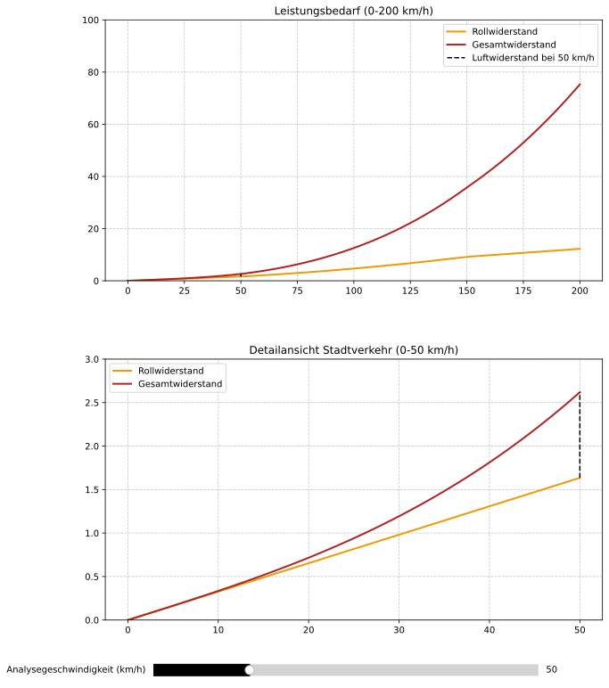

# Was ist beim Pkw wichtiger: der Rollwiderstand oder der Luftwiderstand?

Letzte Aktualisierung: 2024-10-29

**Quelle**: K. Schreiner, *Basiswissen Verbrennungsmotor: Fragen – rechnen – verstehen – bestehen*, 3., erweiterte und aktualisierte Auflage. Wiesbaden: Springer Fachmedien Wiesbaden, 2020. Verfügbar: https://doi.org/10.1007/978-3-658-29226-3

- [Was ist beim Pkw wichtiger: der Rollwiderstand oder der Luftwiderstand?](#was-ist-beim-pkw-wichtiger-der-rollwiderstand-oder-der-luftwiderstand)
  - [Grundlagen und Methodik](#grundlagen-und-methodik)
  - [Mathematische Modellierung](#mathematische-modellierung)
  - [Geschwindigkeitsabhängige Effekte](#geschwindigkeitsabhängige-effekte)
    - [Niedrige Geschwindigkeiten](#niedrige-geschwindigkeiten)
    - [Hohe Geschwindigkeiten](#hohe-geschwindigkeiten)
  - [Praktische Implikationen](#praktische-implikationen)
  - [Extrapolation und Grenzen](#extrapolation-und-grenzen)
  - [Fazit](#fazit)
- [Lineare Interpolation und Extrapolation](#lineare-interpolation-und-extrapolation)
  - [Grundprinzip der linearen Interpolation](#grundprinzip-der-linearen-interpolation)
  - [Mathematische Herleitung](#mathematische-herleitung)
  - [Anwendungsbereiche](#anwendungsbereiche)
  - [Grenzen und Vorsichtsmaßnahmen](#grenzen-und-vorsichtsmaßnahmen)
  - [Praktisches Beispiel (Rollwiderstand)](#praktisches-beispiel-rollwiderstand)
  - [Empfehlungen für die Praxis](#empfehlungen-für-die-praxis)
- [Typische Zahlenwerte für die Berechnung des Leistungsbedarfs von PKW](#typische-zahlenwerte-für-die-berechnung-des-leistungsbedarfs-von-pkw)

## Grundlagen und Methodik

Die Berechnung des Leistungsbedarfs für konstante Geschwindigkeiten auf ebener Strecke basiert auf zwei wesentlichen Widerstandsarten:

1. **Rollwiderstand** ($P_\text{roll}$)
2. **Luftwiderstand** ($P_\text{cw}$)

Der Rollwiderstandskoeffizient ist geschwindigkeitsabhängig und wird durch lineare Interpolation zwischen zwei Stützstellen berechnet:

- Bei $v = 50~\text{km}/\text{h}$: $f_\text{roll} = 0{,}008$
- Bei $v = 150~\text{km}/\text{h}$: $f_\text{roll} = 0{,}015$

## Mathematische Modellierung

Die lineare Interpolation erfolgt nach der Formel:

$$
y = \frac{y_2 - y_1}{x_2 - x_1} \cdot (x - x_1) + y_1
$$

wobei:

- $x$: aktuelle Geschwindigkeit
- $(x_1, y_1)$, $(x_2, y_2)$: Stützstellen
- $y$: interpolierter Widerstandskoeffizient

## Geschwindigkeitsabhängige Effekte

### Niedrige Geschwindigkeiten 

($v < 50~\text{km}/\text{h}$)

- Der Rollwiderstand dominiert den Gesamtwiderstand
- Der Leistungsbedarf steigt annähernd linear mit der Geschwindigkeit
- Besonders relevant im Stadtverkehr

### Hohe Geschwindigkeiten

($v > 150~\text{km}/\text{h}$)

- Der Luftwiderstand wird zur dominanten Komponente
- Exponentieller Anstieg des Gesamtleistungsbedarfs
- Die Differenz zwischen $P_\text{ges}$ und $P_\text{roll}$ wächst stark

## Praktische Implikationen

1. **Stadtverkehr**:
   - Rollwiderstand als Hauptverlustquelle
   - Zusätzlicher Energiebedarf durch häufiges Beschleunigen und Abbremsen

2. **Überlandfahrt**:
   - Luftwiderstand als dominanter Faktor
   - Gesamtleistungsbedarf steigt überproportional mit der Geschwindigkeit

## Extrapolation und Grenzen

- Lineare Extrapolation außerhalb der Stützstellen möglich, aber mit Vorsicht zu verwenden
- Bei großer Entfernung von den Stützstellen können physikalisch unsinnige Werte entstehen
- Empfehlung: Begrenzung auf Funktionswerte der Stützstellen bei Extrapolation

## Fazit

Die relative Bedeutung von Roll- und Luftwiderstand ist geschwindigkeitsabhängig:

- Rollwiderstand dominiert bei niedrigen Geschwindigkeiten
- Luftwiderstand dominiert bei hohen Geschwindigkeiten und steigt quadratisch

# Lineare Interpolation und Extrapolation

## Grundprinzip der linearen Interpolation

Die lineare Interpolation verbindet zwei bekannte Punkte (Stützstellen) durch eine Gerade:

- Punkt 1: $(x_1, y_1)$
- Punkt 2: $(x_2, y_2)$

## Mathematische Herleitung

1. **Steigung der Geraden ($$m$$)**:
   $m = \frac{y_2 - y_1}{x_2 - x_1}$

2. **Geradengleichung**:
   $\frac{y - y_1}{x - x_1} = m$

3. **Interpolationsformel**:
   $y = \frac{y_2 - y_1}{x_2 - x_1} \cdot (x - x_1) + y_1$

## Anwendungsbereiche

1. **Interpolation** (zwischen den Stützstellen):
   - Bereich: $x_1 \leq x \leq x_2$
   - Liefert einen gewichteten Mittelwert
   - Mathematisch und physikalisch sinnvoll

2. **Extrapolation** (außerhalb der Stützstellen):
   - Bereich: $x < x_1$ oder $x > x_2$
   - Zwei Varianten laut Abbildung:
     a) Unter Beibehaltung der Steigung
     b) Unter Beibehaltung des letzten Wertes

## Grenzen und Vorsichtsmaßnahmen

1. **Bei der Interpolation**:
   - Gilt nur für annähernd lineare Zusammenhänge
   - Fehler bei stark nichtlinearem Verhalten

2. **Bei der Extrapolation**:
   - Erhöhtes Risiko für physikalisch unsinnige Werte
   - Je größer die Entfernung von den Stützstellen, desto unzuverlässiger
   - Empfehlung: Begrenzung auf Werte der Stützstellen (Variante b)

## Praktisches Beispiel (Rollwiderstand)

Für den Rollwiderstandskoeffizienten mit:

- $x_1 = 50~\text{km}/\text{h}$, $y_1 = 0{,}008$
- $x_2 = 150~\text{km}/\text{h}$, $y_2 = 0{,}015$

Berechnung für $x = 100~\text{km}/\text{h}$:

$$
f_\text{roll} = \frac{0{,}015 - 0{,}008}{150 - 50} \cdot (100 - 50) + 0{,}008 = 0{,}0115
$$

## Empfehlungen für die Praxis

1. **Interpolation**:
   - Stützstellen möglichst nah am interessierenden Bereich wählen
   - Linearität des Zusammenhangs prüfen

2. **Extrapolation**:
   - Nach Möglichkeit vermeiden
   - Bei Notwendigkeit: Plausibilität prüfen
   - Konservative Variante (b) bevorzugen

# Typische Zahlenwerte für die Berechnung des Leistungsbedarfs von PKW

| Parameter                                                                   | Symbol                   | Wert(e)                                                                                                    |
| --------------------------------------------------------------------------- | ------------------------ | ---------------------------------------------------------------------------------------------------------- |
| Luftwiderstandsbeiwert                                                      | $$c_\text{w}$$           | $0{,}29 \dots 0{,}32$                                                                                      |
| Fahrzeugquerschnittsfläche                                                  | $$A$$                    | $2{,}2~\text{m}^2$ oder $85\%$ der mit der Fahrzeugbreite und der Höhe berechneten Rechteckfläche          |
| Rollwiderstandsbeiwert                                                      | $$\mu$$                  | $0{,}015$                                                                                                  |
| Getriebewirkungsgrad                                                        | $$\eta_\text{Getriebe}$$ | $0{,}90$                                                                                                   |
| Effektiver Motorwirkungsgrad bei Nennleistung                               | $$\eta_\text{e}$$        | $0{,}30$ (Ottomotor) $0{,}35$ (Dieselmotor)                                                             |
| Effektiver Motorwirkungsgrad im Bestpunkt (hohe Last, mittlere Drehzahl) | $$\eta_\text{e}$$        | $0{,}37$ (Ottomotor) $0{,}42$ (Dieselmotor)                                                             |
| Effektiver Motorwirkungsgrad im Stadtverkehr                                | $$\eta_\text{e}$$        | $0{,}10$ (sportlicher Ottomotor) $0{,}15$ (normaler Ottomotor) $0{,}20$ (Kleinwagen mit Dieselmotor) |
| Effektiver Motorwirkungsgrad im Leerlauf                                    | $$\eta_\text{e}$$        | $0{,}00$                                                                                                   |

*Anmerkungen:*

- Die Werte sind Richtwerte für durchschnittliche PKW
- Der Motorwirkungsgrad variiert stark je nach Betriebspunkt
- Die Querschnittsfläche basiert auf der vereinfachten Rechteckfläche aus Fahrzeugbreite und -höhe