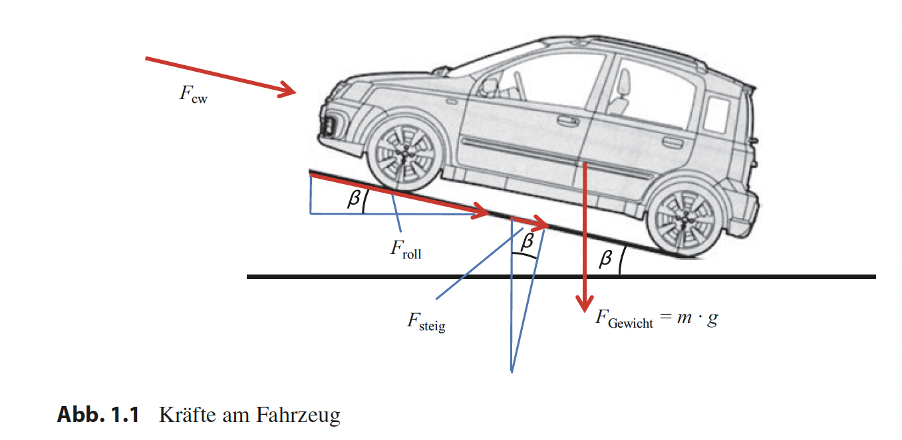
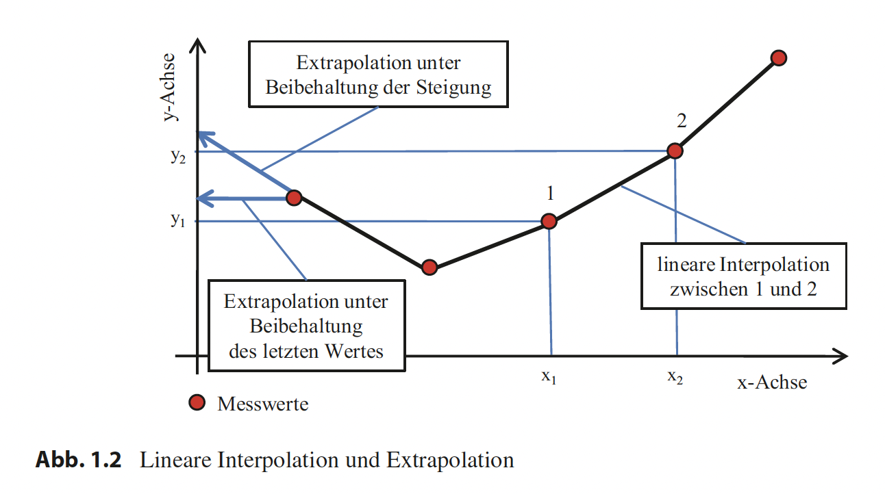
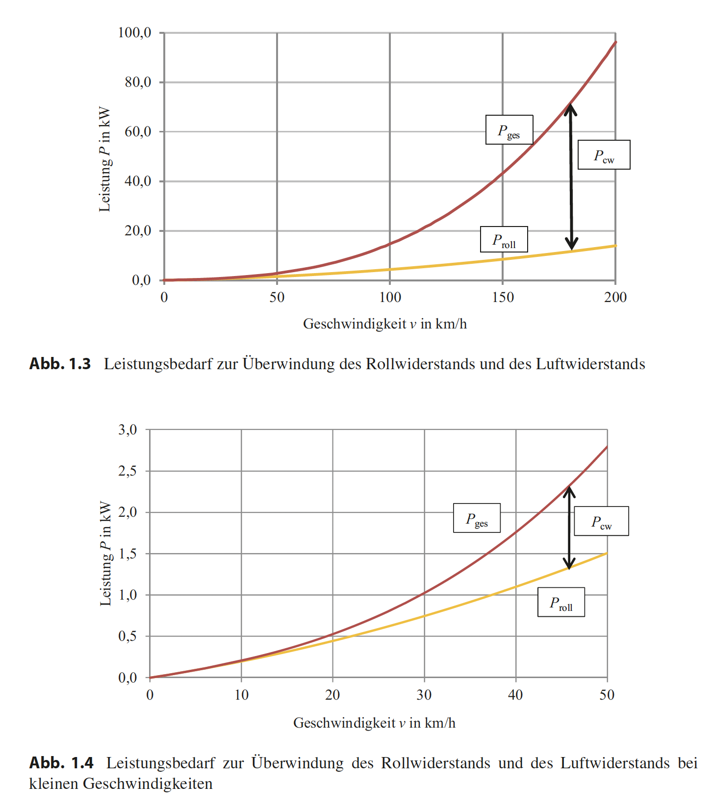

# Bilder und Tabellen - Fahrwiderstand und Motorleistung

Letzte Aktualisierung: 2024-10-24

Quelle: Basiswissen Verbrennungsmotor, Fragen – rechnen – verstehen – bestehen (Schreiner 2020)

## Regeln zur normgerechten Schreibweise von Einheiten

Grundlegende Regeln:

1. Eine physikalische Größe besteht aus Zahlenwert und Einheit, die multiplikativ verbunden sind.
2. Zwischen Zahl und Einheit steht ein Leerzeichen (Festabstand).
3. Formelzeichen werden kursiv geschrieben, Einheiten nicht.
4. Einheiten gehören **nicht** in eckige Klammern (also **nicht**: $s = 3 [\text{km}]$).

Besondere Fälle:

1. Bei Multiplikation:
   - Zwischen Zahl und Einheit darf das Multiplikationszeichen weggelassen werden.
   - Zwischen zwei Zahlen **muss** das Multiplikationszeichen stehen.
   - Beispiel Drehzahl: korrekt ist $n = 1000~\text{min}^{-1}$.

2. Bei zusammengesetzten Einheiten:
   - Mit Leerzeichen oder Multiplikationszeichen: $5~\text{kW h}$ oder $5~\text{kW} \cdot \text{h}$.
   - Bei komplexeren Fällen wie $J / (\text{kg} \cdot \text{K})$:
     - Bruchstrich verwenden: $\frac{J}{\text{kg} \cdot \text{K}}$.
     - Oder Klammern: $J/(\text{kg} \cdot \text{K})$.

3. Alternative normgerechte Schreibweisen:
   - Division durch Einheit: $\frac{s}{\text{km}} = 3$.
   - "s in km" für Achsenbeschriftungen/Tabellenüberschriften.

4. Spezialfälle:
   - Einheiten wie "bar" oder "Liter" sind laut SI-Norm zugelassen.
   - "PS" ist seit 1972 offiziell abgeschafft (auch wenn noch häufig verwendet).

## Tab. 1.1 Verschiedene Kombinationen von Getriebewirkungsgrad und Rollwiderstandsbeiwert

| Variante | Getriebewirkungsgrad | Rollwiderstandsbeiwert |
| -------- | -------------------- | ---------------------- |
| 1        | 0,88                 | 0,0176                 |
| 2        | 0,90                 | 0,0205                 |
| 3        | 0,92                 | 0,0234                 |
| 4        | 0,94                 | 0,0263                 |
| 5        | 0,96                 | 0,0292                 |
| 6        | 0,98                 | 0,0321                 |
| 7        | 1,00                 | 0,0349                 |

## Tab. 1.2 Typische Zahlenwerte für die Berechnung des Leistungsbedarfs von Pkw

| Parameter                                                                                | Wert(e)                                                                                        |
| ---------------------------------------------------------------------------------------- | ---------------------------------------------------------------------------------------------- |
| Luftwiderstandsbeiwert $c_w$                                                             | 0,29 ... 0,32                                                                                  |
| Fahrzeugquerschnittsfläche $A$                                                           | $2,2~\text{m}^2$ oder 85% der mit der Fahrzeugbreite und der Höhe berechneten Rechteckfläche   |
| Rollwiderstandsbeiwert $\mu$                                                             | 0,015                                                                                          |
| Getriebewirkungsgrad $\eta_{\text{Getriebe}}$                                            | 0,90                                                                                           |
| Effektiver Motorwirkungsgrad bei Nennleistung $\eta_e$                                   | 0,30 (Ottomotor) 0,35 (Dieselmotor)                                                         |
| Effektiver Motorwirkungsgrad im Bestpunkt bei hoher Last und mittlerer Drehzahl $\eta_e$ | 0,37 (Ottomotor) 0,42 (Dieselmotor)                                                         |
| Effektiver Motorwirkungsgrad im Stadtverkehr $\eta_e$                                    | 0,10 (sportlicher Ottomotor) 0,15 (normaler Ottomotor) 0,20 (Kleinwagen mit Dieselmotor) |
| Effektiver Motorwirkungsgrad im Leerlauf $\eta_e$                                        | 0,00                                                                                           |

## Tab. 1.3 Kenngrößen eines besonders sparsamen Pkw

| Parameter                                     | Wert  |
| --------------------------------------------- | ----- |
| Luftwiderstandsbeiwert $c_w$                  | 0,25  |
| Rollwiderstandsbeiwert $\mu$                  | 0,008 |
| Motorwirkungsgrad (Dieselmotor) $\eta_e$      | 0,42  |
| Getriebewirkungsgrad $\eta_{\text{Getriebe}}$ | 0,95  |

## Tab. 1.4 Streckenbezogener Kraftstoffverbrauch eines besonders sparsamen Pkw

| Geschwindigkeit in km/h | Streckenbezogener Kraftstoffverbrauch in l/(100 km) |
| ----------------------- | --------------------------------------------------- |
| 30                      | 0,68                                                |
| 50                      | 0,91                                                |
| 80                      | 1,47                                                |
| 100                     | 1,99                                                |

## Abb. 1.1 Kräfte am Fahrzeug

1. **Luftwiderstandskraft** ($F_{\text{cw}}$):
   - Wirkt horizontal entgegen der Fahrtrichtung.
   - Wird hauptsächlich verursacht durch:
     - Frontale Anströmung des Fahrzeugs.
     - Form des Fahrzeugs ($c_w$-Wert).
     - Quadratisch mit der Geschwindigkeit steigend.
     - Stirnfläche des Fahrzeugs.

2. **Gewichtskraft** ($F_{\text{Gewicht}} = m \cdot g$):
   - Wirkt vertikal nach unten.
   - Berechnet sich aus:
     - Masse des Fahrzeugs ($m$).
     - Erdbeschleunigung ($g = 9{,}81~\text{m/s}^2$).
   - Ist unabhängig von der Geschwindigkeit und bleibt konstant bei gleichbleibender Masse.

3. **Rollwiderstandskraft** ($F_{\text{roll}}$):
   - Wirkt parallel zur Fahrbahnoberfläche, entgegen der Fahrtrichtung.
   - Entsteht durch:
     - Verformung der Reifen.
     - Reibung zwischen Reifen und Fahrbahn.
     - Innere Reibung im Antriebsstrang.
   - Proportional zur Normalkraft.

4. **Steigungskraft** ($F_{\text{steig}}$):
   - Tritt bei Steigungen/Gefällen auf.
   - Abhängig vom Steigungswinkel $\beta$.
   - Ist eine Komponente der Gewichtskraft:
     - Bei Steigung: zusätzlich zu überwindende Kraft.
     - Bei Gefälle: unterstützende Kraft.

5. **Winkel $\beta$**:
   - Definiert die Steigung der Fahrbahn.
   - Beeinflusst die Aufteilung der Kräfte:
     - Steigungskraft = $F_{\text{Gewicht}} \cdot \sin(\beta)$.
     - Normalkraft = $F_{\text{Gewicht}} \cdot \cos(\beta)$.

Diese Kräfte bestimmen zusammen:

- Den Gesamtfahrwiderstand.
- Den Leistungsbedarf des Fahrzeugs.
- Den Kraftstoffverbrauch.
- Die maximal mögliche Geschwindigkeit.
- Das erforderliche Antriebsmoment.

## Abb. 1.2 zeigt drei verschiedene Methoden zur Behandlung von Messwerten

1. **Lineare Interpolation zwischen den Punkten 1 und 2**:
   - Wird im Bereich zwischen zwei bekannten Messwerten angewendet ($x_1$ und $x_2$).
   - Verbindet die Punkte durch eine gerade Linie.
   - Ermöglicht die Berechnung von Zwischenwerten.
   - Formel: $y = y_1 + \frac{y_2 - y_1}{x_2 - x_1} \cdot (x - x_1)$.
   - Am genauesten nahe der Messpunkte.

2. **Extrapolation unter Beibehaltung der Steigung**:
   - Wird außerhalb des gemessenen Bereichs angewendet.
   - Verlängert den letzten Kurvenabschnitt mit gleicher Steigung.
   - Nutzt die Steigung zwischen den letzten beiden Messpunkten.
   - Riskanter als Interpolation, da sich der Trend ändern könnte.
   - Mathematisch einfach, aber mit Vorsicht zu verwenden.

3. **Extrapolation unter Beibehaltung des letzten Wertes**:
   - Konservative Schätzungsmethode.
   - Der letzte $y$-Wert wird konstant weitergeführt.
   - Horizontale Verlängerung.
   - Sicherer als Steigungsextrapolation.
   - Gut geeignet für unbekannte Verläufe.

Wichtige Aspekte:

- Rote Punkte markieren die tatsächlichen Messwerte.
- Schwarze Linie zeigt den bekannten Verlauf.
- Blaue Linien zeigen die verschiedenen Extrapolationsmethoden.
- Koordinatensystem mit $x$- und $y$-Achse zur Orientierung.

**Anwendungsbereiche**:

- Technische Berechnungen.
- Wissenschaftliche Analysen.
- Vorhersagen und Prognosen.
- Fehlerbetrachtungen.
- Qualitätssicherung.

**Grenzen und Risiken**:

- Extrapolation ist unsicherer als Interpolation.
- Je weiter von Messwerten entfernt, desto ungenauer.
- Nichtlineare Effekte werden nicht berücksichtigt.
- Methode muss zum erwarteten Verhalten passen.

## Abb. 1.3 (Gesamter Geschwindigkeitsbereich 0–200 km/h)

**Komponenten**:

- **$P_{\text{roll}}$** (gelbe Linie): Leistung für Rollwiderstand
  - Steigt nahezu linear mit der Geschwindigkeit
  - Dominiert bei niedrigen Geschwindigkeiten
  - Flacherer Verlauf bei höheren Geschwindigkeiten

- **$P_{\text{cw}}$** (Differenz zwischen roter und gelber Linie): Leistung für Luftwiderstand
  - Steigt kubisch mit der Geschwindigkeit ($v^3$)
  - Wird bei höheren Geschwindigkeiten dominant
  - Überwiegt ab ca. 60–70 km/h

- **$P_{\text{ges}}$** (rote Linie): Gesamtleistungsbedarf
  - Summe aus $P_{\text{roll}}$ und $P_{\text{cw}}$
  - Exponentieller Anstieg bei hohen Geschwindigkeiten
  - Bei 200 km/h ca. 95 kW benötigt

## Abb. 1.4 (Detailansicht 0–50 km/h)

**Besonderheiten**:

- Fokus auf niedrige Geschwindigkeiten
- Feinere Skalierung der Leistungsachse (0–3 kW)
- Deutlichere Darstellung des Übergangsbereichs
- Zeigt ähnlichen Verlauf beider Widerstände im unteren Geschwindigkeitsbereich
- Bei 50 km/h etwa 2,8 kW Gesamtleistungsbedarf

## Wichtige Erkenntnisse

1. **Geschwindigkeitsabhängigkeit**:
   - Rollwiderstand ≈ linear
   - Luftwiderstand ≈ kubisch
   - Gesamtleistung steigt überproportional

2. **Energieeffizienz**:
   - Hohe Geschwindigkeiten sind sehr energieintensiv
   - Größter Leistungsbedarf durch Luftwiderstand
   - Optimum im mittleren Geschwindigkeitsbereich

3. **Praktische Bedeutung**:
   - Motorauslegung
   - Verbrauchsoptimierung
   - Reichweitenberechnung
   - Fahrstrategie
   - Wirtschaftlichkeit

**Diese Zusammenhänge sind besonders wichtig für**:

- Fahrzeugentwicklung
- Antriebsauslegung
- Verbrauchsoptimierung
- Fahrstilempfehlungen
- Reichweitenvorhersagen
