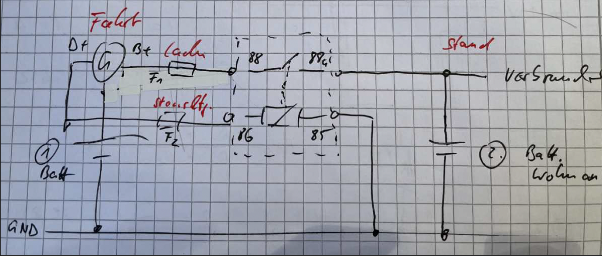

# Mathe-Kfz-Rechnen

Letzte Aktualisierung: 2024-10-20

## Inhaltsverzeichnis

- [Mathe-Kfz-Rechnen](#mathe-kfz-rechnen)
  - [Inhaltsverzeichnis](#inhaltsverzeichnis)
  - [Aufgaben](#aufgaben)
  - [Lösungen](#lösungen)
    - [**2) Berechnung des Vorwiderstands eines dreistufigen Gebläses:**](#2-berechnung-des-vorwiderstands-eines-dreistufigen-gebläses)
      - [**Berechnung für die dritte Stufe (150 W bei 12 V):**](#berechnung-für-die-dritte-stufe-150-w-bei-12-v)
      - [**Berechnung für die zweite Stufe (8 V):**](#berechnung-für-die-zweite-stufe-8-v)
      - [**Berechnung für die erste Stufe (50 W):**](#berechnung-für-die-erste-stufe-50-w)
    - [**3) Verlustberechnung bei der Klimaanlage:**](#3-verlustberechnung-bei-der-klimaanlage)
      - [**Verlust in Gramm:**](#verlust-in-gramm)
      - [**Verlust in Prozent:**](#verlust-in-prozent)
    - [**4) Berechnung der elektrischen Leistung bei Ruhestrommessung:**](#4-berechnung-der-elektrischen-leistung-bei-ruhestrommessung)
    - [**5) Berechnung des benötigten Leiterquerschnitts der zusätzlichen Plusleitung:**](#5-berechnung-des-benötigten-leiterquerschnitts-der-zusätzlichen-plusleitung)
    - [**6) Berechnung des Stromflusses und Auswahl der Sicherung für einen Lüfter:**](#6-berechnung-des-stromflusses-und-auswahl-der-sicherung-für-einen-lüfter)
      - [**Berechnung des Stromflusses:**](#berechnung-des-stromflusses)
      - [**Auswahl der Sicherung:**](#auswahl-der-sicherung)
      - [**Berechnung des Widerstands des Lüfters:**](#berechnung-des-widerstands-des-lüfters)
    - [**7) Berechnung der Sicherung für zwei Nebelscheinwerfer (12 V/55 W):**](#7-berechnung-der-sicherung-für-zwei-nebelscheinwerfer-12-v55-w)
      - [**Berechnung des Stroms für einen Nebelscheinwerfer:**](#berechnung-des-stroms-für-einen-nebelscheinwerfer)
      - [**Berechnung des Gesamtstroms für beide Nebelscheinwerfer:**](#berechnung-des-gesamtstroms-für-beide-nebelscheinwerfer)
      - [**Berechnung des Sicherungswertes:**](#berechnung-des-sicherungswertes)
    - [**8. Berechnung des Zünd- bzw. Kurbelwinkels**](#8-berechnung-des-zünd--bzw-kurbelwinkels)
    - [**9. Berechnung des Kraftstoffverbrauchs auf 100 km bei einem CO2-Ausstoß**](#9-berechnung-des-kraftstoffverbrauchs-auf-100-km-bei-einem-co2-ausstoß)
    - [**10. Berechnung des zu zahlenden Betrags nach Rabatt und Skonto für einen Drehstromgenerator**](#10-berechnung-des-zu-zahlenden-betrags-nach-rabatt-und-skonto-für-einen-drehstromgenerator)
    - [**11. Berechnung des Reifenkomplettpreises pro Reifen**](#11-berechnung-des-reifenkomplettpreises-pro-reifen)
    - [**12. Berechnung der prozentualen Leistungssteigerung durch Chip-Tuning**](#12-berechnung-der-prozentualen-leistungssteigerung-durch-chip-tuning)
    - [**13. Berechnung des Rechnungsbetrags für den Austausch einer Kraftstoffpumpe**](#13-berechnung-des-rechnungsbetrags-für-den-austausch-einer-kraftstoffpumpe)
    - [**14. Berechnung der maximalen Zugkraft einer Spurstange bei dreifacher Sicherheit**](#14-berechnung-der-maximalen-zugkraft-einer-spurstange-bei-dreifacher-sicherheit)
    - [**15. H4-Glühlampen Berechnungen**](#15-h4-glühlampen-berechnungen)
      - [**a) Berechnung der Ströme und Widerstände**](#a-berechnung-der-ströme-und-widerstände)
      - [**b) Erklärung der doppelten Wicklung bei 24V Lampen:**](#b-erklärung-der-doppelten-wicklung-bei-24v-lampen)
      - [**c) Konsequenzen für den Kabelquerschnitt bei 24V-Anlagen:**](#c-konsequenzen-für-den-kabelquerschnitt-bei-24v-anlagen)
    - [**16. Erklärung der Schraubenkennzeichnung 8.8**](#16-erklärung-der-schraubenkennzeichnung-88)
    - [**20. Berechnung des Kabelquerschnitts für die Plus-Leitung am Starter**](#20-berechnung-des-kabelquerschnitts-für-die-plus-leitung-am-starter)
    - [**21. Berechnung der Luftmenge zur Verbrennung von 1 Liter Kraftstoff**](#21-berechnung-der-luftmenge-zur-verbrennung-von-1-liter-kraftstoff)
      - [**Schritt 1: Berechnung der benötigten Luftmasse**](#schritt-1-berechnung-der-benötigten-luftmasse)
      - [**Schritt 2: Umrechnung der Luftmasse in Volumen**](#schritt-2-umrechnung-der-luftmasse-in-volumen)
      - [**Schritt 3: Umrechnung in Liter**](#schritt-3-umrechnung-in-liter)
  - [Größen, Einheiten und Formeln](#größen-einheiten-und-formeln)
  - [Motor - Druckberechnung Pleuel](#motor---druckberechnung-pleuel)
  - [Motorberechnung Audi A8](#motorberechnung-audi-a8)

## Aufgaben

1. **Batterie-Trennrelais und Klemmenbezeichnungen in die Schaltung für Laderegelung und zweite Batterie im Wohnanhänger und Ladespannung von Generator einzeichnen.**

2. **Berechnen Sie den Vorwiderstand eines dreistufigen Gebläses mit einer Leistung in der dritten Stufe von 150 W/12 V. In der ersten Stufe bringt er 50 W Leistung. In der zweiten Stufe liegen 8 V an der Plusleitung an.**

3. **Bei einer Klimaanlage wurden 460 g Kältemittel abgesaugt, wobei der Soll-Wert bei 640 g liegt. Wie hoch ist der Verlust in g und %?**

4. **Bei einer Ruhestrommessung messen Sie einen erhöhten Wert von 820 mA. Berechnen Sie die elektrische Leistung bei 12 V.**

5. **Berechnen Sie den benötigten Leiterquerschnitt der zusätzlichen Plusleitung bei 6,3 m Länge zur zweiten Batterie, um einen Spannungsfall Uv = 0,5 V nicht zu überschreiten. Die Stromaufnahme beträgt 30 A/12 V.**

6. **Berechnen Sie den Stromfluss bei einem Lüfter mit 0,3 kW und 12 V Nennleistung. Welche Sicherung wählen Sie für dieses System? Wie hoch ist der Widerstand des Lüfters?**

7. **Berechnen Sie die zu verwendete Sicherung für zwei zusätzliche Nebelscheinwerfer 12V/55W. Sicherungswert soll das 1,25-Fache des Lampenstroms betragen.**

8. **Die Zünd–Einstellmarkierung auf dem Schwungrad liegt 65 mm vor OT. Der Schwungradumfang beträgt 280 mm. Wie groß ist der Zünd- bzw. Kurbelwinkel?**

9. **Ein Fahrzeug hat laut Herstellerangaben einen CO2 Ausstoß von 134 g/km. Pro Liter Benzin werden 2394 g CO2 freigesetzt. Berechnen Sie den Kraftstoffverbrauch auf 100 km.**

10. **Ein Kfz–Techniker–Meister kauft in einem Großhandel einen Drehstromgenerator im Austausch. Auf den Listenpreis von 326,80 Euro (netto) erhält er einen Rabatt von 32%. Berechnen Sie den von ihm zu zahlenden Betrag, wenn ihm auf den Rechnungsbetrag noch 2% Skonto gewährt werden.**

11. **Ein Kunde benötigt vier neue Reifen mit der Bezeichnung 195/65 R15 91H und fragt Sie nach dem Komplettpreis pro Reifen inkl. Montage, Wuchten, Erneuerung der Ventile, Altreifenentsorgung und USt. Ihr Einkaufpreis pro Reifen beträgt 59,50 EUR derselbe für das Ventil 0,21 EUR, für die Montage, Wuchten und Entsorgung berechnen Sie dem Kunden 12,07 EUR pro Stück. (Alle vorgenannten Preise enthalten keine USt.)**

- **Berechnen Sie den Reifenkomplettpreis, der vom Kunden zu zahlen ist, wenn Sie am Reifen und Ventil beim Verkauf 15% verdienen wollen.**

12. **Ein Pkw, Turbodiesel – 1900 ccm – 66 kW, soll, laut Herstellerangaben, durch Veränderung mittels Chip–Tuning eine Leistung von 120 PS erreichen. Wie groß ist die Leistungssteigerung in Prozent?**

13. **Eine Kraftstoffpumpe wurde im Austausch ersetzt, Listenverkaufspreis der Kraftstoffpumpe 185,60 Euro, die benötigte Einbauzeit beträgt 1 Stunde 45 Minuten und der Preis pro AW liegt bei 8,70 (1 AW= 5 min). Ermitteln Sie den Rechnungsbetrag**

14. **Eine Spurstange mit 28 mm Außen- und 22 mm Innendurchmesser hat eine Mindestzugfestigkeit von 600 $\text{N/mm}^2$. Wie groß ist die maximale Zugkraft bei dreifacher Sicherheit?**

15. **Gegeben: zwei H4 Glühlampen mit folgenden Werten: (1.) 12V60/55W; (2.) 24V60/55W**

- **a) Ermitteln Sie rechnerisch zu 1. und 2. die Ströme, die die Fernlichtglühwendel durchfließen und die Widerstände derselben.**
- **b) Erläutern Sie, warum der Glühwendel der 24V Lampe doppelt gewickelt ist.**
- **c) Welche Konsequenz ergibt sich durch den Stromfluss bei 24V – Anlagen bezüglich des Kabelquerschnitts?**

16. **Ihr Azubi fragt Sie nach der Bedeutung der auf einem Schraubenkopf aufgedruckten Zahl 8.8 Welche Erklärung geben Sie ihm?**

17. **Kunde fragt, was es an Aufpreis kosten würde, wenn ein Endschalldämpfer und ein AT-Kompressor ausgetauscht wird. Erstellen Sie einen Kostenvoranschlag.**

- **geg: WSL = 14,74 EUR/h, KI = 3,80, WF = 11 AW/h, Kundenrabatt 10% auf AT-Kompressor, Materialien: AT-Kompressor 312,00 EUR, Dämpfer 200,00 EUR, 2x Kleinteile 1,80 EUR durchzuführenden Arbeiten: xx = 12 AW, yy = 13 AW, zz = 3 AW**

18. **Steuerzeitendiagramm ist gegeben, Bogenlänge ausrechnen und °KW vor OT einzeichnen. Annahmen: 1. der Zündzeitpunkt liegt 15° vor dem oberen Totpunkt (OT) und 2. der Durchmesser des Kurbelwellen-Hauptlagers beträgt 60 mm.**

19. **Verkaufte Stunden monatlich, FLh = 152 h, WF = 13 AW/h, 5x MA, Ist-AW = 9900 AW sind gegeben. Berechnen Sie die möglichen Mehr-AWs und die verkauften AWs.**

20. **Was für einen Kabelquerschnitt benötigen Sie als Plus-Leitung am Starter und begründen Sie ihre Wahl.**

21. **Wie viel Liter Luft werden zur Verbrennung von 1 l Kraftstoff benötigt. Luft- und Kraftstoffdichte sind gegeben.**

22. **Zwei parallel geschaltete Kennzeichenleuchten (Glühlampen 12V/4W) sind in Reihe mit der rechten Schlussleuchte (12V/5W) geschaltet.**

- **a) Berechnen Sie den Gesamtwiderstand,**
- **b) den Stromfluss und**
- **c) nennen Sie die zur Absicherung benötigte Flachsicherung.**

\newpage
## Lösungen

**1) Batterie-Trennrelais und Klemmenbezeichnungen in die Schaltung für Laderegelung und zweite Batterie im Wohnanhänger und Ladespannung von Generator einzeichnen.**

Nachrüstung einer Verbraucherbatterie


{width=60%}

- **Zweck:** In Fahrzeugen, die im Stand längere Zeit mit Strom versorgt werden müssen, ist eine zweite Batterie erforderlich.
- **Vorteil:** Die Verbraucherbatterie ermöglicht die Nutzung des Bordnetzes ohne die Gefahr, dass die Starterbatterie entladen wird und der Motor nicht starten kann.
- **Lademechanismus:** Ein Batterietrennrelais sorgt dafür, dass im Stand nur die Verbraucherbatterie genutzt wird, während der Fahrt jedoch beide Batterien geladen werden.
- **Anbindung des Relais:** Der Steuerstromkreis des Batterietrennrelais wird an den D+ Anschluss des Generators gekoppelt, was das Relais beim Laden schließt und so beide Batterien verbindet.
- **Empfehlung für Verbraucherbatterien:** Spezielle Verbraucherbatterien, die eine längere Lebensdauer haben und idealerweise nicht gasend sind (z.B. Gel- oder AGM-Batterien), werden für die Verwendung als Verbraucherbatterie empfohlen, insbesondere wenn diese im Fahrgastraum eingebaut wird.
- **Integration:** Die zusätzliche Verbraucherbatterie kann über ein Trennrelais ins Bordnetz integriert werden, was eine Ladung beider Batterien durch den Generator ermöglicht.


### **2) Berechnung des Vorwiderstands eines dreistufigen Gebläses:**

**Gegeben:**

- Leistung in der dritten Stufe: 150 W bei 12 V
- Leistung in der ersten Stufe: 50 W
- Spannung in der zweiten Stufe: 8 V an der Plusleitung

---

#### **Berechnung für die dritte Stufe (150 W bei 12 V):**

Zunächst wird der Strom berechnet, der bei voller Leistung fließt:

$$
I = \frac{P}{U} = \frac{150~\text{W}}{12~\text{V}} = 12{,}5~\text{A}
$$

Der Widerstand des Motors in der dritten Stufe ist:

$$
R_\text{Motor} = \frac{U^2}{P} = \frac{12^2~\text{V}}{150~\text{W}} = 0{,}96~\Omega
$$

Für die dritte Stufe ist kein Vorwiderstand erforderlich, da das Gebläse direkt mit 12 V betrieben wird.

---

#### **Berechnung für die zweite Stufe (8 V):**

Die Spannung an der Plusleitung beträgt 8 V, was bedeutet, dass der Vorwiderstand die restlichen 4 V der Quellspannung abfallen lässt. Der Strom ist der gleiche wie in der dritten Stufe:

$$
U_\text{ges} = 12~\text{V}, \quad U_\text{Stufe2} = 8~\text{V}
$$
$$
U_\text{R2} = U_\text{ges} - U_\text{Stufe2} = 12~\text{V} - 8~\text{V} = 4~\text{V}
$$

Der Vorwiderstand für die zweite Stufe beträgt:

$$
R_\text{2 Stufe2} = \frac{U_\text{R2}}{I} = \frac{4~\text{V}}{12{,}5~\text{A}} = 0{,}32~\Omega
$$

---

#### **Berechnung für die erste Stufe (50 W):**

Jetzt wird die Spannung berechnet, die für 50 W erforderlich ist:

$$
U_\text{Stufe1} = \frac{P}{I} = \frac{50~\text{W}}{12{,}5~\text{A}} = 4~\text{V}
$$

Da die Quellspannung 12 V beträgt und das Gebläse in dieser Stufe mit 4 V betrieben wird, muss der Vorwiderstand einen Spannungsabfall von 8 V verursachen:

$$
U_\text{R1} = U_\text{ges} - U_\text{Stufe1} = 12~\text{V} - 4~\text{V} = 8~\text{V}
$$

Der Vorwiderstand für die erste Stufe beträgt:

$$
R_\text{1 Stufe1} = \frac{U_\text{R1}}{I} = \frac{8~\text{V}}{12{,}5~\text{A}} = 0{,}64~\Omega
$$

---

### **3) Verlustberechnung bei der Klimaanlage:**

Gegeben:

- Soll-Wert: 640 g
- Tatsächliche Menge: 460 g

#### **Verlust in Gramm:**

$$
\text{Verlust (g)} = \text{Soll-Wert} - \text{Tat-Menge} = 640~\text{g} - 460~\text{g} = 180~\text{g}
$$

#### **Verlust in Prozent:**

$$
\text{Verlust} (\%) = \left( \frac{\text{Verlust (g)}}{\text{Soll-Wert}} \right) \times 100 = \left( \frac{180~\text{g}}{640~\text{g}} \right) \times 100 = 28{,}13\%
$$

Der Verlust beträgt 180 g, was 28,13% des Soll-Wertes entspricht.

---

### **4) Berechnung der elektrischen Leistung bei Ruhestrommessung:**

Gegeben:

- Ruhestrom: 820 mA = 0,82 A
- Spannung: 12 V

Die elektrische Leistung wird wie folgt berechnet:

$$
P = U \times I = 12~\text{V} \times 0{,}82~\text{A} = 9{,}84~\text{W}
$$

Die elektrische Leistung bei einem Ruhestrom von 820 mA und einer Spannung von 12 V beträgt 9,84 Watt.


### **5) Berechnung des benötigten Leiterquerschnitts der zusätzlichen Plusleitung:**

**Gegeben:**

- Stromaufnahme: 30 A
- Spannung: 12 V
- Länge der Leitung: 6,3 m (Hin- und Rückweg = 12,6 m)
- Erlaubter Spannungsfall $U_\text{v}$: 0,5 V
- Spezifischer Widerstand von Kupfer $\rho = 0{,}0178~\Omega \cdot \text{mm}^2 / \text{m}$

Die Formel für den Leiterquerschnitt ist:

$$
A = \frac{I \cdot l \cdot \rho}{U_\text{v}}
$$

Eingesetzt ergibt das:

$$
A = \frac{30~\text{A} \cdot 12{,}6~\text{m} \cdot 0{,}0178~\Omega \cdot \text{mm}^2 / \text{m}}{0{,}5~\text{V}} = 13{,}45~\text{mm}^2
$$

Der benötigte Leiterquerschnitt beträgt also etwa **13,45 mm²**.

---

### **6) Berechnung des Stromflusses und Auswahl der Sicherung für einen Lüfter:**

**Gegeben:**

- Nennleistung des Lüfters: 0,3 kW = 300 W
- Spannung: 12 V

#### **Berechnung des Stromflusses:**

$$
I = \frac{P}{U} = \frac{300~\text{W}}{12~\text{V}} = 25~\text{A}
$$

Der Stromfluss beträgt **25 A**.

#### **Auswahl der Sicherung:**

Eine Sicherung sollte ca. 25% mehr Strom aushalten als der erwartete Betriebsstrom:

$$
I_\text{Sicherung} = 1{,}25 \times 25~\text{A} = 31{,}25~\text{A}
$$

Die nächste standardisierte Sicherungsgröße wäre **30 A**.

#### **Berechnung des Widerstands des Lüfters:**

$$
R = \frac{U}{I} = \frac{12~\text{V}}{25~\text{A}} = 0{,}48~\Omega
$$

Der Widerstand des Lüfters beträgt **0,48 Ohm**.

---

### **7) Berechnung der Sicherung für zwei Nebelscheinwerfer (12 V/55 W):**

**Gegeben:**

- Leistung pro Scheinwerfer: 55 W
- Spannung: 12 V
- Sicherungswert soll das 1,25-Fache des Lampenstroms betragen.

#### **Berechnung des Stroms für einen Nebelscheinwerfer:**

$$
I = \frac{P}{U} = \frac{55~\text{W}}{12~\text{V}} = 4{,}58~\text{A}
$$

#### **Berechnung des Gesamtstroms für beide Nebelscheinwerfer:**

$$
I_\text{gesamt} = 2 \times 4{,}58~\text{A} = 9{,}16~\text{A}
$$

#### **Berechnung des Sicherungswertes:**

Der Sicherungswert soll 1,25 mal den Gesamtstrom betragen:

$$
I_\text{Sicherung} = 1{,}25 \times 9{,}16~\text{A} = 11{,}45~\text{A}
$$

Da Sicherungen in standardisierten Werten erhältlich sind, würde man eine **15-Ampere-Sicherung** verwenden, da dies der nächsthöhere Standardwert ist.


### **8. Berechnung des Zünd- bzw. Kurbelwinkels**

Der Umfang $U$ des Schwungrades beträgt 280 mm, und die Zünd-Einstellmarkierung liegt 65 mm vor dem oberen Totpunkt (OT). Um den zugehörigen Winkel $\alpha$ zu finden, setzen wir das Verhältnis der Strecke zum Umfang gleich dem Verhältnis des Winkels zu einem Vollkreis (360 Grad).

$$
\frac{65~\text{mm}}{280~\text{mm}} = \frac{\alpha}{360^\circ} \quad \to \quad \alpha = \frac{65}{280} \times 360^\circ = 83{,}57^\circ
$$

Der Zünd- bzw. Kurbelwinkel beträgt **ca. 83,57 Grad**.

---

### **9. Berechnung des Kraftstoffverbrauchs auf 100 km bei einem CO2-Ausstoß**

**Gegeben:**

- CO2-Ausstoß: 134 g/km
- CO2-Freisetzung pro Liter Benzin: 2394 g/Liter

**Berechnung:**

$$
\text{Kraftstoffverbrauch} = \frac{\text{CO2-Ausstoß} \times 100~\text{km}}{\text{CO2-Freisetzung pro Liter}} = \frac{134~\text{g/km} \times 100~\text{km}}{2394~\text{g/Liter}} \approx 5{,}6~\text{Liter pro 100 km}
$$

Der Kraftstoffverbrauch beträgt **ca. 5,6 Liter pro 100 km**.

---

### **10. Berechnung des zu zahlenden Betrags nach Rabatt und Skonto für einen Drehstromgenerator**

**Gegeben:**

- Listenpreis (LVP): 326,80 EUR (netto)
- Rabatt: 32%
- Skonto: 2% nach Abzug des Rabatts
- Umsatzsteuer (UST): 19%

**Berechnung:**

```plaintext
  LVP                 326,80 EUR
- Rabatt 32%          104,58 EUR
= Summe               222,22 EUR
+ UST     19%          42,22 EUR
= Bruttobetrag        264,44 EUR
- Skonto 2%             5,29 EUR
--------------------------------
= Rechnungsbetrag     259,15 EUR
```

1. **Rabattabzug:**

$$
\text{Rabatt} = 326{,}80~\text{EUR} \times 0{,}32 = 104{,}58~\text{EUR}
$$

$$
\text{Nettobetrag nach Rabatt} = 326{,}80~\text{EUR} - 104{,}58~\text{EUR} = 222{,}22~\text{EUR}
$$

2. **Umsatzsteuer:**

$$
\text{UST} = 222{,}22~\text{EUR} \times 0{,}19 = 42{,}22~\text{EUR}
$$

3. **Zwischensumme:**

$$
\text{Bruttobetrag} = 222{,}22~\text{EUR} + 42{,}22~\text{EUR} = 264{,}44~\text{EUR}
$$

4. **Skontoabzug:**

$$
\text{Skonto} = 264{,}44~\text{EUR} \times 0{,}02 = 5{,}29~\text{EUR}
$$

5. **Rechnungsbetrag:**

$$
\text{Rechnungsbetrag} = 264{,}44~\text{EUR} - 5{,}29~\text{EUR} = 259{,}15~\text{EUR}
$$

Der zu zahlende Betrag beträgt **259,15 EUR**.

---

### **11. Berechnung des Reifenkomplettpreises pro Reifen**

**Gegeben:**

- Einkaufspreis pro Reifen: 59,50 EUR (netto)
- Einkaufspreis pro Ventil: 0,21 EUR (netto)
- Montage, Wuchten, Entsorgung: 12,07 EUR (netto)
- Aufschlag: 15%
- Umsatzsteuer (UST): 19%

**Berechnung:**

```plaintext
  Reifen:     59,50 x 1,15     68,43 EUR
+ Ventil:      0,21 x 1,15      0,24 EUR
+ Montage, Wuchten, Entsorgung 12,07 EUR
= Summe                        80,74 EUR
+ UST     19%                  15,34 EUR
----------------------------------------
= Gesamtpreis pro Reifen       96,08 EUR
```

1. **Reifenpreis mit 15% Gewinn:**

$$
\text{Reifenpreis} = 59{,}50~\text{EUR} \times 1{,}15 = 68{,}43~\text{EUR}
$$

2. **Ventilpreis mit 15% Gewinn:**

$$
\text{Ventilpreis} = 0{,}21~\text{EUR} \times 1{,}15 = 0{,}24~\text{EUR}
$$

3. **Summe der Kosten (ohne UST):**

$$
\text{Nettopreis} = 68{,}43~\text{EUR} + 0{,}24~\text{EUR} + 12{,}07~\text{EUR} = 80{,}74~\text{EUR}
$$

4. **Umsatzsteuer:**

$$
\text{UST} = 80{,}74~\text{EUR} \times 0{,}19 = 15{,}34~\text{EUR}
$$

5. **Komplettpreis pro Reifen:**

$$
\text{Bruttopreis} = 80{,}74~\text{EUR} + 15{,}34~\text{EUR} = 96{,}08~\text{EUR}
$$

Der Komplettpreis pro Reifen beträgt **96,08 EUR**.

---

### **12. Berechnung der prozentualen Leistungssteigerung durch Chip-Tuning**

**Gegeben:**

- Ursprüngliche Leistung: 66 kW
- Nach Tuning: 120 PS

**Berechnung:**

```plaintext
  Ursprüngliche Leistung      89,80 PS
  Neue Leistung              120,00 PS
--------------------------------------
= Steigerung                  30,20 PS
= Steigerung in %             33,63%
```

1. **Umrechnung der ursprünglichen Leistung in PS:**

$$
66~\text{kW} \times \frac{1}{0{,}735} = 89{,}80~\text{PS}
$$

2. **Leistungssteigerung:**

$$
\text{Leistungssteigerung} = 120~\text{PS} - 89{,}80~\text{PS} = 30{,}20~\text{PS}
$$

3. **Prozentuale Steigerung:**

$$
\frac{30{,}20~\text{PS}}{89{,}80~\text{PS}} \times 100 \approx 33{,}63\%
$$

Die Leistungssteigerung beträgt **ca. 33,63%**.

---

### **13. Berechnung des Rechnungsbetrags für den Austausch einer Kraftstoffpumpe**

**Gegeben:**

- Listenpreis (LVP): 185,60 EUR
- Einbauzeit: 1 Stunde 45 Minuten = 105 Minuten
- Preis pro AW: 8,70 EUR (1 AW = 5 Minuten)
- Umsatzsteuer (UST): 19%

**Berechnung:**

```plaintext
  AP  21 AW x 8,70           182,70 EUR
  LVP                        185,60 EUR
= Summe                      368,30 EUR
+ UST     19%                 69,98 EUR
----------------------------------------
= Rechnungsbetrag            438,28 EUR
```

1. **Anzahl der AW:**

$$
\frac{105~\text{Minuten}}{5~\text{Minuten/AW}} = 21~\text{AW}
$$

2. **Arbeitskosten:**

$$
\text{Arbeitskosten} = 21~\text{AW} \times 8{,}70~\text{EUR/AW} = 182{,}70~\text{EUR}
$$

3. **Zwischensumme (ohne UST):**

$$
\text{Summe} = 182{,}70~\text{EUR} + 185{,}60~\text{EUR} = 368{,}30~\text{EUR}
$$

4. **Umsatzsteuer:**

$$
\text{UST} = 368{,}30~\text{EUR} \times 0{,}19 = 69{,}98~\text{EUR}
$$

5. **Gesamtbetrag:**

$$
\text{Rechnungsbetrag} = 368{,}30~\text{EUR} + 69{,}98~\text{EUR} = 438{,}28~\text{EUR}
$$

Der Gesamtbetrag für die Rechnung beträgt **438,28 EUR**.


Hier ist die vollständig überprüfte und formatierte Version der Aufgaben:

---

### **14. Berechnung der maximalen Zugkraft einer Spurstange bei dreifacher Sicherheit**

**Gegeben:**

- Außendurchmesser $d_a = 28~\text{mm}$
- Innendurchmesser $d_i = 22~\text{mm}$
- Mindestzugfestigkeit $\sigma = 600~\text{N/mm}^2$
- Sicherheitsfaktor = 3

**Berechnung der Querschnittsfläche:**

Die Formel für die Querschnittsfläche eines ringförmigen Querschnitts lautet:

$$
A = \pi \times \frac{d_a^2 - d_i^2}{4}
$$

Eingesetzt:

$$
A = \pi \times \frac{(28~\text{mm})^2 - (22~\text{mm})^2}{4} = 235{,}62~\text{mm}^2
$$

**Berechnung der maximalen Zugkraft:**

$$
F = \sigma \times A = 600~\text{N/mm}^2 \times 235{,}62~\text{mm}^2 = 141372~\text{N}
$$

Da die Sicherheit dreifach ist, teilen wir diese Kraft durch 3:

$$
F_\text{max} = \frac{F}{3} = \frac{141372~\text{N}}{3} = 47124~\text{N}
$$

Die maximale Zugkraft beträgt **47124 N**.

---

### **15. H4-Glühlampen Berechnungen**

#### **a) Berechnung der Ströme und Widerstände**

1. **Für die 12V Glühlampe (Fernlicht mit 60W):**

$$
I_{12V} = \frac{P}{U} = \frac{60~\text{W}}{12~\text{V}} = 5~\text{A}
$$

$$
R_{12V} = \frac{U}{I} = \frac{12~\text{V}}{5~\text{A}} = 2{,}4~\Omega
$$

2. **Für die 24V Glühlampe (Fernlicht mit 60W):**

$$
I_{24V} = \frac{P}{U} = \frac{60~\text{W}}{24~\text{V}} = 2{,}5~\text{A}
$$

$$
R_{24V} = \frac{U}{I} = \frac{24~\text{V}}{2{,}5~\text{A}} = 9{,}6~\Omega
$$

#### **b) Erklärung der doppelten Wicklung bei 24V Lampen:**

Die doppelte Wicklung bei 24V Lampen kompensiert die höhere Spannung. Ein höherer Widerstand ist erforderlich, um den Strom zu reduzieren und dennoch die gleiche Leistung zu erzielen. Dies ermöglicht eine ähnliche Licht- und Wärmeabgabe wie bei 12V Lampen, ohne dass die Lampe überhitzt.

#### **c) Konsequenzen für den Kabelquerschnitt bei 24V-Anlagen:**

Bei 24V Lampen fließt weniger Strom (2,5A) als bei 12V Lampen (5A). Da der Stromfluss die Erwärmung im Kabel bestimmt, kann bei 24V-Anlagen ein dünnerer Kabelquerschnitt verwendet werden, was zu Materialeinsparungen führt.

---

### **16. Erklärung der Schraubenkennzeichnung 8.8**

- **Zugfestigkeit**: Die erste Zahl (8) multipliziert mit 100 ergibt die Zugfestigkeit. Eine Schraube der Klasse 8.8 hat also eine Zugfestigkeit von **800 N/mm²**.
- **Streckgrenze**: Die zweite Zahl (8) gibt an, dass die Streckgrenze 80% der Zugfestigkeit beträgt. Somit hat die Schraube eine Streckgrenze von **640 N/mm²**.

**Berechnung der Streckgrenze:**

$$
\text{Streckgrenze} = 800~\text{N/mm}^2 \times 0{,}8 = 640~\text{N/mm}^2
$$

Eine Schraube der Klasse 8.8 weist folgende Eigenschaften auf:

- Zugfestigkeit: **800 N/mm²**
- Streckgrenze: **640 N/mm²**

---

Alle Berechnungen sind korrekt durchgeführt und in der gewünschten Form dargestellt.

**17. Kunde fragt, was es an Aufpreis kosten würde, wenn ein Endschalldämpfer und ein AT-Kompressor ausgetauscht wird. Erstellen Sie einen Kostenvoranschlag.**

**geg: WSL = 14,74 EUR/h, KI = 3,80, WF = 11 AW/h, Kundenrabatt 10% auf AT-Kompressor, Materialien: AT-Kompressor 312,00 EUR, Dämpfer 200,00 EUR, 2x Kleinteile 1,80 EUR durchzuführenden Arbeiten: xx = 12 AW, yy = 13 AW, zz = 3 AW**

KVA mit Kundenrabatt

- $\text{St-Vs} = \text{WSL} \times \text{KI} = 14{,}74 \times 3{,}80 = 56{,}01 \text{ EUR/h}$
- $\text{AW-Vs} = \frac{\text{St-Vs}}{\text{WF}} = \frac{56{,}01}{11} = 5{,}092  \text{ EUR/AW}$

```
# KVA
Anzahl Ersatzteil          LVP   Kundenrabatt E-Preis Et-Preis
-----------------------------------------------------------------
1      AT-Kompressor      312,00   x 0,9       280,80  280,80 EUR
1      Dämpfer            200,00               200,00  200,00 EUR
2      Kleinteile           1,80                 1,80    3,60 EUR
-----------------------------------------------------------------
Ersatzteilpreis (EP, Materialkosten)                   484,40 EUR

Nr. Bezeichnung   AW-VS     AW     Preis
--------------------------------------------
1   xx            5,092     12     61,10 EUR
2   yy            5,092     13     66,20 EUR
3   zz            5,092      3     15,28 EUR
--------------------------------------------
Arbeitspreis (AP) 5,092     28    142,58 EUR

  Arbeitspreis (AP)               142,58 EUR
+ Ersatzteilpreis (EP)            484,40 EUR
= Zwischensumme                   626,98 EUR
+ UST     19%                     119,13 EUR
+ AT-St x 10% x 19%                 5,93 EUR // 312,00 LVP
--------------------------------------------
= Rechnungsbetrag                 752,04 EUR
```

**18. Steuerzeitendiagramm ist gegeben, Bogenlänge ausrechnen und °KW vor OT einzeichnen. Annahmen: 1. der Zündzeitpunkt liegt 15° vor dem oberen Totpunkt (OT) und 2. der Durchmesser des Kurbelwellen-Hauptlagers beträgt 60 mm.**


$l_B = 2 \times \pi \times r \times \frac{\alpha}{360^\circ}$


1. Bestimme den Umfang des Kurbelwellen-Hauptlagers anhand des gegebenen Durchmessers von 60 mm:

- $\text{Umfang} = \pi \times \text{Durchmesser} = \pi \times 60~\text{mm} \approx 188{,}5~\text{mm}$

2. Berechne den Bogenabschnitt, der 15° auf dem Umfang entspricht, da der volle Kreis 360° beträgt:

- $\text{Bogenlänge } 15^\circ = \frac{15}{360} \times \text{Umfang} = \frac{15}{360} \times 188{,}5~\text{mm}  \approx 7{,}85~\text{mm}$


**19. Verkaufte Stunden monatlich, FLh = 152 h, WF = 13 AW/h, 5x MA, Ist-AW = 9900 AW sind gegeben. Berechnen Sie die möglichen Mehr-AWs und die verkauften AWs.**

$\text{Verkaufte AWs} = \text{Fertigungslohnstunden (FLh)} \times \text{Werkstattfaktor (WF)} \times \text{Anzahl (MA)}$

Gegeben sind:

- Fertigungslohnstunden monatlich (FLh) = 152 h
- Werkstattfaktor (WF) = 13 AW/h
- Anzahl der Mitarbeiter (MA) = 5
- Ist-Arbeitswerte (Ist-AW) = 9900 AW

Berechnen wir zuerst die verkauften AWs:

- $\text{Verkaufte AWs} = 152~\text{h} \times 13~\text{AW/h} \times 5 = 152 \times 13 \times 5 = 9880~\text{AW}$

Die möglichen Mehr-AWs werden berechnet, indem die Ist-AW von den verkauften AWs abgezogen werden:

- $\text{Mehr-AWs} = \text{Ist-AW} - \text{Verkaufte AWs} = 9900~\text{AW} - 9880~\text{AW} = 20~\text{AW}$

Zusammenfassung:

- Verkaufte AWs: 9880 AW
- Mögliche Mehr-AWs: 20 AW

### **20. Berechnung des Kabelquerschnitts für die Plus-Leitung am Starter**

**Gegeben:**

- Starterstrom: 300 A
- Leitungslänge: 3 m
- Erlaubter Spannungsfall $U_\text{v}: 0,5~\text{V}$
- Spezifischer Widerstand von Kupfer: $\rho = 0{,}0178~\Omega \cdot \text{mm}^2 / \text{m}$

**Formel für den Leiterquerschnitt:**

$$
A = \frac{I \cdot l \cdot \rho}{U_\text{v}}
$$

**Berechnung:**

$$
A = \frac{300~\text{A} \cdot 3~\text{m} \cdot 0{,}0178~\Omega \cdot \text{mm}^2 / \text{m}}{0{,}5~\text{V}} = 32{,}04~\text{mm}^2
$$

Der berechnete Querschnitt beträgt **32,04 mm²**. 

Da Kabelquerschnitte in standardisierten Größen erhältlich sind, wird auf den nächsthöheren verfügbaren Querschnitt aufgerundet. In diesem Fall würde man einen Kabelquerschnitt von **35 mm²** oder sogar **50 mm²** wählen, um zusätzliche Sicherheit und geringeren Spannungsfall zu gewährleisten.

---

### **21. Berechnung der Luftmenge zur Verbrennung von 1 Liter Kraftstoff**

**Gegeben:**

- Dichte von Benzin: $0{,}74~\text{kg/L}$
- Dichte von Luft: $1{,}225~\text{kg/m}^3$
- Stöchiometrisches Luft-Kraftstoff-Verhältnis: 14,7 (Luft zu Kraftstoff)

#### **Schritt 1: Berechnung der benötigten Luftmasse**

Ein Liter Benzin hat eine Masse von:

$$
\text{Masse Benzin} = 1~\text{L} \times 0{,}74~\text{kg/L} = 0{,}74~\text{kg}
$$

Die benötigte Luftmasse zur vollständigen Verbrennung beträgt:

$$
\text{Luftmasse} = 0{,}74~\text{kg} \times 14{,}7 = 10{,}878~\text{kg}
$$

#### **Schritt 2: Umrechnung der Luftmasse in Volumen**

Das Volumen der benötigten Luft wird unter Verwendung der Dichte der Luft berechnet:

$$
\text{Volumen Luft} = \frac{\text{Luftmasse}}{\text{Dichte Luft}} = \frac{10{,}878~\text{kg}}{1{,}225~\text{kg/m}^3} = 8{,}8784~\text{m}^3
$$

#### **Schritt 3: Umrechnung in Liter**

Da $1~\text{m}^3 = 1000~\text{Liter}$ entspricht, ergibt sich:

$$
8{,}8784~\text{m}^3 \times 1000~\text{L/m}^3 = 8878{,}4~\text{Liter}
$$

**Ergebnis:**

Für die Verbrennung von **1 Liter Benzin** werden etwa **8878,4 Liter Luft** benötigt.

---

Diese beiden Berechnungen sind nun korrekt und vollständig dargestellt.

**22. Zwei parallel geschaltete Kennzeichenleuchten (Glühlampen 12V/4W) sind in Reihe mit der rechten Schlussleuchte (12V/5W) geschaltet.**

- **a) Berechnen Sie den Gesamtwiderstand,**
- **b) den Stromfluss und**
- **c) nennen Sie die zur Absicherung benötigte Flachsicherung.**

**a) Gesamtwiderstand berechnen:**

**Kennzeichenleuchten:**

- Leistung $P = 4~\text{W}$
- Spannung $U = 12~\text{V}$

Der Widerstand $R$ für eine und zwei Lampen:

- $R = \frac{U^2}{P} = \frac{12^2}{4} = 36~\Omega$
- $R_\text{parallel} = \frac{36~\Omega \cdot 36~\Omega}{36~\Omega + 36~\Omega} = 18~\Omega$


**Schlussleuchte:**

- Leistung $P = 5~\text{W}$
- Spannung $U = 12~\text{V}$

Widerstand $R$ für die Schlussleuchte:

- $R_\text{Schlussleuchte} = \frac{12^2}{5} = 28{,}8~\Omega$
- $R_\text{Gesamt} = R_\text{Kennzeichen} + R_\text{Schlussleuchte} = 18~\Omega + 28{,}8~\Omega = 46{,}8~\Omega$

**b) Stromfluss berechnen:**

- $I = \frac{U}{R_\text{Gesamt}} = \frac{12~\text{V}}{46{,}8~\Omega} \approx 0{,}256~\text{A}$

**c) Flachsicherung wählen:**

Für die Absicherung wählen wir eine Sicherung, die etwas größer als der maximale Stromfluss ist, um gelegentliche Spitzen abzudecken, ohne bei normalem Betrieb durchzubrennen $\to$  3 A-Sicherung.


## Größen, Einheiten und Formeln

**1) Ordne den folgenden Begriffen das passende Formelzeichen und die SI-Basiseinheit zu:**

- a) Druck $\to p~[Pa]$
- b) Weg $\to s~[m]$
- c) Zeit $\to t~[s]$
- d) Geschwindigkeit $\to v~[m/s]$
- e) Beschleunigung $\to a~[m/s^2]$
- f) Leistung $\to P~[W]$
- g) Drehmoment $\to M~[Nm]$
- h) Differenz (ohne Einheit) $\to \Delta$

**2) Rechne die folgenden Werte in die genannte Einheit um:**

- a) 100 km/h $\to$  m/s 
  - $\frac{100}{3{,}6} = 27{,}78$ m/s
  - $\frac{1000}{3600} = 3{,}6$
- b) 3 Stunden 47 Minuten 11 Sekunden $\to$  Dezimalstunden 3,7864
  - 3 Std + (2) + (1)
  - (2) $\frac{47}{60} = 0{,}7833$ Std
  - (1) $\frac{11}{3600} = 0{,}0031$ Std
- c) 17 Zoll $\to$  cm 
  - 1 Zoll = 25,4 mm 
  - 17 Zoll = 431,8 mm = 43,18 cm
- d) 15 bar $\to$  Pa 
  - 1 bar = 100.000 Pa 
  - 15 bar = 1.500.000 Pa
- e) 15 daN $\to$  N 
  - $15 \cdot 10 = 150$ N
- f) $\Delta  45~\text{K} \to \text{?}^\circ\text{C}$  
  - $\Delta 1~\text{K} = \Delta 1^\circ\text{C}$ Hinweis: diese Äquivalenz gilt nur für Temperaturdifferenzen, nicht für Temperaturangaben selbst.
  - $\Delta 45^\circ\text{C}$
  - $0~\text{K} = -273{,}15^\circ\text{C}$
  - $^\circ\text{C} = K - 273{,}15$
  - $45~\text{K} = 45 - 273{,}15 = -228{,}15^\circ\text{C}$
- g) 150 Nm $\to$  J 
  - 150 J (da Arbeit = Kraft x Weg; Drehmoment = Kraft x Hebelarm)

**3) Stelle die folgenden Formeln nach der genannten Größe um** (mit Herleitungsweg)

- a) $M = F \cdot r \to  F = \frac{M}{r}$
- b) $p_\text{i} = \frac{12000 \cdot P_\text{i}}{A \cdot s \cdot n \cdot z} \to  P_\text{i} = \frac{p_\text{i} \cdot A \cdot s \cdot n \cdot z}{12000}$
- c) $V_\text{h} = \frac{\pi \cdot d^2}{4} \cdot s \to  d^2 = \frac{4 \cdot V_\text{h}}{\pi \cdot s} \to  d = \sqrt{\frac{4 \cdot V_\text{h}}{\pi \cdot s}}$


## Motor - Druckberechnung Pleuel

**Kolbenflächenberechnung:** $\boxed{A = \frac{d^2}{4} \cdot \pi}$

Kolbendurchmesser $d = 80~\text{mm} = 8~\text{cm}$

$$A_\text{Kolben} = \frac{(80~\text{mm})^2}{4} \cdot \pi = 5026{,}55~\text{mm}^2 = 50{,}27~\text{cm}^2$$

**Kolbenkraftberechnung:** $\boxed{\text{Druck} = \frac{\text{Kraft}}{\text{Fläche}}}$

$\boxed{p = \frac{F}{A}} \quad \boxed{p~[\text{N}/\text{cm}^2] \quad F~[\text{N}] \quad A~[\text{cm}^2]} \quad \boxed{10~\text{N}/\text{cm}^2 = 1~\text{bar}}$

**Verbrennungsdrücke:**

$\text{Benzin} \to 65~\text{bar} = 650~\text{N}/\text{cm}^2 \quad \text{Diesel} \to 180~\text{bar} = 1800~\text{N}/\text{cm}^2$

$$F = p \cdot A$$

$$F_\text{Kolben B} = 50{,}27~\text{cm}^2 \cdot 650~\text{N}/\text{cm}^2 = 32675{,}5~\text{N}$$
$$F_\text{Kolben D} = 50{,}27~\text{cm}^2 \cdot 1800~\text{N}/\text{cm}^2 = 90486~\text{N}$$

**Kreisbogenberechnung:** $\boxed{A = \frac{d \cdot \pi}{2} \cdot b}$

$d_\text{Kurbelwelle} = 60~\text{mm} = 6~\text{cm}$ und
$d_\text{Lager} = 25~\text{mm} = 2{,}5~\text{cm}$

$$A_\text{Krb} = \frac{6~\text{cm} \cdot \pi}{2} \cdot 2{,}5~\text{cm} = 23{,}56~\text{cm}^2$$

**Druckberechnung Pleuelfuß:**

$$p_\text{Pleuel B} = \frac{F}{A} = \frac{32675{,}5~\text{N}}{23{,}56~\text{cm}^2} = 1386{,}91~\text{N}/\text{cm}^2 = 138{,}69~\text{bar}$$
$$p_\text{Pleuel D} = \frac{F}{A} = \frac{90486~\text{N}}{23{,}56~\text{cm}^2} = 3840{,}66~\text{N}/\text{cm}^2 = 384{,}07~\text{bar}$$

**Versorgungsdruck (Öldruck) max.** $5~\text{bar}$

$$\to p_\text{Pleuel Benzin}: 138{,}69~\text{bar}$$
$$\to p_\text{Pleuel Diesel}: 384{,}07~\text{bar}$$

Vgl. Kapitel "*Motormechanik / Hydrodynamischer Schmierkeil*"


## Motorberechnung Audi A8

Tabellenbuch S. 32 - 33 ([@bell:2021:tabellenbuchKfz]) und FS S. 32 - 37 ([@bell:2020:formelsammlung]).

**Aufgabe 1a Zylinderhubraum**

geg: $V_\text{H} = 4172~\text{cm}^3, z = 8$

ges: $V_\text{h}$

Formel: $V_\text{H} = V_\text{h} \cdot z \to V_\text{h} = \frac{V_\text{H}}{z}$

Lösung: $V_\text{h} = 521{,}5~\text{cm}^3$

---

**Aufgabe 1b Bohrung**

geg: $s = 9{,}3~\text{cm}, V_\text{h} = 521{,}5~\text{cm}^3$

ges: $d$

Formel: $V_\text{h} = \frac{\pi \cdot d^2}{4} \cdot s \to d = \sqrt{\frac{V_\text{h} \cdot 4}{\pi \cdot s}}$

Lösung: $d = 8{,}4497~\text{cm} = 84{,}4969~\text{mm}$

---

**Aufgabe 1c Verdichtungsraum**

geg: $\epsilon = 11 : 1, V_\text{h} = 521{,}5~\text{cm}^3$

ges: $V_\text{c}$

Formel: $V_\text{c} = \frac{V_\text{h}}{\epsilon - 1}$

Lösung: $V_\text{c} = 52{,}15~\text{cm}^3$

---

**Aufgabe 1d Hubraumleistung in kW**

geg: $P_{\text{eff}} = 250~\text{kW}, V_\text{H} = 4172~\text{cm}^3 = 4{,}172~\text{l}$

ges: $P_\text{H}$

Formel: $P_\text{H} = \frac{P_{\text{eff}}}{V_\text{H}}$

Lösung: $P_\text{H} = 59{,}9233~\text{kW/l}$

*spezifische Leistung* ($\to$ Literleistung, bessere Vergleichbarkeit)

Umrechnungsfaktor $\boxed{1~\text{PS} = 0{,}735~\text{kW} \quad 1~\text{kW} = 1{,}36~\text{PS}}$

$$ \frac{81{,}4~\text{PS/l}}{1{,}36} = 59{,}85~\text{kW} $$

---

**Aufgabe 1e Effektive Leistung**

geg: $M = 420~\text{Nm}, n = 3400~\text{U/min}$

ges: $P_{\text{eff}}$

Formel: $P_{\text{eff}} = \frac{M \cdot n}{9550}$

Lösung: $P_{\text{eff}} = 149{,}5288~\text{kW}$

---

**Aufgabe 1f Effektiver Kolbendruck bei maximaler Leistung**

geg: $P_{\text{eff}} = 250~\text{kW}, V_\text{H} = 4{,}172~\text{l}, n = 7000~\text{U/min}$

ges: $p_{\text{eff}}$

Formel: $$p_{\text{eff}} = \frac{1200 \cdot P_{\text{eff}}}{V_\text{H} \cdot n}$$

Lösung: $p_{\text{eff}} = 10{,}2726~\text{bar}$

---

**Aufgabe 1g Mittlere Kolbengeschwindigkeit bei maximaler Leistung**

geg: $s = 0{,}093~\text{m}, n = 7000~\text{U/min}$

ges: $v_\text{m}$

Formel: $v_\text{m} = \frac{s \cdot n}{30}$

Lösung: $v_\text{m} = 21{,}7~\text{m/s}$

*Standard:*

- Otto: $9 - 16~\text{m/s}$
- Diesel: $8 - 14~\text{m/s}$

---

**Aufgabe 2 Motortyp nach Art der Motorsteuerung**

- "double overhead camshaft" (dohc)
- zwei Nockenwellen über dem Zylinderkopf

---

**Aufgabe 3 Hub-Bohrung-Verhältnis**

Hub > Bohrung: $s > d$, $93~\text{mm} > 84{,}5~\text{mm} \to \text{Langhuber}$

$$ \boxed{\alpha > 1 \quad \text{Langhuber}, \alpha = 1 \quad \text{Quadrathuber}, \alpha < 1 \quad \text{Kurzhuber}} $$

oder

$$ \alpha = \frac{s}{d} = \frac{93}{84{,}5} = 1{,}1 $$

---

**Aufgabe 4 Elastischer Bereich**

Drehzahlbereich vom maximalen Drehmoment bis zur maximalen Leistung: $3400 - 7000~\text{U/min}$
