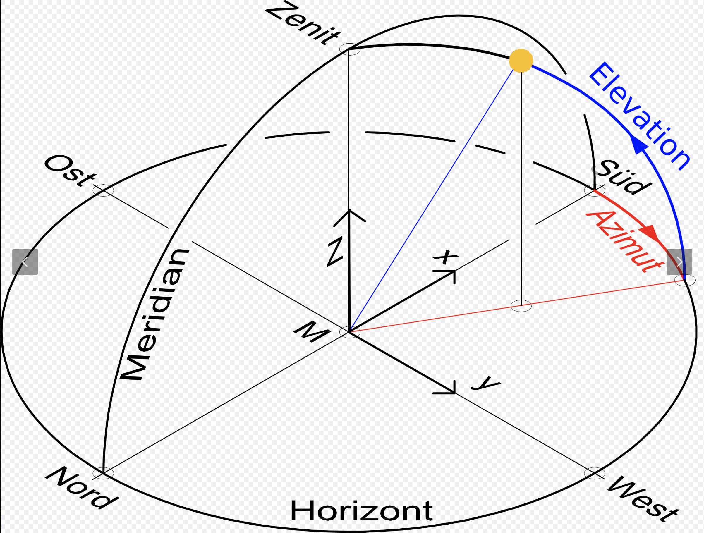

# Rechenbeispiel: Kraft und Drehmoment

Letzte Aktualisierung: 2024-10-20

## Inhaltsverzeichnis

1. [Einführung](#einführung)
2. [Grundlagen der Vektorrechnung](#grundlagen-der-vektorrechnung)
3. [Kraft als Vektor](#kraft-als-vektor)
4. [Drehmoment als Kreuzprodukt](#drehmoment-als-kreuzprodukt)
5. [Rechenbeispiel](#rechenbeispiel)
6. [Visualisierung](#visualisierung)
7. [Praktische Anwendungen](#praktische-anwendungen)
8. [Zusammenfassung](#zusammenfassung)

## Einführung

In der Physik spielen Kraft und Drehmoment eine zentrale Rolle bei der Beschreibung von mechanischen Systemen. Dieses Dokument führt in die grundlegenden Konzepte ein und demonstriert ihre Anwendung anhand eines Rechenbeispiels.

## Grundlagen der Vektorrechnung

Bevor wir uns mit Kraft und Drehmoment befassen, ist es wichtig, die Grundlagen der Vektorrechnung zu verstehen.

Ein Vektor $\mathbf{v}$ im dreidimensionalen Raum wird durch drei Komponenten dargestellt:

$$\mathbf{v} = (v_\text{x}, v_\text{y}, v_\text{z})$$

Der Betrag eines Vektors $|\mathbf{v}|$ berechnet sich als:

$$|\mathbf{v}| = \sqrt{v_\text{x}^2 + v_\text{y}^2 + v_\text{z}^2}$$

Zwei wichtige Vektoroperationen sind:

1. **Skalarprodukt**: $\mathbf{a} \cdot \mathbf{b} = a_\text{x} b_\text{x} + a_\text{y} b_\text{y} + a_\text{z} b_\text{z}$
2. **Kreuzprodukt**: $\mathbf{a} \times \mathbf{b} = (a_\text{y} b_\text{z} - a_\text{z} b_\text{y}, a_\text{z} b_\text{x} - a_\text{x} b_\text{z}, a_\text{x} b_\text{y} - a_\text{y} b_\text{x})$

## Kraft als Vektor

Eine Kraft $\mathbf{F}$ ist ein Vektor, der sowohl eine Stärke (Betrag) als auch eine Richtung hat. In der Mechanik wird die Kraft oft durch die Newtonsche Bewegungsgleichung beschrieben:

$$\mathbf{F} = m \cdot \mathbf{a}$$

wobei $m$ die Masse des Objekts und $\mathbf{a}$ der Beschleunigungsvektor ist.

## Drehmoment als Kreuzprodukt

Das Drehmoment $\mathbf{M}$ ist ein Maß für die Drehwirkung einer Kraft um einen Bezugspunkt. Es wird als Kreuzprodukt des Ortsvektors $\mathbf{r}$ (auch als Hebelarm bezeichnet) und der Kraft $\mathbf{F}$ berechnet:

$$\mathbf{M} = \mathbf{r} \times \mathbf{F}$$

Die geometrische Interpretation des Kreuzprodukts ist wichtig:

- Der resultierende Vektor $\mathbf{M}$ steht senkrecht auf der von $\mathbf{r}$ und $\mathbf{F}$ aufgespannten Ebene.
- Die Richtung von $\mathbf{M}$ folgt der Rechte-Hand-Regel.
- Der Betrag von $\mathbf{M}$ ist proportional zur Senkrechten Komponente von $\mathbf{F}$ bezüglich $\mathbf{r}$.

## Rechenbeispiel

Gegeben:

- Masse $m = 2{,}5~\text{kg}$
- Beschleunigungsvektor $\mathbf{a} = (3{,}0~\text{m/s}^2, 4{,}0~\text{m/s}^2, 0~\text{m/s}^2)$
- Ortsvektor (Hebelarm) $\mathbf{r} = (0{,}5~\text{m}, 0~\text{m}, 1{,}2~\text{m})$

### Schritt 1: Berechnung der Kraft

$$\begin{align*}
\mathbf{F} &= m \cdot \mathbf{a} \\[6pt]
&= 2{,}5~\text{kg} \cdot (3{,}0~\text{m/s}^2, 4{,}0~\text{m/s}^2, 0~\text{m/s}^2) \\[6pt]
&= (7{,}5~\text{N}, 10{,}0~\text{N}, 0~\text{N})
\end{align*}$$

### Schritt 2: Berechnung des Drehmoments

$$\begin{align*}
\mathbf{M} &= \mathbf{r} \times \mathbf{F} \\[6pt]
&= (0{,}5~\text{m}, 0~\text{m}, 1{,}2~\text{m}) \times (7{,}5~\text{N}, 10{,}0~\text{N}, 0~\text{N}) \\[6pt]
&= \begin{pmatrix}
   0 \cdot 0 - 1{,}2 \cdot 10{,}0 \\
   1{,}2 \cdot 7{,}5 - 0{,}5 \cdot 0 \\
   0{,}5 \cdot 10{,}0 - 0 \cdot 7{,}5
   \end{pmatrix} \\[6pt]
&= (-12{,}0~\text{N}\cdot\text{m}, 9{,}0~\text{N}\cdot\text{m}, 5{,}0~\text{N}\cdot\text{m})
\end{align*}$$

### Schritt 3: Berechnung der Beträge

Betrag der Kraft:
$$|\mathbf{F}| = \sqrt{7{,}5^2 + 10{,}0^2 + 0^2} \approx 12{,}5~\text{N}$$

Betrag des Drehmoments:
$$|\mathbf{M}| = \sqrt{(-12{,}0)^2 + 9{,}0^2 + 5{,}0^2} \approx 15{,}8~\text{N}\cdot\text{m}$$

## Visualisierung

Für die Visualisierung wurde das Drehmoment um den Faktor 0,3 skaliert:

$$\mathbf{M}_{\text{skaliert}} = 0{,}3 \cdot \mathbf{M} = (-3{,}6~\text{N}\cdot\text{m}, 2{,}7~\text{N}\cdot\text{m}, 1{,}5~\text{N}\cdot\text{m})$$

Die beigefügte Grafik zeigt die Vektoren $\mathbf{a}$, $\mathbf{F}$, $\mathbf{r}$ und das skalierte $\mathbf{M}$ im dreidimensionalen Raum.

## Praktische Anwendungen

1. **Maschinenbau**: Berechnung von Kräften und Drehmomenten in Getrieben und Motoren.
2. **Statik**: Analyse von Kräften und Momenten in Tragwerken und Brücken.
3. **Robotik**: Steuerung von Roboterarmen durch präzise Kraft- und Drehmomentberechnung.
4. **Biomechanik**: Untersuchung von Bewegungsabläufen und Gelenkbelastungen im menschlichen Körper.

## Zusammenfassung

- Kraft $\mathbf{F}$ ist ein Vektor, der die Stärke und Richtung einer mechanischen Einwirkung beschreibt.
- Drehmoment $\mathbf{M}$ quantifiziert die Drehwirkung einer Kraft bezüglich eines Bezugspunkts.
- Die Berechnung von $\mathbf{F}$ und $\mathbf{M}$ erfolgt durch Vektoroperationen (Multiplikation und Kreuzprodukt).
- Die Visualisierung im dreidimensionalen Raum hilft, die räumlichen Beziehungen zwischen den Vektoren zu verstehen.

## Umrechnung zwischen Betrag/Richtung und Vektorkomponenten

Ein Kraftvektor $\mathbf{F}$ kann sowohl durch seine kartesischen Komponenten als auch durch seinen Betrag und seine Richtung (üblicherweise durch Winkel in Kugelkoordinaten) dargestellt werden.

### Von Vektorkomponenten zu Betrag und Richtung

Gegeben: Kraftvektor $\mathbf{F} = (F_\text{x}, F_\text{y}, F_\text{z})$

1. **Betrag**:
   $$|\mathbf{F}| = \sqrt{F_\text{x}^2 + F_\text{y}^2 + F_\text{z}^2}$$

2. **Richtungswinkel**:
   - Azimutwinkel $\phi$ (in der x-y-Ebene, von der x-Achse gemessen):
     $$\phi = \arctan2(F_\text{y}, F_\text{x})$$
   - Polarwinkel $\theta$ (vom Zenith, d.h. von der positiven z-Achse):
     $$\theta = \arccos\left(\frac{F_\text{z}}{|\mathbf{F}|}\right)$$

   Hinweis: Die Funktion $\arctan2(y, x)$ berücksichtigt die Quadranten korrekt und gibt Werte im Bereich $[-\pi, \pi]$ zurück.

### Von Betrag und Richtung zu Vektorkomponenten

Gegeben: Betrag $|\mathbf{F}|$, Azimutwinkel $\phi$, Polarwinkel $\theta$

1. **x-Komponente**:
   $$F_\text{x} = |\mathbf{F}| \sin\theta \cos\phi$$

2. **y-Komponente**:
   $$F_\text{y} = |\mathbf{F}| \sin\theta \sin\phi$$

3. **z-Komponente**:
   $$F_\text{z} = |\mathbf{F}| \cos\theta$$

### Beispiel

Betrachten wir den Kraftvektor $\mathbf{F} = (7{,}5~\text{N}, 10{,}0~\text{N}, 0~\text{N})$:

1. Berechnung des Betrags:
   $$\begin{align*}
   |\mathbf{F}| &= \sqrt{(7{,}5~\text{N})^2 + (10{,}0~\text{N})^2 + (0~\text{N})^2} \\
   &= \sqrt{56{,}25~\text{N}^2 + 100{,}00~\text{N}^2 + 0~\text{N}^2} \\
   &= \sqrt{156{,}25~\text{N}^2} \\
   &\approx 12{,}5~\text{N}
   \end{align*}$$

2. Berechnung der Richtungswinkel:
   - Azimutwinkel $\phi$:
     $$\begin{align*}
     \phi &= \arctan2(10{,}0~\text{N}, 7{,}5~\text{N}) \\
     &\approx 0{,}9273~\text{rad} \\
     &\approx 53{,}1^\circ
     \end{align*}$$
   - Polarwinkel $\theta$:
     $$\begin{align*}
     \theta &= \arccos\left(\frac{0~\text{N}}{12{,}5~\text{N}}\right) \\
     &= \arccos(0) \\
     &= \frac{\pi}{2}~\text{rad} \\
     &= 90{,}0^\circ
     \end{align*}$$

3. Rückrechnung von Betrag und Richtung zu Vektorkomponenten:
   $$\begin{align*}
   F_\text{x} &= 12{,}5~\text{N} \cdot \sin(90{,}0^\circ) \cdot \cos(53{,}1^\circ) \\
   &\approx 12{,}5~\text{N} \cdot 1 \cdot 0{,}6 \\
   &\approx 7{,}5~\text{N} \\[6pt]
   F_\text{y} &= 12{,}5~\text{N} \cdot \sin(90{,}0^\circ) \cdot \sin(53{,}1^\circ) \\
   &\approx 12{,}5~\text{N} \cdot 1 \cdot 0{,}8 \\
   &\approx 10{,}0~\text{N} \\[6pt]
   F_\text{z} &= 12{,}5~\text{N} \cdot \cos(90{,}0^\circ) \\
   &= 12{,}5~\text{N} \cdot 0 \\
   &= 0~\text{N}
   \end{align*}$$

## Der Azimutwinkel $\phi$ (Phi)

Der Azimutwinkel $\phi$ (Phi) ist ein wichtiger Begriff bei der Beschreibung von Positionen oder Richtungen im dreidimensionalen Raum.

## Definition

Der Azimutwinkel ist der Winkel in der horizontalen Ebene (üblicherweise die x-y-Ebene), gemessen von einer Referenzrichtung (meist die positive x-Achse) gegen den Uhrzeigersinn zu der Projektion des betrachteten Punktes oder Vektors auf diese Ebene.

## Eigenschaften

- Wertebereich: Üblicherweise $0^\circ \leq \varphi < 360^\circ$ oder $-180^\circ < \varphi \leq 180^\circ$ (bzw. $0 \leq \varphi < 2\pi$ oder $-\pi < \varphi \leq \pi$ in Bogenmaß)

- In der Geographie entspricht 0° oft Norden, 90° Osten, 180° Süden und 270° Westen
- In der Mathematik und Physik ist die Referenzachse meist die positive x-Achse
