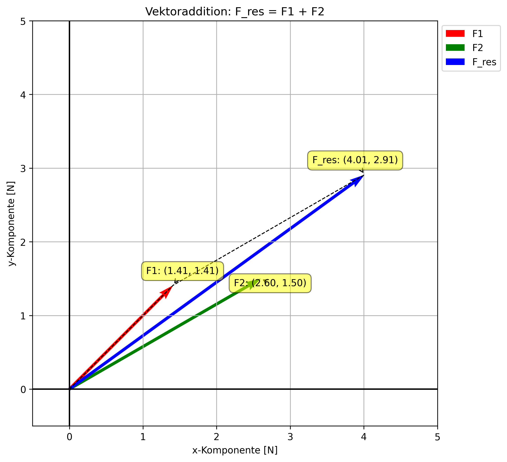

# Vektorrechnung - Koordinatendarstellung

Letzte Aktualisierung: 2024-10-21

Quelle: Rießinger, Thomas. Mathematik für Ingenieure: Eine anschauliche Einführung für das praxisorientierte Studium. 9. Auflage, Springer Vieweg, 2013.

## Inhaltsverzeichnis

- [Vektorrechnung - Koordinatendarstellung](#vektorrechnung---koordinatendarstellung)
  - [Inhaltsverzeichnis](#inhaltsverzeichnis)
  - [Prompt](#prompt)
  - [Einleitung](#einleitung)
  - [Grundlagen der Vektordarstellung](#grundlagen-der-vektordarstellung)
    - [Bemerkung: Vektoren in der Ebene und im Raum](#bemerkung-vektoren-in-der-ebene-und-im-raum)
    - [Definition: Rechtssystem und Linkssystem](#definition-rechtssystem-und-linkssystem)
  - [Eigenschaften und Operationen von Vektoren](#eigenschaften-und-operationen-von-vektoren)
    - [Satz 1: Länge eines Vektors](#satz-1-länge-eines-vektors)
    - [Satz 2: Winkelbeziehungen in der Ebene](#satz-2-winkelbeziehungen-in-der-ebene)
    - [Satz 3: Grundrechenarten für Vektoren](#satz-3-grundrechenarten-für-vektoren)
  - [Anwendungsbeispiele](#anwendungsbeispiele)
    - [Beispiel 1: Kräfteaddition in der Ebene](#beispiel-1-kräfteaddition-in-der-ebene)
    - [Beispiel 2: Vektorzerlegung in der Robotik](#beispiel-2-vektorzerlegung-in-der-robotik)
  - [Visuelle Darstellung](#visuelle-darstellung)
  - [Zusammenfassung und Ausblick](#zusammenfassung-und-ausblick)
  - [Rechenbeispiele](#rechenbeispiele)
    - [Beispiel 1: Berechnung der Länge eines Vektors in der Ebene](#beispiel-1-berechnung-der-länge-eines-vektors-in-der-ebene)
    - [Beispiel 2: Berechnung der Länge eines Vektors im Raum](#beispiel-2-berechnung-der-länge-eines-vektors-im-raum)
    - [Beispiel 3: Berechnung des Richtungswinkels eines Vektors](#beispiel-3-berechnung-des-richtungswinkels-eines-vektors)
    - [Beispiel 4: Berechnung der Koordinaten eines Vektors und seines Winkels](#beispiel-4-berechnung-der-koordinaten-eines-vektors-und-seines-winkels)
    - [Beispiel 5: Berechnung der resultierenden Kraftvektoren](#beispiel-5-berechnung-der-resultierenden-kraftvektoren)
    - [Beispiel 6: Berechnung einer Vektoroperation](#beispiel-6-berechnung-einer-vektoroperation)
    - [Beispiel 7: Berechnung der resultierenden Kraft](#beispiel-7-berechnung-der-resultierenden-kraft)
    - [Beispiel 8: Berechnung der resultierenden Kraft aus drei Vektoren](#beispiel-8-berechnung-der-resultierenden-kraft-aus-drei-vektoren)
      - [Schritt 1: Koordinatendarstellung der Kräfte](#schritt-1-koordinatendarstellung-der-kräfte)
      - [Schritt 2: Addition der Vektoren](#schritt-2-addition-der-vektoren)
      - [Schritt 3: Betrag der resultierenden Kraft](#schritt-3-betrag-der-resultierenden-kraft)
    - [Beispiel 9](#beispiel-9)

## Prompt

- Thema: Vektorrechnung / Kap. Koordinatendarstellung

- Aufgabe: Kernpunkte zusammenfassen und das Konzept etwas vertiefen
  - Ausgabe: Markdown mit LaTeX-Mathematik, beachte Sprachstil-Richtlinien

- Aufgabe: fasse alle Definitionen und Sätze zusammen

- Aufgabe: Berechne schritt-für-schritt die Lösung. Fange mit Punkt 1. an. Vergleiche Ergebnis mit der PDF.

- Visualisieren mit Python
  - Skript soll genau die Berechnungen durchführen, die in der Aufgabenstellung beschrieben sind
  - interaktiv, speichern in PNG und SVG
  - Maßstab des Plots anpassen
  - Vektorendarstellung, Koordinatenursprung (0,0,0), Pfeile und Längen
  - rechtshändiges Koordinatensystem
  - sinnvoller Name für das Python-Skript

---

## Einleitung

Die Vektorrechnung in Koordinatendarstellung ist ein fundamentales Konzept in den Ingenieurwissenschaften und der Physik. Sie ermöglicht die präzise Beschreibung und Analyse von gerichteten Größen wie Kräften, Geschwindigkeiten oder elektrischen Feldern. Für Ingenieursstudierende ist dieses Thema von großer Bedeutung, da es die Grundlage für viele fortgeschrittene Konzepte in der Mechanik, Elektrotechnik und anderen technischen Disziplinen bildet.

## Grundlagen der Vektordarstellung

### Bemerkung: Vektoren in der Ebene und im Raum

**(i) Ebene:** 
Ein Vektor $\mathbf{a}$ in der Ebene lässt sich als Linearkombination von zwei Einheitsvektoren $\mathbf{e}_1$ und $\mathbf{e}_2$ darstellen. Die Koordinatendarstellung eines Vektors $\mathbf{a}$ lautet:

$$ \mathbf{a} = a_1 \cdot \mathbf{e}_1 + a_2 \cdot \mathbf{e}_2 = \begin{pmatrix} a_1 \\ a_2 \end{pmatrix} $$

wobei $a_1$ und $a_2$ die Komponenten von $\mathbf{a}$ in den Richtungen von $\mathbf{e}_1$ und $\mathbf{e}_2$ sind. Die Einheitsvektoren haben die Koordinatendarstellungen:

$$ \mathbf{e}_1 = \begin{pmatrix} 1 \\ 0 \end{pmatrix}, \quad \mathbf{e}_2 = \begin{pmatrix} 0 \\ 1 \end{pmatrix} $$

**(ii) Raum:** 
Ein Vektor $\mathbf{a}$ im Raum hat drei Koordinaten $a_1, a_2, a_3$ und wird als Linearkombination von drei Einheitsvektoren dargestellt:

$$ \mathbf{a} = a_1 \cdot \mathbf{e}_1 + a_2 \cdot \mathbf{e}_2 + a_3 \cdot \mathbf{e}_3 = \begin{pmatrix} a_1 \\ a_2 \\ a_3 \end{pmatrix} $$

wobei die Einheitsvektoren im Raum die Koordinaten haben:

$$ \mathbf{e}_1 = \begin{pmatrix} 1 \\ 0 \\ 0 \end{pmatrix}, \quad \mathbf{e}_2 = \begin{pmatrix} 0 \\ 1 \\ 0 \end{pmatrix}, \quad \mathbf{e}_3 = \begin{pmatrix} 0 \\ 0 \\ 1 \end{pmatrix} $$

Diese Darstellung ermöglicht es uns, komplexe räumliche Beziehungen in einfache numerische Ausdrücke zu übersetzen, was besonders in der Computersimulation und numerischen Analyse von großem Nutzen ist.

### Definition: Rechtssystem und Linkssystem

Ein System von drei Vektoren $\mathbf{x}, \mathbf{y}, \mathbf{z}$ im Raum bildet ein **Rechtssystem**, wenn man die rechte Hand so halten kann, dass Daumen, Zeigefinger und Mittelfinger in Richtung von $\mathbf{x}, \mathbf{y}$ bzw. $\mathbf{z}$ zeigen. Analog wird ein **Linkssystem** definiert.

Diese Unterscheidung ist wichtig in der Physik und Technik, da viele Phänomene (z.B. elektromagnetische Felder) sich je nach verwendetem Koordinatensystem unterschiedlich verhalten können.

## Eigenschaften und Operationen von Vektoren

### Satz 1: Länge eines Vektors

Die Länge (oder der Betrag) eines Vektors $\mathbf{a}$ ist gegeben durch:

**(i) Für Vektoren in der Ebene:**
$$ |\mathbf{a}| = \sqrt{a_1^2 + a_2^2} $$

**(ii) Für Vektoren im Raum:**
$$ |\mathbf{a}| = \sqrt{a_1^2 + a_2^2 + a_3^2} $$

Diese Formel ist eine Verallgemeinerung des Satzes des Pythagoras und findet Anwendung in vielen Bereichen, von der Berechnung von Entfernungen bis zur Bestimmung von Kräften in der Mechanik.

### Satz 2: Winkelbeziehungen in der Ebene

Ein Vektor $\mathbf{a}$ in der Ebene, dessen Anfangspunkt der Nullpunkt ist und der mit der positiven x-Achse den Winkel $\varphi$ bildet, hat die Komponenten:

$$ a_1 = |\mathbf{a}| \cdot \cos(\varphi), \quad a_2 = |\mathbf{a}| \cdot \sin(\varphi) $$

wobei $|\mathbf{a}|$ der Betrag des Vektors ist. Diese Beziehung ist besonders nützlich in der Physik und Ingenieurwissenschaft, wenn Kräfte oder Bewegungen in verschiedene Richtungen zerlegt werden müssen.

### Satz 3: Grundrechenarten für Vektoren

Die Grundrechenarten für Vektoren in der Koordinatendarstellung lauten:

**(i) Addition und Subtraktion:**
$$ \begin{pmatrix} a_1 \\ a_2 \\ a_3 \end{pmatrix} \pm \begin{pmatrix} b_1 \\ b_2 \\ b_3 \end{pmatrix} = \begin{pmatrix} a_1 \pm b_1 \\ a_2 \pm b_2 \\ a_3 \pm b_3 \end{pmatrix} $$

**(ii) Skalare Multiplikation:**
$$ \lambda \cdot \begin{pmatrix} a_1 \\ a_2 \\ a_3 \end{pmatrix} = \begin{pmatrix} \lambda \cdot a_1 \\ \lambda \cdot a_2 \\ \lambda \cdot a_3 \end{pmatrix}, \quad \lambda \in \mathbb{R} $$

Diese Operationen bilden die Grundlage für komplexere Berechnungen in der Vektoranalysis und finden Anwendung in verschiedenen Bereichen wie der Statik, Dynamik und Elektromagnetismus.

## Anwendungsbeispiele

### Beispiel 1: Kräfteaddition in der Ebene

Ein Objekt wird von zwei Kräften beeinflusst: $\mathbf{F}_1$ mit $2{,}0~\text{N}$ unter $45^\circ$ und $\mathbf{F}_2$ mit $3{,}0~\text{N}$ unter $30^\circ$ zur x-Achse. Berechnen Sie die resultierende Kraft.

**Lösung:**

1. Bestimmung der Vektorkomponenten:
   $\mathbf{F}_1 = \begin{pmatrix} 2{,}0 \cdot \cos(45^\circ) \\ 2{,}0 \cdot \sin(45^\circ) \end{pmatrix} = \begin{pmatrix} 1{,}41 \\ 1{,}41 \end{pmatrix}~\text{N}$
   $\mathbf{F}_2 = \begin{pmatrix} 3{,}0 \cdot \cos(30^\circ) \\ 3{,}0 \cdot \sin(30^\circ) \end{pmatrix} = \begin{pmatrix} 2{,}60 \\ 1{,}50 \end{pmatrix}~\text{N}$

2. Addition der Kräfte:
   $\mathbf{F}_\text{res} = \mathbf{F}_1 + \mathbf{F}_2 = \begin{pmatrix} 4{,}01 \\ 2{,}91 \end{pmatrix}~\text{N}$

3. Berechnung des Betrags und der Richtung:
   $|\mathbf{F}_\text{res}| = \sqrt{4{,}01^2 + 2{,}91^2} \approx 4{,}96~\text{N}$
   $\varphi = \arctan\left(\frac{2{,}91}{4{,}01}\right) \approx 36{,}0^\circ$

Die resultierende Kraft hat also einen Betrag von $4{,}96~\text{N}$ und wirkt unter einem Winkel von $36{,}0^\circ$ zur x-Achse.

### Beispiel 2: Vektorzerlegung in der Robotik

Ein Roboterarm soll ein Objekt mit einer Kraft von $10{,}0~\text{N}$ unter einem Winkel von $60^\circ$ zur Horizontalen anheben. Berechnen Sie die horizontale und vertikale Komponente der Kraft.

**Lösung:**

$\mathbf{F} = \begin{pmatrix} 10{,}0 \cdot \cos(60^\circ) \\ 10{,}0 \cdot \sin(60^\circ) \end{pmatrix} = \begin{pmatrix} 5{,}00 \\ 8{,}66 \end{pmatrix}~\text{N}$

Die horizontale Komponente beträgt $5{,}00~\text{N}$, die vertikale $8{,}66~\text{N}$.

## Visuelle Darstellung

Dieses Python-Skript erstellt eine visuelle Darstellung der Vektoraddition aus Beispiel 1. Es zeigt die Vektoren $\mathbf{F}_1$, $\mathbf{F}_2$ und den resultierenden Vektor $\mathbf{F}_\text{res}$ in einem zweidimensionalen Koordinatensystem.

## Zusammenfassung und Ausblick

Die Vektorrechnung in Koordinatendarstellung ist ein grundlegendes Werkzeug in den Ingenieurwissenschaften und der Physik. Sie ermöglicht die präzise Beschreibung und Manipulation von gerichteten Größen in zwei- und dreidimensionalen Räumen. Die vorgestellten Konzepte und Beispiele zeigen, wie dieses mathematische Werkzeug auf praktische Probleme angewendet werden kann.

In weiterführenden Studien bauen komplexere Konzepte wie Vektorfelder, Gradienten und Rotationen auf diesen Grundlagen auf. Diese finden Anwendung in der Strömungsmechanik, Elektromagnetismus und vielen anderen Bereichen der Ingenieurwissenschaften.

Das Verständnis der Vektorrechnung in Koordinatendarstellung ist daher nicht nur für die unmittelbare Anwendung wichtig, sondern bildet auch die Basis für fortgeschrittene mathematische Methoden in der Ingenieurspraxis.

## Rechenbeispiele

### Beispiel 1: Berechnung der Länge eines Vektors in der Ebene

Gegeben sei der Vektor $a = \begin{pmatrix} 3 \\ 4 \end{pmatrix}$. Es soll die Länge des Vektors berechnet werden.

**Schritt 1: Bestimme die Komponenten**

- Die x-Komponente von $a$ ist $a_1 = 3$
- Die y-Komponente von $a$ ist $a_2 = 4$

**Schritt 2: Verwende die Formel für die Länge eines Vektors in der Ebene**
$$
|a| = \sqrt{a_1^2 + a_2^2}
$$
Setze die Werte von $a_1$ und $a_2$ in die Formel ein:
$$
|a| = \sqrt{3^2 + 4^2} = \sqrt{9 + 16} = \sqrt{25} = 5
$$

**Ergebnis:**
Die Länge des Vektors $a$ beträgt $5$.

---

### Beispiel 2: Berechnung der Länge eines Vektors im Raum

Gegeben sei der Vektor $b = \begin{pmatrix} 1 \\ -2 \\ 4 \end{pmatrix}$. Es soll die Länge des Vektors berechnet werden.

**Schritt 1: Bestimme die Komponenten**
- Die x-Komponente von $b$ ist $b_1 = 1$
- Die y-Komponente von $b$ ist $b_2 = -2$
- Die z-Komponente von $b$ ist $b_3 = 4$

**Schritt 2: Verwende die Formel für die Länge eines Vektors im Raum**
$$
|b| = \sqrt{b_1^2 + b_2^2 + b_3^2}
$$
Setze die Werte von $b_1$, $b_2$ und $b_3$ in die Formel ein:
$$
|b| = \sqrt{1^2 + (-2)^2 + 4^2} = \sqrt{1 + 4 + 16} = \sqrt{21} \approx 4,583
$$

**Ergebnis:**
Die Länge des Vektors $b$ beträgt ungefähr $4,583$.

---

### Beispiel 3: Berechnung des Richtungswinkels eines Vektors

Gegeben sei der Vektor $a = \begin{pmatrix} 3 \\ 4 \end{pmatrix}$. Der Winkel $\varphi$, den der Vektor mit der positiven x-Achse bildet, soll berechnet werden.

**Schritt 1: Berechne die Länge des Vektors**
Aus Beispiel 1 wissen wir bereits, dass die Länge von $a$ $|a| = 5$ beträgt.

**Schritt 2: Verwende die Formel für die Komponenten in Abhängigkeit vom Winkel**
$$
a_1 = |a| \cdot \cos(\varphi), \quad a_2 = |a| \cdot \sin(\varphi)
$$

**Schritt 3: Bestimme den Cosinus und Sinus des Winkels**
- Aus $a_1 = 3$ und $|a| = 5$ folgt:
  $$
  \cos(\varphi) = \frac{a_1}{|a|} = \frac{3}{5} = 0,6
  $$
- Aus $a_2 = 4$ und $|a| = 5$ folgt:
  $$
  \sin(\varphi) = \frac{a_2}{|a|} = \frac{4}{5} = 0,8
  $$

**Schritt 4: Bestimme den Winkel $\varphi$**
Verwende einen Taschenrechner, um den Winkel $\varphi$ zu bestimmen:
$$
\varphi = \arccos(0,6) \approx 53,13^\circ
$$

**Ergebnis:**
Der Winkel $\varphi$, den der Vektor $a$ mit der x-Achse bildet, beträgt $53,13^\circ$.

### Beispiel 4: Berechnung der Koordinaten eines Vektors und seines Winkels

Gegeben sei der Vektor $b = \begin{pmatrix} -1 \\ 2 \end{pmatrix}$. Es soll die Länge des Vektors sowie der Winkel $\varphi$, den der Vektor mit der positiven x-Achse bildet, berechnet werden.

**Schritt 1: Berechne die Länge des Vektors**

Verwende die Formel für die Länge eines Vektors in der Ebene:
$$
|b| = \sqrt{b_1^2 + b_2^2}
$$
Setze die Werte von $b_1 = -1$ und $b_2 = 2$ ein:
$$
|b| = \sqrt{(-1)^2 + 2^2} = \sqrt{1 + 4} = \sqrt{5} \approx 2,236
$$

**Schritt 2: Verwende die Formel für die Komponenten in Abhängigkeit vom Winkel**

Die Komponenten des Vektors sind durch $b_1 = |b| \cdot \cos(\varphi)$ und $b_2 = |b| \cdot \sin(\varphi)$ gegeben.

Berechne den Cosinus und den Sinus des Winkels:
- $b_1 = -1$, daher gilt:
  $$
  \cos(\varphi) = \frac{b_1}{|b|} = \frac{-1}{2,236} \approx -0,447
  $$
- $b_2 = 2$, daher gilt:
  $$
  \sin(\varphi) = \frac{b_2}{|b|} = \frac{2}{2,236} \approx 0,894
  $$

**Schritt 3: Berechne den Winkel $\varphi$**

Verwende einen Taschenrechner, um den Winkel $\varphi$ zu berechnen:
$$
\varphi = \arccos(-0,447) \approx 116,57^\circ
$$

**Ergebnis:**
Die Länge des Vektors beträgt $|b| \approx 2,236$, und der Winkel $\varphi$, den der Vektor mit der x-Achse bildet, beträgt $116,57^\circ$.

---

### Beispiel 5: Berechnung der resultierenden Kraftvektoren

Gegeben sind zwei Kräfte $\vec{F}_1$ und $\vec{F}_2$, die an einem Massenpunkt angreifen. Die Beträge und Winkel der Kräfte sind:
- $\vec{F}_1$: Betrag $|F_1| = 2$, Winkel $\varphi_1 = 30^\circ$
- $\vec{F}_2$: Betrag $|F_2| = 2$, Winkel $\varphi_2 = 90^\circ$

Es sollen die Koordinatendarstellungen der Kräfte $\vec{F}_1$ und $\vec{F}_2$ sowie die resultierende Kraft $\vec{F} = \vec{F}_1 + \vec{F}_2$ berechnet werden.

**Schritt 1: Berechne die Komponenten von $\vec{F}_1$**

Verwende die Formeln $F_1 = \begin{pmatrix} F_{1x} \\ F_{1y} \end{pmatrix}$, wobei:
$$
F_{1x} = |F_1| \cdot \cos(\varphi_1), \quad F_{1y} = |F_1| \cdot \sin(\varphi_1)
$$
Setze die Werte für $|F_1| = 2$, $\cos(30^\circ) = \frac{\sqrt{3}}{2}$ und $\sin(30^\circ) = \frac{1}{2}$ ein:
$$
F_{1x} = 2 \cdot \frac{\sqrt{3}}{2} = \sqrt{3}, \quad F_{1y} = 2 \cdot \frac{1}{2} = 1
$$
Somit ist:
$$
\vec{F}_1 = \begin{pmatrix} \sqrt{3} \\ 1 \end{pmatrix}
$$

**Schritt 2: Berechne die Komponenten von $\vec{F}_2$**

Verwende die gleichen Formeln wie in Schritt 1 für $\vec{F}_2$, wobei $\varphi_2 = 90^\circ$ ist:
$$
F_{2x} = |F_2| \cdot \cos(90^\circ) = 2 \cdot 0 = 0, \quad F_{2y} = |F_2| \cdot \sin(90^\circ) = 2 \cdot 1 = 2
$$
Somit ist:
$$
\vec{F}_2 = \begin{pmatrix} 0 \\ 2 \end{pmatrix}
$$

**Schritt 3: Berechne die resultierende Kraft $\vec{F} = \vec{F}_1 + \vec{F}_2$**

Addiere die Komponenten der beiden Kräfte:
$$
\vec{F} = \begin{pmatrix} \sqrt{3} \\ 1 \end{pmatrix} + \begin{pmatrix} 0 \\ 2 \end{pmatrix} = \begin{pmatrix} \sqrt{3} \\ 3 \end{pmatrix}
$$

**Schritt 4: Berechne die Länge der resultierenden Kraft**

Verwende die Formel für die Länge eines Vektors in der Ebene:
$$
|\vec{F}| = \sqrt{F_x^2 + F_y^2} = \sqrt{(\sqrt{3})^2 + 3^2} = \sqrt{3 + 9} = \sqrt{12} \approx 3,464
$$

**Schritt 5: Berechne den Winkel $\varphi$ der resultierenden Kraft**

Berechne den Cosinus und Sinus des Winkels:
$$
\cos(\varphi) = \frac{F_x}{|\vec{F}|} = \frac{\sqrt{3}}{3,464} \approx 0,5, \quad \sin(\varphi) = \frac{F_y}{|\vec{F}|} = \frac{3}{3,464} \approx 0,866
$$
Der Winkel beträgt:
$$
\varphi = \arccos(0,5) = 60^\circ
$$

**Ergebnis:**
Die resultierende Kraft beträgt $|\vec{F}| \approx 3,464$ und wirkt unter einem Winkel von $60^\circ$.

### Beispiel 6: Berechnung einer Vektoroperation

Gegeben ist die Vektoroperation:
$$
2 \cdot \begin{pmatrix} 1 \\ -1 \\ 2 \end{pmatrix} - 3 \cdot \begin{pmatrix} 1 \\ -2 \\ 0 \end{pmatrix} + \begin{pmatrix} 3 \\ 2 \\ -5 \end{pmatrix}
$$
Diese Vektoroperation soll schrittweise gelöst werden.

**Schritt 1: Skalar-Multiplikation**

Multipliziere die Vektoren mit den entsprechenden Skalaren:
$$
2 \cdot \begin{pmatrix} 1 \\ -1 \\ 2 \end{pmatrix} = \begin{pmatrix} 2 \\ -2 \\ 4 \end{pmatrix}, \quad 3 \cdot \begin{pmatrix} 1 \\ -2 \\ 0 \end{pmatrix} = \begin{pmatrix} 3 \\ -6 \\ 0 \end{pmatrix}
$$

**Schritt 2: Subtrahiere die beiden Vektoren**

Subtrahiere den zweiten Vektor vom ersten:
$$
\begin{pmatrix} 2 \\ -2 \\ 4 \end{pmatrix} - \begin{pmatrix} 3 \\ -6 \\ 0 \end{pmatrix} = \begin{pmatrix} 2 - 3 \\ -2 - (-6) \\ 4 - 0 \end{pmatrix} = \begin{pmatrix} -1 \\ 4 \\ 4 \end{pmatrix}
$$

**Schritt 3: Addiere den dritten Vektor**

Addiere den verbleibenden Vektor:
$$
\begin{pmatrix} -1 \\ 4 \\ 4 \end{pmatrix} + \begin{pmatrix} 3 \\ 2 \\ -5 \end{pmatrix} = \begin{pmatrix} -1 + 3 \\ 4 + 2 \\ 4 + (-5) \end{pmatrix} = \begin{pmatrix} 2 \\ 6 \\ -1 \end{pmatrix}
$$

**Ergebnis:**
Das Ergebnis der Vektoroperation lautet:
$$
\begin{pmatrix} 2 \\ 6 \\ -1 \end{pmatrix}
$$

### Beispiel 7: Berechnung der resultierenden Kraft

In diesem Beispiel geht es um die Berechnung der resultierenden Kraft $\vec{F}$ durch die Addition zweier Kräfte $\vec{F}_1$ und $\vec{F}_2$.

**Gegeben:**
- $\vec{F}_1 = \begin{pmatrix} \sqrt{3} \\ 1 \end{pmatrix}$
- $\vec{F}_2 = \begin{pmatrix} 0 \\ 2 \end{pmatrix}$

**Aufgabe:**
Berechne die resultierende Kraft $\vec{F} = \vec{F}_1 + \vec{F}_2$.

**Schritt 1: Addition der Vektoren**

Die beiden Vektoren werden komponentenweise addiert:
$$
\vec{F} = \vec{F}_1 + \vec{F}_2 = \begin{pmatrix} \sqrt{3} \\ 1 \end{pmatrix} + \begin{pmatrix} 0 \\ 2 \end{pmatrix}
$$
$$
= \begin{pmatrix} \sqrt{3} + 0 \\ 1 + 2 \end{pmatrix} = \begin{pmatrix} \sqrt{3} \\ 3 \end{pmatrix}
$$

**Schritt 2: Berechnung des Betrags der resultierenden Kraft**

Der Betrag eines Vektors $\vec{F} = \begin{pmatrix} F_x \\ F_y \end{pmatrix}$ berechnet sich nach der Formel:
$$
|\vec{F}| = \sqrt{F_x^2 + F_y^2}
$$
Setze die Komponenten von $\vec{F}$ ein:
$$
|\vec{F}| = \sqrt{(\sqrt{3})^2 + 3^2} = \sqrt{3 + 9} = \sqrt{12} = 2\sqrt{3}
$$

**Schritt 3: Berechnung des Winkels $\varphi$**

Um den Winkel $\varphi$ zu berechnen, unter dem die resultierende Kraft angreift, verwenden wir die Beziehung:
$$
\cos \varphi = \frac{F_x}{|\vec{F}|}, \quad \sin \varphi = \frac{F_y}{|\vec{F}|}
$$
Setze die Werte für $\vec{F}_x$ und $\vec{F}_y$ sowie den Betrag $|\vec{F}|$ ein:
$$
\cos \varphi = \frac{\sqrt{3}}{2\sqrt{3}} = \frac{1}{2}, \quad \sin \varphi = \frac{3}{2\sqrt{3}} = \frac{\sqrt{3}}{2}
$$
Da $\cos \varphi = \frac{1}{2}$ und $\sin \varphi = \frac{\sqrt{3}}{2}$, folgt:
$$
\varphi = 60^\circ
$$

**Ergebnis:**
Die resultierende Kraft $\vec{F}$ hat den Betrag $2\sqrt{3}$ und greift unter einem Winkel von $60^\circ$ an.

### Beispiel 8: Berechnung der resultierenden Kraft aus drei Vektoren

In diesem Beispiel sollen drei Kräfte $\vec{F}_1$, $\vec{F}_2$ und $\vec{F}_3$ vektoriell addiert werden, um die resultierende Kraft $\vec{F}$ zu bestimmen.

**Gegeben:**
- $\vec{F}_1$ hat einen Betrag von $2 \, \text{N}$ und einen Winkel von $0^\circ$,
- $\vec{F}_2$ hat einen Betrag von $3 \, \text{N}$ und einen Winkel von $30^\circ$,
- $\vec{F}_3$ hat einen Betrag von $1 \, \text{N}$ und einen Winkel von $135^\circ$.

**Aufgabe:**
Berechne die resultierende Kraft $\vec{F} = \vec{F}_1 + \vec{F}_2 + \vec{F}_3$.

---

#### Schritt 1: Koordinatendarstellung der Kräfte

Für jede Kraft muss die Koordinatendarstellung ermittelt werden. Die Koordinaten einer Kraft $\vec{F}_i = \begin{pmatrix} F_{i_x} \\ F_{i_y} \end{pmatrix}$ lassen sich mithilfe von Sinus und Cosinus berechnen:

$$
F_{i_x} = |\vec{F}_i| \cdot \cos(\varphi_i), \quad F_{i_y} = |\vec{F}_i| \cdot \sin(\varphi_i)
$$

---

**Kraft $\vec{F}_1$:**
$$
\vec{F}_1 = 2 \, \text{N}, \quad \varphi_1 = 0^\circ
$$
$$
F_{1_x} = 2 \cdot \cos(0^\circ) = 2, \quad F_{1_y} = 2 \cdot \sin(0^\circ) = 0
$$
$$
\vec{F}_1 = \begin{pmatrix} 2 \\ 0 \end{pmatrix}
$$

---

**Kraft $\vec{F}_2$:**
$$
\vec{F}_2 = 3 \, \text{N}, \quad \varphi_2 = 30^\circ
$$
$$
F_{2_x} = 3 \cdot \cos(30^\circ) = 3 \cdot \frac{\sqrt{3}}{2} = \frac{3\sqrt{3}}{2}, \quad F_{2_y} = 3 \cdot \sin(30^\circ) = 3 \cdot \frac{1}{2} = \frac{3}{2}
$$
$$
\vec{F}_2 = \begin{pmatrix} \frac{3\sqrt{3}}{2} \\ \frac{3}{2} \end{pmatrix}
$$

---

**Kraft $\vec{F}_3$:**
$$
\vec{F}_3 = 1 \, \text{N}, \quad \varphi_3 = 135^\circ
$$
$$
F_{3_x} = 1 \cdot \cos(135^\circ) = 1 \cdot \left(-\frac{\sqrt{2}}{2}\right) = -\frac{\sqrt{2}}{2}, \quad F_{3_y} = 1 \cdot \sin(135^\circ) = 1 \cdot \frac{\sqrt{2}}{2} = \frac{\sqrt{2}}{2}
$$
$$
\vec{F}_3 = \begin{pmatrix} -\frac{\sqrt{2}}{2} \\ \frac{\sqrt{2}}{2} \end{pmatrix}
$$

---

#### Schritt 2: Addition der Vektoren

Nun addieren wir die drei Vektoren $\vec{F}_1$, $\vec{F}_2$ und $\vec{F}_3$ komponentenweise:

$$
\vec{F} = \vec{F}_1 + \vec{F}_2 + \vec{F}_3
$$

**x-Komponente:**
$$
F_x = 2 + \frac{3\sqrt{3}}{2} + \left(-\frac{\sqrt{2}}{2}\right) = 2 + \frac{3\sqrt{3}}{2} - \frac{\sqrt{2}}{2}
$$

**y-Komponente:**
$$
F_y = 0 + \frac{3}{2} + \frac{\sqrt{2}}{2} = \frac{3}{2} + \frac{\sqrt{2}}{2}
$$

---

#### Schritt 3: Betrag der resultierenden Kraft

Der Betrag des Vektors $\vec{F} = \begin{pmatrix} F_x \\ F_y \end{pmatrix}$ wird berechnet mit:

$$
|\vec{F}| = \sqrt{F_x^2 + F_y^2}
$$

Setze die Werte von $F_x$ und $F_y$ ein, um den Betrag der resultierenden Kraft zu berechnen. Da hier die exakten Werte in Wurzelform vorliegen, empfiehlt sich eine numerische Berechnung, um das Ergebnis zu präzisieren.

1. **Berechnung der resultierenden Kraft $\vec{F}$**:

$$
\vec{F} = \begin{pmatrix} 2 \\ 0 \end{pmatrix} + \begin{pmatrix} \frac{3\sqrt{3}}{2} \\ \frac{3}{2} \end{pmatrix} + \begin{pmatrix} -\frac{\sqrt{2}}{2} \\ \frac{\sqrt{2}}{2} \end{pmatrix}
$$

Numerisch ergibt das:

$$
\vec{F} = \begin{pmatrix} 2 + 2{,}598 - 0{,}707 \\ 1{,}5 + 0{,}707 \end{pmatrix} = \begin{pmatrix} 3{,}891 \\ 2{,}207 \end{pmatrix}
$$

2. **Berechnung des Betrags der resultierenden Kraft**:

$$
|\vec{F}| = \sqrt{3{,}891^2 + 2{,}207^2} = \sqrt{15{,}137 + 4{,}874} = \sqrt{20{,}011} \approx 4{,}473 \, \text{N}
$$

3. **Berechnung des Winkels $\varphi$**:

$$
\cos \varphi = \frac{3{,}891}{4{,}473} \approx 0{,}87, \quad \sin \varphi = \frac{2{,}207}{4{,}473} \approx 0{,}493
$$

Da die resultierende Kraft im ersten Quadranten liegt, beträgt der Winkel:

$$
\varphi = \arctan \left(\frac{2{,}207}{3{,}891}\right) \approx 29{,}54^\circ
$$

**Ergebnis**: Die resultierende Kraft $\vec{F}$ hat einen Betrag von $4{,}473 \, \text{N}$ und greift unter einem Winkel von $29{,}54^\circ$ an.

Die Schritte und Werte sind korrekt.

### Beispiel 9

Gegeben:
- Zwei Kräfte $\vec{F}_1$ und $\vec{F}_2$ greifen an einen Massenpunkt an und ergeben eine resultierende Kraft $\vec{F}$.
- $\vec{F}_1$ hat einen Betrag von $2 \, \text{N}$ und wirkt unter einem Winkel von $45^\circ$, während $\vec{F}$ einen Betrag von $1 \, \text{N}$ hat und unter einem Winkel von $180^\circ$ wirkt.
- Gesucht ist $\vec{F}_2$.

Schritt 1: Koordinaten der Kräfte bestimmen.

Für $\vec{F}_1 = \begin{pmatrix} a_1 \\ a_2 \end{pmatrix}$:

$$
a_1 = |\vec{F}_1| \cdot \cos(45^\circ) = 2 \cdot \frac{1}{\sqrt{2}} = \sqrt{2}, \quad a_2 = |\vec{F}_1| \cdot \sin(45^\circ) = 2 \cdot \frac{1}{\sqrt{2}} = \sqrt{2}
$$

Also:

$$
\vec{F}_1 = \begin{pmatrix} \sqrt{2} \\ \sqrt{2} \end{pmatrix}
$$

Für $\vec{F} = \begin{pmatrix} c_1 \\ c_2 \end{pmatrix}$:

$$
c_1 = |\vec{F}| \cdot \cos(180^\circ) = 1 \cdot (-1) = -1, \quad c_2 = |\vec{F}| \cdot \sin(180^\circ) = 1 \cdot 0 = 0
$$

Also:

$$
\vec{F} = \begin{pmatrix} -1 \\ 0 \end{pmatrix}
$$

Schritt 2: $\vec{F}_2$ berechnen.

$$
\vec{F}_2 = \vec{F} - \vec{F}_1 = \begin{pmatrix} -1 \\ 0 \end{pmatrix} - \begin{pmatrix} \sqrt{2} \\ \sqrt{2} \end{pmatrix} = \begin{pmatrix} -1 - \sqrt{2} \\ 0 - \sqrt{2} \end{pmatrix} = \begin{pmatrix} -1{,}414 - \sqrt{2} \\ -1{,}414 \end{pmatrix}
$$

Schritt 3: Betrag von $\vec{F}_2$ berechnen.

$$
|\vec{F}_2| = \sqrt{(-1{,}414 - \sqrt{2})^2 + (-\sqrt{2})^2} \approx \sqrt{7{,}828} \approx 2{,}798 \, \text{N}
$$

Schritt 4: Winkel $\varphi$ von $\vec{F}_2$ bestimmen.

$$
\cos \varphi = \frac{-1{,}414 - \sqrt{2}}{2{,}798} \approx -0{,}863, \quad \sin \varphi = \frac{-1{,}414}{2{,}798} \approx -0{,}505
$$

Winkel $\varphi$:

$$
\varphi = 210{,}34^\circ
$$

**Ergebnis:**

$\vec{F}_2$ hat einen Betrag von $2{,}798 \, \text{N}$ und wirkt unter einem Winkel von $210{,}34^\circ$.
