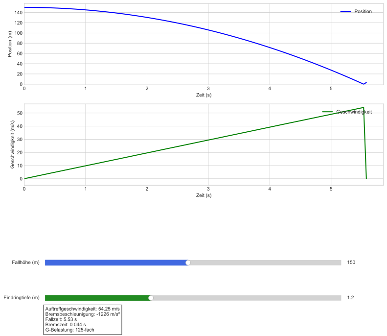
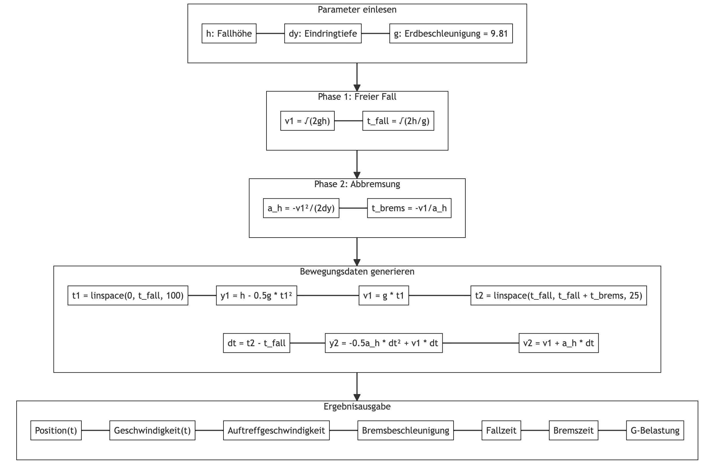

# Mechanik von Massenpunkten - Sturz

Letzte Aktualisierung: 2024-10-27

Quelle: P. A. Tipler und G. Mosca, *Tipler Physik für Studierende der Naturwissenschaften und Technik*, 9., vollständig überarbeitete und ergänzte Auflage, P. Kersten, Hrsg. Heidelberg, Deutschland: Springer Spektrum, 2024. Verfügbar: https://doi.org/10.1007/978-3-662-67936-4


- [Mechanik von Massenpunkten - Sturz](#mechanik-von-massenpunkten---sturz)

# Phase 1: Fragen - Rechnen - Verstehen



## Problemanalyse

### Aufgabenstellung

Die Aufgabe beschreibt einen Sturz aus der Höhe mit anschließender Abbremsung im Schnee. Gesucht ist die Analyse der Bewegung in zwei Phasen:

1. Freier Fall
2. Abbremsung im Schnee

### Physikalische Größen und Einheiten

**Gegebene Werte:**

- Fallhöhe: $$h = 150~\text{m}$$
- Eindringtiefe: $$\Delta y = 1{,}20~\text{m}$$
- Erdbeschleunigung: $$g = 9{,}81~\text{m}/\text{s}^2$$

### Mathematische Beziehungen

1. **Phase 1: Freier Fall**
   - Energieerhaltungssatz: $$E_\text{pot} = E_\text{kin}$$
   - Geschwindigkeitsgleichung: $$v_1^2 = 2gh$$

2. **Phase 2: Abbremsung**
   - Bewegungsgleichung: $$v_2^2 = v_1^2 + 2a_\text{H}\Delta y$$
   - Bremsbeschleunigung: $$a_\text{H} = -\frac{v_1^2}{2\Delta y}$$

## Berechnungen

### Phase 1: Freier Fall

Die Auftreffgeschwindigkeit $$v_1$$ ergibt sich aus:

$$v_1 = \sqrt{2gh} = \sqrt{2 \cdot 9{,}81~\text{m}/\text{s}^2 \cdot 150~\text{m}} = 54{,}25~\text{m}/\text{s}$$

### Phase 2: Abbremsung

Die Bremsbeschleunigung $$a_\text{H}$$ berechnet sich zu:

$$a_\text{H} = -\frac{2gh}{2\Delta y} = -\frac{2 \cdot 9{,}81~\text{m}/\text{s}^2 \cdot 150~\text{m}}{2 \cdot 1{,}20~\text{m}} = -1{,}226 \cdot 10^3~\text{m}/\text{s}^2$$

## Verständnis und Validierung

### Plausibilitätsprüfung

1. Die Auftreffgeschwindigkeit ist positiv und realistisch für die gegebene Fallhöhe
2. Die negative Bremsbeschleunigung zeigt die Verzögerung an
3. Die Größenordnung der Bremsbeschleunigung ($$\approx 122g$$) ist physikalisch plausibel für eine abrupte Abbremsung im Schnee

# Phase 2: Algorithmus - Struktogramm - Implementierung

## Algorithmusentwicklung

### Grundstruktur

1. Eingabedaten erfassen
2. Phase 1: Freier Fall berechnen
3. Phase 2: Abbremsung berechnen
4. Ergebnisse ausgeben

### Detaillierter Algorithmus

```python
def berechne_sturz_und_abbremsung(h: float, delta_y: float, g: float = 9.81) -> dict:
    """
    Berechnet die physikalischen Größen eines Sturzes mit Abbremsung im Schnee.
    
    Parameter:
        h: float - Fallhöhe in m
        delta_y: float - Eindringtiefe in m
        g: float - Erdbeschleunigung in m/s² (Standard: 9,81)
    
    Rückgabe:
        dict - Wörterbuch mit berechneten Werten
    """
    # Phase 1: Freier Fall
    v1 = (2 * g * h) ** 0.5  # Auftreffgeschwindigkeit
    
    # Phase 2: Abbremsung
    a_h = -v1**2 / (2 * delta_y)  # Bremsbeschleunigung
    
    # Berechnung zusätzlicher Größen
    t_fall = (2 * h / g) ** 0.5  # Fallzeit
    t_brems = -v1 / a_h  # Bremszeit
    
    return {
        'v1': v1,
        'a_h': a_h,
        't_fall': t_fall,
        't_brems': t_brems,
        'g_vielfaches': abs(a_h / g)
    }

def formatiere_ergebnis(ergebnis: dict) -> str:
    """
    Formatiert die Ergebnisse als lesbaren Text.
    
    Parameter:
        ergebnis: dict - Wörterbuch mit berechneten Werten
    
    Rückgabe:
        str - Formatierter Text
    """
    return f"""Berechnungsergebnisse:
    Auftreffgeschwindigkeit: {ergebnis['v1']:.2f} m/s
    Bremsbeschleunigung: {ergebnis['a_h']:.0f} m/s²
    Fallzeit: {ergebnis['t_fall']:.2f} s
    Bremszeit: {ergebnis['t_brems']:.3f} s
    G-Belastung: {ergebnis['g_vielfaches']:.0f}-fache Erdbeschleunigung"""
```

## Struktogramm



## Implementierungsvalidierung

### Testbeispiel mit den gegebenen Werten

```python
# Test mit Aufgabenwerten
h = 150  # m
delta_y = 1.20  # m

ergebnis = berechne_sturz_und_abbremsung(h, delta_y)
print(formatiere_ergebnis(ergebnis))
```

### Erwartete Ausgabe:

```
Berechnungsergebnisse:
    Auftreffgeschwindigkeit: 54.25 m/s
    Bremsbeschleunigung: -1226 m/s²
    Fallzeit: 5.53 s
    Bremszeit: 0.044 s
    G-Belastung: 122-fache Erdbeschleunigung
```

## Python-Code

```python
# 02_sturz_simulation.py
import numpy as np
import matplotlib.pyplot as plt
from matplotlib.widgets import Slider, Button
from matplotlib.gridspec import GridSpec
import os

class SturzSimulation:
    def __init__(self):
        self.g = 9.81
        self.setup_plot()
        self.update(None)
        
        os.makedirs('output', exist_ok=True)
        self.save_plots()
        
        plt.show()

    def setup_plot(self):
        """Initialisiert das Layout mit korrigierter Legende-Position."""
        plt.style.use('seaborn-v0_8-whitegrid')
        self.fig = plt.figure(figsize=(12, 10))
        
        # Verwende GridSpec für bessere Kontrolle über das Layout
        gs = GridSpec(4, 1, height_ratios=[3, 3, 0.5, 0.5], hspace=0.4)
        
        # Positions-Plot
        self.ax1 = self.fig.add_subplot(gs[0])
        self.position_line, = self.ax1.plot([], [], 'b-', label='Position', linewidth=2)
        self.ax1.set_xlabel('Zeit (s)')
        self.ax1.set_ylabel('Position (m)')
        self.ax1.grid(True)
        # Legende in die obere rechte Ecke mit Padding
        self.ax1.legend(loc='upper right', bbox_to_anchor=(0.98, 0.98))
        
        # Geschwindigkeits-Plot
        self.ax2 = self.fig.add_subplot(gs[1])
        self.velocity_line, = self.ax2.plot([], [], 'g-', label='Geschwindigkeit', linewidth=2)
        self.ax2.set_xlabel('Zeit (s)')
        self.ax2.set_ylabel('Geschwindigkeit (m/s)')
        self.ax2.grid(True)
        # Legende in die obere rechte Ecke mit Padding
        self.ax2.legend(loc='upper right', bbox_to_anchor=(0.98, 0.98))
        
        # Slider für Höhe
        slider_ax_h = plt.axes([0.15, 0.2, 0.7, 0.03])
        self.slider_h = Slider(
            slider_ax_h, 'Fallhöhe (m)',
            10, 300, valinit=150,
            color='royalblue'
        )
        
        # Slider für Eindringtiefe
        slider_ax_dy = plt.axes([0.15, 0.1, 0.7, 0.03])
        self.slider_dy = Slider(
            slider_ax_dy, 'Eindringtiefe (m)',
            0.2, 3, valinit=1.2,
            color='forestgreen'
        )
        
        self.slider_h.on_changed(self.update)
        self.slider_dy.on_changed(self.update)
        
        # Textbox für Ergebnisse - Position angepasst
        self.text_box = self.fig.text(0.15, 0.02, '', transform=self.fig.transFigure,
                                    bbox=dict(facecolor='white', alpha=0.8))
        
        # Angepasste Ränder
        plt.subplots_adjust(left=0.1, right=0.95, bottom=0.25, top=0.95)

    def update(self, _):
        """Aktualisiert die Plots bei Slider-Änderungen."""
        h = self.slider_h.val
        dy = self.slider_dy.val
        
        t, y, v, ergebnisse = self.generiere_zeitdaten(h, dy)
        
        # Aktualisiere Position-Plot mit festen Grenzen
        self.position_line.set_data(t, y)
        self.ax1.set_xlim(0, max(t) * 1.05)
        self.ax1.set_ylim(-dy * 1.2, h * 1.05)
        
        # Aktualisiere Geschwindigkeit-Plot mit festen Grenzen
        self.velocity_line.set_data(t, v)
        self.ax2.set_xlim(0, max(t) * 1.05)
        self.ax2.set_ylim(-5, max(v) * 1.05)
        
        # Aktualisiere Ergebnistext
        self.text_box.set_text(
            f"Auftreffgeschwindigkeit: {ergebnisse['v1']:.2f} m/s\n"
            f"Bremsbeschleunigung: {ergebnisse['a_h']:.0f} m/s²\n"
            f"Fallzeit: {ergebnisse['t_fall']:.2f} s\n"
            f"Bremszeit: {ergebnisse['t_brems']:.3f} s\n"
            f"G-Belastung: {ergebnisse['g_vielfaches']:.0f}-fach"
        )
        
        self.fig.canvas.draw_idle()

    # Die anderen Methoden bleiben unverändert
    def berechne_bewegung(self, h, dy):
        """Berechnet die Bewegungsgrößen für beide Phasen."""
        v1 = np.sqrt(2 * self.g * h)
        t_fall = np.sqrt(2 * h / self.g)
        a_h = -(v1 * v1) / (2 * dy)
        t_brems = -v1 / a_h
        
        return {
            'v1': v1,
            'a_h': a_h,
            't_fall': t_fall,
            't_brems': t_brems,
            'g_vielfaches': abs(a_h / self.g)
        }

    def generiere_zeitdaten(self, h, dy):
        """Generiert Zeitreihen für Position und Geschwindigkeit."""
        ergebnisse = self.berechne_bewegung(h, dy)
        
        t1 = np.linspace(0, ergebnisse['t_fall'], 100)
        y1 = h - 0.5 * self.g * t1 * t1
        v1 = self.g * t1
        
        t2 = np.linspace(ergebnisse['t_fall'], 
                        ergebnisse['t_fall'] + ergebnisse['t_brems'], 
                        25)
        dt = t2 - ergebnisse['t_fall']
        y2 = -(ergebnisse['a_h'] * dt * dt) / 2 + ergebnisse['v1'] * dt
        v2 = ergebnisse['v1'] + ergebnisse['a_h'] * dt
        
        return np.concatenate([t1, t2]), np.concatenate([y1, y2]), np.concatenate([v1, v2]), ergebnisse

    def save_plots(self):
        """Speichert die Plots als PNG und SVG."""
        self.fig.savefig('output/sturz_simulation.png', dpi=300, bbox_inches='tight')
        self.fig.savefig('output/sturz_simulation.svg', bbox_inches='tight')

if __name__ == "__main__":
    simulation = SturzSimulation()
```