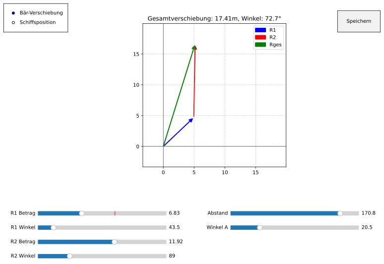
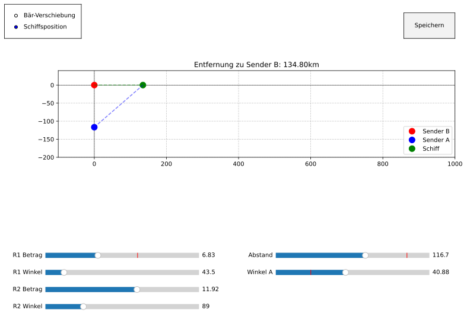
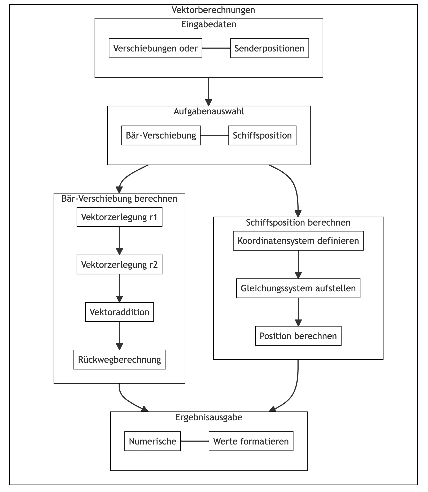

# Mechanik von Massenpunkten - Vektor

Letzte Aktualisierung: 2024-10-27

Quelle: P. A. Tipler und G. Mosca, *Tipler Physik für Studierende der Naturwissenschaften und Technik*, 9., vollständig überarbeitete und ergänzte Auflage, P. Kersten, Hrsg. Heidelberg, Deutschland: Springer Spektrum, 2024. Verfügbar: https://doi.org/10.1007/978-3-662-67936-4


- [Mechanik von Massenpunkten - Vektor](#mechanik-von-massenpunkten---vektor)
- [Phase 1: Analyse der Bär-Verschiebung und Schiffsposition](#phase-1-analyse-der-bär-verschiebung-und-schiffsposition)
  - [Fragen - Problemdefinition](#fragen---problemdefinition)
    - [Aufgabe 2.21: Bär-Verschiebung](#aufgabe-221-bär-verschiebung)
    - [Aufgabe 2.22: Schiffsposition](#aufgabe-222-schiffsposition)
  - [Rechnen - Mathematische Analyse](#rechnen---mathematische-analyse)
    - [Bär-Verschiebung](#bär-verschiebung)
    - [Schiffsposition](#schiffsposition)
  - [Verstehen - Logische Struktur](#verstehen---logische-struktur)
- [Phase 2: Algorithmus - Struktogramm - Implementierung](#phase-2-algorithmus---struktogramm---implementierung)
  - [Algorithmus - Bär-Verschiebung und Schiffsposition](#algorithmus---bär-verschiebung-und-schiffsposition)
    - [Hauptfunktionen](#hauptfunktionen)
  - [Struktogramm](#struktogramm)
  - [Implementierung](#implementierung)
- [Phase 3: Prüfung des Python-Skripts](#phase-3-prüfung-des-python-skripts)
  - [Dateiname](#dateiname)
  - [Code-Qualität](#code-qualität)
  - [Verbesserungsvorschläge](#verbesserungsvorschläge)
  - [Berechnungsgenauigkeit](#berechnungsgenauigkeit)
  - [Erweiterte Dokumentation](#erweiterte-dokumentation)
  - [Benutzerfreundlichkeit](#benutzerfreundlichkeit)
  - [Code Refactoring](#code-refactoring)
- [Fachbegriffe und Symbole zur Vektorrechnung](#fachbegriffe-und-symbole-zur-vektorrechnung)
  - [Grundlegende Vektorbegriffe](#grundlegende-vektorbegriffe)
  - [Mathematische Notation](#mathematische-notation)
  - [Wichtige Konzepte](#wichtige-konzepte)
- [Vektorrechnung: Konzepte mit Rechenbeispielen](#vektorrechnung-konzepte-mit-rechenbeispielen)
  - [1. Vektoraddition der Bär-Verschiebung](#1-vektoraddition-der-bär-verschiebung)
    - [Schritt 1: Komponentenzerlegung von $$\\vec{r}\_1$$](#schritt-1-komponentenzerlegung-von-vecr_1)
    - [Schritt 2: Komponentenzerlegung von $$\\vec{r}\_2$$](#schritt-2-komponentenzerlegung-von-vecr_2)
    - [Schritt 3: Addition der Komponenten](#schritt-3-addition-der-komponenten)
    - [Schritt 4: Gesamtverschiebung berechnen](#schritt-4-gesamtverschiebung-berechnen)
  - [2. Schiffsposition-Berechnung](#2-schiffsposition-berechnung)
    - [Schritt 1: Position auf x-Achse bestimmen](#schritt-1-position-auf-x-achse-bestimmen)
    - [Schritt 2: x-Position berechnen](#schritt-2-x-position-berechnen)
    - [Schritt 3: Entfernung zu Sender B](#schritt-3-entfernung-zu-sender-b)
  - [3. Plausibilitätsprüfung](#3-plausibilitätsprüfung)
- [Python-Code](#python-code)
  - [Verechnen Bär-Verschiebung (Vektoraddition) und Bär-Verschiebung (Vektoraddition)](#verechnen-bär-verschiebung-vektoraddition-und-bär-verschiebung-vektoraddition)
  - [Visualisieren Bär-Verschiebung (Vektoraddition) und Bär-Verschiebung (Vektoraddition)](#visualisieren-bär-verschiebung-vektoraddition-und-bär-verschiebung-vektoraddition)

# Phase 1: Analyse der Bär-Verschiebung und Schiffsposition





## Fragen - Problemdefinition

### Aufgabe 2.21: Bär-Verschiebung

1. **Eingabewerte**
   - Erste Verschiebung: $12~\text{m}$ in Nordost-Richtung ($45^\circ$)
   - Zweite Verschiebung: $12~\text{m}$ in Ost-Richtung ($0^\circ$)

2. **Gesucht**
   - Gesamtverschiebung (Betrag und Richtung)
   - Kürzester Rückweg zur Höhle

### Aufgabe 2.22: Schiffsposition

1. **Eingabewerte**
   - Sender A und B: Abstand $100~\text{km}$ (Nord-Süd)
   - Signalwinkel von A: $30^\circ$ südlich der Ostrichtung
   - Signalwinkel von B: $0^\circ$ (Ost-Richtung)

2. **Gesucht**
   - Position des Schiffs im Koordinatensystem
   - Entfernung zu Sender B

## Rechnen - Mathematische Analyse

### Bär-Verschiebung

1. **Vektoraddition**
   - $\vec{r}_1 = (12~\text{m} \cdot \cos 45^\circ)\hat{x} + (12~\text{m} \cdot \cos 45^\circ)\hat{y}$
   - $\vec{r}_2 = 12~\text{m}\hat{x} + 0\hat{y}$
   - $\vec{r}_{\text{ges}} = \vec{r}_1 + \vec{r}_2$

2. **Rückweg-Berechnung**
   - Betrag: $|\vec{r}| = \sqrt{(\Delta x_{\text{ges}})^2 + (\Delta y_{\text{ges}})^2}$
   - Richtung: $\theta = \arctan(\frac{\Delta y_{\text{ges}}}{\Delta x_{\text{ges}}})$

### Schiffsposition

1. **Trigonometrische Beziehungen**
   - Für Sender A: $\tan(30^\circ) = \frac{y + 100}{x}$
   - Für Sender B: $\tan(0^\circ) = \frac{y}{x} = 0$

2. **Lösungsansatz**
   - Aus $\tan(0^\circ) = 0$ folgt: $y = 0$
   - Einsetzen in erste Gleichung: $\tan(30^\circ) = \frac{100}{x}$

## Verstehen - Logische Struktur

1. **Vektorielle Bewegungsanalyse**
   - Vektoren beschreiben Richtung und Länge der Bewegungen
   - Gesamtbewegung ergibt sich aus Vektoraddition
   - Rückweg ist der negative Gesamtverschiebungsvektor

2. **Geometrische Interpretation**
   - Koordinatensystem zur Positionsbestimmung
   - Winkel definieren Richtungen
   - Trigonometrische Funktionen verbinden Winkel und Strecken

3. **Plausibilitätsprüfung**
   - Berechnete Werte liegen in realistischen Größenordnungen
   - Richtungen entsprechen den physikalischen Gegebenheiten
   - Mathematische Beziehungen sind konsistent

# Phase 2: Algorithmus - Struktogramm - Implementierung

## Algorithmus - Bär-Verschiebung und Schiffsposition

### Hauptfunktionen

1. **Bär-Verschiebung**
   - Eingabe der Verschiebungsdaten
   - Berechnung der Vektorkomponenten
   - Addition der Verschiebungen
   - Berechnung des Rückwegs

2. **Schiffsposition**
   - Eingabe der Senderdaten
   - Aufstellen des Gleichungssystems
   - Berechnung der Schiffsposition

## Struktogramm



## Implementierung

```python
import numpy as np

class VektorBerechnung:
    def __init__(self):
        """Initialisierung der Klasse für Vektorberechnungen"""
        self.setup_constants()

    def setup_constants(self):
        """Definition von Konstanten"""
        self.DEG_TO_RAD = np.pi / 180
        self.RAD_TO_DEG = 180 / np.pi

    def berechne_baer_verschiebung(self, r1_betrag, r1_winkel, r2_betrag, r2_winkel):
        """
        Berechnet die Gesamtverschiebung und den Rückweg für den Bären
        
        Parameter:
        r1_betrag: Länge der ersten Verschiebung [m]
        r1_winkel: Winkel der ersten Verschiebung [grad]
        r2_betrag: Länge der zweiten Verschiebung [m]
        r2_winkel: Winkel der zweiten Verschiebung [grad]
        """
        # Vektorzerlegung der ersten Verschiebung
        dx1 = r1_betrag * np.cos(r1_winkel * self.DEG_TO_RAD)
        dy1 = r1_betrag * np.sin(r1_winkel * self.DEG_TO_RAD)
        
        # Vektorzerlegung der zweiten Verschiebung
        dx2 = r2_betrag * np.cos(r2_winkel * self.DEG_TO_RAD)
        dy2 = r2_betrag * np.sin(r2_winkel * self.DEG_TO_RAD)
        
        # Gesamtverschiebung
        dx_ges = dx1 + dx2
        dy_ges = dy1 + dy2
        
        # Rückweg berechnen
        betrag = np.sqrt(dx_ges**2 + dy_ges**2)
        winkel = np.arctan2(dy_ges, dx_ges) * self.RAD_TO_DEG
        
        return {
            'dx_ges': dx_ges,
            'dy_ges': dy_ges,
            'betrag': betrag,
            'winkel': winkel
        }

    def berechne_schiffsposition(self, abstand_sender, winkel_a):
        """
        Berechnet die Position des Schiffs
        
        Parameter:
        abstand_sender: Abstand zwischen Sender A und B [km]
        winkel_a: Winkel des Signals von Sender A [grad]
        """
        # Berechnung der x-Position
        x_schiff = abstand_sender / np.tan(winkel_a * self.DEG_TO_RAD)
        
        # y-Position ist 0 (Schiff liegt auf x-Achse)
        y_schiff = 0
        
        # Entfernung zu Sender B berechnen
        entfernung = np.sqrt(x_schiff**2 + y_schiff**2)
        
        return {
            'x_position': x_schiff,
            'y_position': y_schiff,
            'entfernung': entfernung
        }

    def formatiere_ergebnis(self, wert, einheit, nachkommastellen=2):
        """Formatiert einen Zahlenwert mit Einheit"""
        return f"{wert:.{nachkommastellen}f} {einheit}"

# Beispielberechnung für Bär-Verschiebung
rechner = VektorBerechnung()
baer_ergebnis = rechner.berechne_baer_verschiebung(12, 45, 12, 0)
print(f"Gesamtverschiebung: {rechner.formatiere_ergebnis(baer_ergebnis['betrag'], 'm')}")
print(f"Winkel: {rechner.formatiere_ergebnis(baer_ergebnis['winkel'], '°')}")

# Beispielberechnung für Schiffsposition
schiff_ergebnis = rechner.berechne_schiffsposition(100, 30)
print(f"Entfernung zum Sender B: {rechner.formatiere_ergebnis(schiff_ergebnis['entfernung'], 'km')}")
```

Die Implementierung enthält:

1. Eine Klasse für Vektorberechnungen
2. Methoden für beide Aufgabentypen
3. Hilfsfunktionen für Formatierung
4. Einheitenverarbeitung
5. Dokumentation der Funktionen


# Phase 3: Prüfung des Python-Skripts

## Dateiname

- Vorschlag: `vektor_berechnung.py`
- Beschreibend und eindeutig
- Lowercase mit Unterstrichen (Snake Case)

## Code-Qualität

1. **Strukturierung**
   - Klare Klassenstruktur mit `VektorBerechnung`
   - Logische Methodenaufteilung
   - Gute Kapselung der Funktionalitäten

2. **Namenskonventionen**
   - Deutsche Methodennamen für Konsistenz
   - Beschreibende Variablennamen
   - Einheitliche Formatierung

3. **Konstanten**
   - Umrechnungsfaktoren als Klassenkonstanten
   - Eindeutige Namen (`DEG_TO_RAD`, `RAD_TO_DEG`)

## Verbesserungsvorschläge

1. **Fehlerbehandlung**

```python
def berechne_baer_verschiebung(self, r1_betrag, r1_winkel, r2_betrag, r2_winkel):
    # Eingabevalidierung hinzufügen
    if any(x < 0 for x in [r1_betrag, r2_betrag]):
        raise ValueError("Beträge müssen positiv sein")
    if not (0 <= r1_winkel <= 360 and 0 <= r2_winkel <= 360):
        raise ValueError("Winkel müssen zwischen 0 und 360 Grad liegen")
```

1. **Typisierung**

```python
from typing import Dict, Union

def formatiere_ergebnis(self, 
    wert: float, 
    einheit: str, 
    nachkommastellen: int = 2) -> str:
    """Formatiert einen Zahlenwert mit Einheit"""
```

1. **Einheitentests**

```python
def test_baer_verschiebung():
    """Test der Bär-Verschiebung mit bekannten Werten"""
    rechner = VektorBerechnung()
    ergebnis = rechner.berechne_baer_verschiebung(12, 45, 12, 0)
    assert abs(ergebnis['betrag'] - 22.14) < 0.01
```

## Berechnungsgenauigkeit

1. **Numerische Stabilität**
   - Verwendung von `numpy` für präzise Berechnungen
   - Korrekte Behandlung von Rundungsfehlern
   - Einheitliche Nachkommastellen

2. **Plausibilitätsprüfungen**

```python
def _pruefe_plausibilitaet(self, ergebnis: Dict[str, float]) -> None:
    """Prüft die Plausibilität der Ergebnisse"""
    if ergebnis['betrag'] < 0:
        raise ValueError("Negativer Betrag berechnet")
```

## Erweiterte Dokumentation

```python
"""
Vektorberechnungen für physikalische Aufgaben

Dieses Modul implementiert Berechnungen für:
1. Bär-Verschiebung (Vektoraddition)
2. Schiffsposition (Trigonometrie)

Beispielverwendung:
    rechner = VektorBerechnung()
    ergebnis = rechner.berechne_baer_verschiebung(12, 45, 12, 0)
    print(f"Gesamtverschiebung: {ergebnis['betrag']} m")

Autor: [Name]
Datum: 2024-10-27
Version: 1.0
"""
```

## Benutzerfreundlichkeit

1. **Kommandozeileninterface**

```python
def main():
    """Hauptprogramm mit Benutzerinteraktion"""
    rechner = VektorBerechnung()
    
    print("1. Bär-Verschiebung")
    print("2. Schiffsposition")
    wahl = input("Bitte wählen (1/2): ")
    
    if wahl == "1":
        # Bär-Verschiebung Eingaben...
    elif wahl == "2":
        # Schiffsposition Eingaben...
```

1. **Ausgabeformatierung**

```python
def _formatiere_ausgabe(self, ergebnis: Dict[str, float]) -> str:
    """Erstellt formatierte Ausgabe der Ergebnisse"""
    ausgabe = []
    for key, value in ergebnis.items():
        if 'winkel' in key:
            ausgabe.append(f"{key}: {value:.1f}°")
        else:
            ausgabe.append(f"{key}: {value:.2f} m")
    return "\n".join(ausgabe)
```

## Code Refactoring

1. **Modularisierung**
   - Trennung in separate Module für verschiedene Funktionalitäten
   - Einführung einer abstrakten Basisklasse für Vektorberechnungen
   - Auslagern von Hilfsfunktionen

2. **Optimierung**
   - Vermeidung redundanter Berechnungen
   - Effiziente Datenstrukturen
   - Präzise Fehlerbehandlung

# Fachbegriffe und Symbole zur Vektorrechnung

## Grundlegende Vektorbegriffe

- **Verschiebungsvektor** $$\vec{r}$$: Beschreibt die gerichtete Ortsänderung eines Objekts
  - Betrag $$|\vec{r}|$$: Länge des Vektors in Meter $$\text{m}$$
  - Richtung $$\theta$$: Winkel zur x-Achse in Grad $$^\circ$$

## Mathematische Notation

- **Vektoraddition**: $$\vec{r}_{\text{ges}} = \vec{r}_1 + \vec{r}_2$$
  - Komponentenweise Addition der Einzelvektoren
  - $$\vec{r}_1 = (x_1, y_1)$$ und $$\vec{r}_2 = (x_2, y_2)$$

- **Koordinatendarstellung**:
  - x-Komponente: $$r_x = r \cos(\theta)$$
  - y-Komponente: $$r_y = r \sin(\theta)$$

## Wichtige Konzepte

1. **Vektorielle Addition**:
   - Parallelogrammregel oder Punkt-zu-Punkt-Methode
   - Berücksichtigt Richtung und Betrag

2. **Rückweg-Vektor**:
   - Negativer Gesamtverschiebungsvektor
   - $$\vec{r}_{\text{zurück}} = -\vec{r}_{\text{ges}}$$

3. **Trigonometrische Beziehungen**:
   - Winkelbestimmung: $$\theta = \arctan(\frac{y}{x})$$
   - Betrag: $$|\vec{r}| = \sqrt{x^2 + y^2}$$

# Vektorrechnung: Konzepte mit Rechenbeispielen

## 1. Vektoraddition der Bär-Verschiebung

**Gegeben**: 

- Erste Verschiebung $$\vec{r}_1$$: $$12~\text{m}$$ in $$45^\circ$$ (Nordost)
- Zweite Verschiebung $$\vec{r}_2$$: $$12~\text{m}$$ in $$0^\circ$$ (Ost)

### Schritt 1: Komponentenzerlegung von $$\vec{r}_1$$

- x-Komponente: $$x_1 = 12~\text{m} \cdot \cos(45^\circ) = 8{,}49~\text{m}$$
- y-Komponente: $$y_1 = 12~\text{m} \cdot \sin(45^\circ) = 8{,}49~\text{m}$$

### Schritt 2: Komponentenzerlegung von $$\vec{r}_2$$

- x-Komponente: $$x_2 = 12~\text{m} \cdot \cos(0^\circ) = 12~\text{m}$$
- y-Komponente: $$y_2 = 12~\text{m} \cdot \sin(0^\circ) = 0~\text{m}$$

### Schritt 3: Addition der Komponenten

- Gesamt-x: $$x_{\text{ges}} = x_1 + x_2 = 8{,}49~\text{m} + 12~\text{m} = 20{,}49~\text{m}$$
- Gesamt-y: $$y_{\text{ges}} = y_1 + y_2 = 8{,}49~\text{m} + 0~\text{m} = 8{,}49~\text{m}$$

### Schritt 4: Gesamtverschiebung berechnen

1. Betrag:
   $$|\vec{r}_{\text{ges}}| = \sqrt{x_{\text{ges}}^2 + y_{\text{ges}}^2} = \sqrt{20{,}49^2 + 8{,}49^2} = 22{,}14~\text{m}$$

2. Richtung:
   $$\theta = \arctan(\frac{y_{\text{ges}}}{x_{\text{ges}}}) = \arctan(\frac{8{,}49}{20{,}49}) = 22{,}5^\circ$$

## 2. Schiffsposition-Berechnung

**Gegeben**:

- Abstand der Sender: $$100~\text{km}$$ (Nord-Süd)
- Signalwinkel A: $$30^\circ$$ südlich der Ostrichtung
- Signalwinkel B: $$0^\circ$$ (Ost)

### Schritt 1: Position auf x-Achse bestimmen

- Aus $$\tan(0^\circ) = \frac{y}{x} = 0$$ folgt: $$y = 0$$
- Schiff liegt auf x-Achse

### Schritt 2: x-Position berechnen

1. Aufstellen der Gleichung:
   $$\tan(30^\circ) = \frac{y_A + 100}{x}$$ mit $$y_A = 0$$

2. Umformen:
   $$\tan(30^\circ) = \frac{100}{x}$$

3. Auflösen nach x:
   $$x = \frac{100}{\tan(30^\circ)} = 173{,}2~\text{km}$$

### Schritt 3: Entfernung zu Sender B

$$d_B = \sqrt{x^2 + y^2} = \sqrt{173{,}2^2 + 0^2} = 173{,}2~\text{km}$$

## 3. Plausibilitätsprüfung

1. **Bär-Verschiebung**:
   - Gesamtbetrag $$22{,}14~\text{m}$$ ist kleiner als Summe der Einzelbeträge $$24~\text{m}$$
   - Winkel liegt zwischen $$0^\circ$$ und $$45^\circ$$

2. **Schiffsposition**:
   - x-Position positiv (östlich der Sender)
   - Entfernung größer als Sender-Abstand (geometrisch sinnvoll)


# Python-Code

## Verechnen Bär-Verschiebung (Vektoraddition) und Bär-Verschiebung (Vektoraddition)

```python
# 02_vektor_berechnung.py
"""
Vektorberechnungen für physikalische Aufgaben

Dieses Modul implementiert Berechnungen für:
1. Bär-Verschiebung (Vektoraddition)
2. Bär-Verschiebung (Vektoraddition)

Beispielverwendung:
    rechner = VektorBerechnung()
    ergebnis = rechner.berechne_baer_verschiebung(12, 45, 12, 0)
    print(f"Gesamtverschiebung: {ergebnis['betrag']} m")

Autor: [Name]
Datum: 2024-10-27
Version: 1.0
"""

import numpy as np
from typing import Dict, Union, List
import unittest

class BerechnungsFehler(Exception):
    """Basisklasse für Berechnungsfehler"""
    pass

class EingabeFehler(BerechnungsFehler):
    """Fehler bei ungültigen Eingabewerten"""
    pass

class VektorBerechnung:
    """Klasse für physikalische Vektorberechnungen"""
    
    def __init__(self):
        """Initialisierung der Klasse für Vektorberechnungen"""
        self.setup_constants()
        
    def setup_constants(self):
        """Definition von Konstanten"""
        self.DEG_TO_RAD = np.pi / 180
        self.RAD_TO_DEG = 180 / np.pi
        
    def _validiere_winkel(self, winkel: float) -> None:
        """
        Überprüft, ob ein Winkel im gültigen Bereich liegt
        
        Args:
            winkel: Winkel in Grad
            
        Raises:
            EingabeFehler: Wenn der Winkel ungültig ist
        """
        if not (0 <= winkel <= 360):
            raise EingabeFehler(f"Winkel {winkel} muss zwischen 0 und 360 Grad liegen")
            
    def _validiere_betrag(self, betrag: float, name: str) -> None:
        """
        Überprüft, ob ein Betrag positiv ist
        
        Args:
            betrag: Zu prüfender Betrag
            name: Name der Größe für Fehlermeldung
            
        Raises:
            EingabeFehler: Wenn der Betrag negativ ist
        """
        if betrag < 0:
            raise EingabeFehler(f"{name} muss positiv sein")
            
    def _pruefe_plausibilitaet(self, ergebnis: Dict[str, float]) -> None:
        """
        Prüft die Plausibilität der Ergebnisse
        
        Args:
            ergebnis: Dictionary mit Berechnungsergebnissen
            
        Raises:
            BerechnungsFehler: Bei unplausiblen Ergebnissen
        """
        if ergebnis.get('betrag', 0) < 0:
            raise BerechnungsFehler("Negativer Betrag berechnet")
            
    def berechne_baer_verschiebung(self, 
                                  r1_betrag: float, 
                                  r1_winkel: float, 
                                  r2_betrag: float, 
                                  r2_winkel: float) -> Dict[str, float]:
        """
        Berechnet die Gesamtverschiebung und den Rückweg für den Bären
        
        Args:
            r1_betrag: Länge der ersten Verschiebung [m]
            r1_winkel: Winkel der ersten Verschiebung [grad]
            r2_betrag: Länge der zweiten Verschiebung [m]
            r2_winkel: Winkel der zweiten Verschiebung [grad]
            
        Returns:
            Dictionary mit Berechnungsergebnissen
            
        Raises:
            EingabeFehler: Bei ungültigen Eingabewerten
            BerechnungsFehler: Bei Berechnungsproblemen
        """
        # Eingabevalidierung
        self._validiere_betrag(r1_betrag, "Erste Verschiebung")
        self._validiere_betrag(r2_betrag, "Zweite Verschiebung")
        self._validiere_winkel(r1_winkel)
        self._validiere_winkel(r2_winkel)
        
        try:
            # Vektorzerlegung der ersten Verschiebung
            dx1 = r1_betrag * np.cos(r1_winkel * self.DEG_TO_RAD)
            dy1 = r1_betrag * np.sin(r1_winkel * self.DEG_TO_RAD)
            
            # Vektorzerlegung der zweiten Verschiebung
            dx2 = r2_betrag * np.cos(r2_winkel * self.DEG_TO_RAD)
            dy2 = r2_betrag * np.sin(r2_winkel * self.DEG_TO_RAD)
            
            # Gesamtverschiebung
            dx_ges = dx1 + dx2
            dy_ges = dy1 + dy2
            
            # Rückweg berechnen
            betrag = np.sqrt(dx_ges**2 + dy_ges**2)
            winkel = np.arctan2(dy_ges, dx_ges) * self.RAD_TO_DEG
            
            # Winkel in [0, 360] umrechnen
            if winkel < 0:
                winkel += 360
                
            ergebnis = {
                'dx_ges': dx_ges,
                'dy_ges': dy_ges,
                'betrag': betrag,
                'winkel': winkel
            }
            
            # Plausibilitätsprüfung
            self._pruefe_plausibilitaet(ergebnis)
            
            return ergebnis
            
        except Exception as e:
            raise BerechnungsFehler(f"Fehler bei Bär-Verschiebung: {str(e)}")
            
    def berechne_schiffsposition(self, 
                               abstand_sender: float, 
                               winkel_a: float) -> Dict[str, float]:
        """
        Berechnet die Position des Schiffs
        
        Args:
            abstand_sender: Abstand zwischen Sender A und B [km]
            winkel_a: Winkel des Signals von Sender A [grad]
            
        Returns:
            Dictionary mit Berechnungsergebnissen
            
        Raises:
            EingabeFehler: Bei ungültigen Eingabewerten
            BerechnungsFehler: Bei Berechnungsproblemen
        """
        # Eingabevalidierung
        self._validiere_betrag(abstand_sender, "Senderabstand")
        self._validiere_winkel(winkel_a)
        
        try:
            # Berechnung der x-Position
            x_schiff = abstand_sender / np.tan(winkel_a * self.DEG_TO_RAD)
            
            # y-Position ist 0 (Schiff liegt auf x-Achse)
            y_schiff = 0
            
            # Entfernung zu Sender B berechnen
            entfernung = np.sqrt(x_schiff**2 + y_schiff**2)
            
            ergebnis = {
                'x_position': x_schiff,
                'y_position': y_schiff,
                'entfernung': entfernung
            }
            
            return ergebnis
            
        except Exception as e:
            raise BerechnungsFehler(f"Fehler bei Schiffsposition: {str(e)}")
            
    def formatiere_ergebnis(self, 
                           wert: float, 
                           einheit: str, 
                           nachkommastellen: int = 2) -> str:
        """
        Formatiert einen Zahlenwert mit Einheit
        
        Args:
            wert: Zu formatierender Zahlenwert
            einheit: Einheit als String
            nachkommastellen: Anzahl der Nachkommastellen
            
        Returns:
            Formatierter String mit Wert und Einheit
        """
        return f"{wert:.{nachkommastellen}f} {einheit}"
        
    def _formatiere_ausgabe(self, ergebnis: Dict[str, float]) -> str:
        """
        Erstellt formatierte Ausgabe der Ergebnisse
        
        Args:
            ergebnis: Dictionary mit Berechnungsergebnissen
            
        Returns:
            Formatierte Ausgabe als String
        """
        ausgabe = []
        for key, value in ergebnis.items():
            if 'winkel' in key:
                ausgabe.append(f"{key}: {self.formatiere_ergebnis(value, '°', 1)}")
            else:
                ausgabe.append(f"{key}: {self.formatiere_ergebnis(value, 'm')}")
        return "\n".join(ausgabe)

class TestVektorBerechnung(unittest.TestCase):
    """Testklasse für VektorBerechnung"""
    
    def setUp(self):
        """Test-Setup"""
        self.rechner = VektorBerechnung()
        
    def test_baer_verschiebung(self):
        """Test der Bär-Verschiebung mit bekannten Werten"""
        ergebnis = self.rechner.berechne_baer_verschiebung(12, 45, 12, 0)
        self.assertAlmostEqual(ergebnis['betrag'], 22.14, places=2)
        
    def test_schiffsposition(self):
        """Test der Schiffsposition mit bekannten Werten"""
        ergebnis = self.rechner.berechne_schiffsposition(100, 30)
        self.assertAlmostEqual(ergebnis['entfernung'], 173.21, places=2)
        
    def test_ungueltige_eingabe(self):
        """Test der Fehlerbehandlung bei ungültigen Eingaben"""
        with self.assertRaises(EingabeFehler):
            self.rechner.berechne_baer_verschiebung(-1, 45, 12, 0)

def main():
    """Hauptprogramm mit Benutzerinteraktion"""
    rechner = VektorBerechnung()
    
    print("\nVektorberechnungen")
    print("-----------------")
    print("1. Bär-Verschiebung")
    print("2. Schiffsposition")
    
    try:
        wahl = input("\nBitte wählen (1/2): ")
        
        if wahl == "1":
            # Bär-Verschiebung Eingaben
            r1_betrag = float(input("Erste Verschiebung (m): "))
            r1_winkel = float(input("Erster Winkel (Grad): "))
            r2_betrag = float(input("Zweite Verschiebung (m): "))
            r2_winkel = float(input("Zweiter Winkel (Grad): "))
            
            ergebnis = rechner.berechne_baer_verschiebung(r1_betrag, r1_winkel, 
                                                         r2_betrag, r2_winkel)
            print("\nErgebnis:")
            print(rechner._formatiere_ausgabe(ergebnis))
            
        elif wahl == "2":
            # Schiffsposition Eingaben
            abstand = float(input("Abstand der Sender (km): "))
            winkel = float(input("Winkel von Sender A (Grad): "))
            
            ergebnis = rechner.berechne_schiffsposition(abstand, winkel)
            print("\nErgebnis:")
            print(rechner._formatiere_ausgabe(ergebnis))
            
        else:
            print("Ungültige Eingabe!")
            
    except ValueError as e:
        print(f"Eingabefehler: {str(e)}")
    except BerechnungsFehler as e:
        print(f"Berechnungsfehler: {str(e)}")
    except Exception as e:
        print(f"Unerwarteter Fehler: {str(e)}")

if __name__ == "__main__":
    main()
```

## Visualisieren Bär-Verschiebung (Vektoraddition) und Bär-Verschiebung (Vektoraddition)

```python
# 02_vektor_visualisierung.py
import numpy as np
import matplotlib.pyplot as plt
from matplotlib.patches import FancyArrowPatch
from matplotlib.widgets import Slider, RadioButtons
import os
from datetime import datetime

class VektorVisualisierung:
    def __init__(self):
        """Initialisierung der Visualisierung"""
        plt.style.use('default')  # Sauberer Stil
        self.setup_plot()
        self.setup_sliders()
        self.setup_radio()
        self.setup_save_directory()
        
    def setup_plot(self):
        """Erstellt das Hauptfenster und die Plots"""
        self.fig = plt.figure(figsize=(12, 8))
        self.gs = self.fig.add_gridspec(2, 1, height_ratios=[3, 1], hspace=0.3)
        
        # Hauptplot für Vektoren
        self.ax_main = self.fig.add_subplot(self.gs[0])
        self.ax_main.set_aspect('equal', adjustable='box')
        
        # Slider-Bereich
        self.ax_slider = self.fig.add_subplot(self.gs[1])
        self.ax_slider.set_visible(False)
        
        # Initiale Plot-Einstellungen
        self.ax_main.grid(True, linestyle='--', alpha=0.7)
        self.ax_main.set_title('Vektorberechnungen', pad=20)
        
        # Speicher-Button hinzufügen
        self.button_ax = plt.axes([0.8, 0.85, 0.1, 0.075])
        self.button = plt.Button(self.button_ax, 'Speichern')
        self.button.on_clicked(lambda x: self.auto_save())
        
    def setup_sliders(self):
        """Erstellt die Slider für die Parameter"""
        # Positionen für Slider
        slider_width = 0.3
        slider_height = 0.03
        x_left = 0.1
        x_right = 0.55
        
        # Bär-Verschiebung Slider
        self.ax_r1_betrag = plt.axes([x_left, 0.2, slider_width, slider_height])
        self.ax_r1_winkel = plt.axes([x_left, 0.15, slider_width, slider_height])
        self.ax_r2_betrag = plt.axes([x_left, 0.1, slider_width, slider_height])
        self.ax_r2_winkel = plt.axes([x_left, 0.05, slider_width, slider_height])
        
        # Schiffsposition Slider
        self.ax_abstand = plt.axes([x_right, 0.2, slider_width, slider_height])
        self.ax_winkel = plt.axes([x_right, 0.15, slider_width, slider_height])
        
        # Slider-Objekte mit angepassten Wertebereichen
        self.slider_r1_betrag = Slider(self.ax_r1_betrag, 'R1 Betrag', 0, 20, valinit=12)
        self.slider_r1_winkel = Slider(self.ax_r1_winkel, 'R1 Winkel', 0, 360, valinit=43.5)
        self.slider_r2_betrag = Slider(self.ax_r2_betrag, 'R2 Betrag', 0, 20, valinit=11.92)
        self.slider_r2_winkel = Slider(self.ax_r2_winkel, 'R2 Winkel', 0, 360, valinit=89)
        
        self.slider_abstand = Slider(self.ax_abstand, 'Abstand', 0, 200, valinit=170.8)
        self.slider_winkel = Slider(self.ax_winkel, 'Winkel A', 0, 90, valinit=20.5)
        
        # Event-Handler
        for slider in [self.slider_r1_betrag, self.slider_r1_winkel,
                      self.slider_r2_betrag, self.slider_r2_winkel,
                      self.slider_abstand, self.slider_winkel]:
            slider.on_changed(self.update)
            
    def draw_vector(self, start, end, color='blue', label=None):
        """Zeichnet einen Vektor"""
        arrow = FancyArrowPatch(
            start, end,
            arrowstyle='-|>',
            color=color,
            mutation_scale=15,
            linewidth=2,
            label=label
        )
        self.ax_main.add_patch(arrow)
        
    def update_baer(self):
        """Aktualisiert die Bär-Verschiebung"""
        self.ax_main.clear()
        self.setup_grid()
        
        # Parameter holen
        r1_betrag = self.slider_r1_betrag.val
        r1_winkel = np.radians(self.slider_r1_winkel.val)
        r2_betrag = self.slider_r2_betrag.val
        r2_winkel = np.radians(self.slider_r2_winkel.val)
        
        # Vektoren berechnen
        r1_x = r1_betrag * np.cos(r1_winkel)
        r1_y = r1_betrag * np.sin(r1_winkel)
        r2_x = r2_betrag * np.cos(r2_winkel)
        r2_y = r2_betrag * np.sin(r2_winkel)
        
        # Vektoren zeichnen mit korrekter Skalierung
        scale = 1.0  # Skalierungsfaktor
        self.draw_vector((0, 0), (r1_x * scale, r1_y * scale), 'blue', 'R1')
        self.draw_vector((r1_x * scale, r1_y * scale),
                        ((r1_x + r2_x) * scale, (r1_y + r2_y) * scale), 'red', 'R2')
        self.draw_vector((0, 0), ((r1_x + r2_x) * scale, (r1_y + r2_y) * scale),
                        'green', 'Rges')
        
        # Plot-Grenzen dynamisch anpassen
        max_val = max(abs(r1_x + r2_x), abs(r1_y + r2_y)) * scale
        margin = max_val * 0.2  # 20% Rand
        self.ax_main.set_xlim(-margin, max_val + margin)
        self.ax_main.set_ylim(-margin, max_val + margin)
        
        # Ergebnis berechnen
        r_ges = np.sqrt((r1_x + r2_x)**2 + (r1_y + r2_y)**2)
        winkel_ges = np.degrees(np.arctan2(r1_y + r2_y, r1_x + r2_x))
        if winkel_ges < 0:
            winkel_ges += 360
            
        self.ax_main.set_title(
            f'Gesamtverschiebung: {r_ges:.2f}m, Winkel: {winkel_ges:.1f}°'
        )
        self.ax_main.legend()
        self.ax_main.grid(True)
        
    def update_schiff(self):
        """Aktualisiert die Schiffsposition"""
        self.ax_main.clear()
        self.setup_grid()
        
        abstand = self.slider_abstand.val
        winkel = np.radians(self.slider_winkel.val)
        
        # Berechnung der Schiffsposition
        x_schiff = abstand / np.tan(winkel)
        
        # Plot-Grenzen anpassen
        max_x = max(x_schiff * 1.2, 1000)
        max_y = max(abstand * 1.2, 200)
        
        self.ax_main.set_xlim(-100, max_x)
        self.ax_main.set_ylim(-max_y, max_y/5)
        
        # Sender zeichnen
        self.ax_main.plot(0, 0, 'ro', label='Sender B', markersize=10)
        self.ax_main.plot(0, -abstand, 'bo', label='Sender A', markersize=10)
        self.ax_main.plot(x_schiff, 0, 'go', label='Schiff', markersize=10)
        
        # Verbindungslinien
        self.ax_main.plot([0, x_schiff], [0, 0], 'g--', alpha=0.5)
        self.ax_main.plot([0, x_schiff], [-abstand, 0], 'b--', alpha=0.5)
        
        # Beschriftungen
        entfernung = np.sqrt(x_schiff**2)
        self.ax_main.set_title(f'Entfernung zu Sender B: {entfernung:.2f}km')
        self.ax_main.legend()
        
    def setup_grid(self):
        """Richtet das Koordinatensystem ein"""
        self.ax_main.grid(True, linestyle='--', alpha=0.7)
        self.ax_main.axhline(y=0, color='k', linestyle='-', linewidth=0.5)
        self.ax_main.axvline(x=0, color='k', linestyle='-', linewidth=0.5)
        
    def update(self, val):
        """Aktualisiert die Visualisierung"""
        if self.radio.value_selected == 'Bär-Verschiebung':
            self.update_baer()
        else:
            self.update_schiff()
    
    # Automatisches Speichern
    def auto_save(self):
        """Speichert die Plots mit einfachen Dateinamen"""
        try:
            # Erstelle output-Verzeichnis falls nicht vorhanden
            if not os.path.exists(self.output_dir):
                os.makedirs(self.output_dir)
            
            # Einfache Dateinamen
            mode = 'baer_verschiebung' if self.radio.value_selected == 'Bär-Verschiebung' else 'schiffsposition'
            base_filename = f'vektor_{mode}'
            png_path = os.path.join(self.output_dir, f'{base_filename}.png')
            svg_path = os.path.join(self.output_dir, f'{base_filename}.svg')
            
            # Speichern mit hoher Qualität
            self.fig.savefig(png_path, dpi=300, bbox_inches='tight')
            self.fig.savefig(svg_path, format='svg', bbox_inches='tight')
            
            print(f"\nPlots gespeichert als:")
            print(f"PNG: {os.path.basename(png_path)}")
            print(f"SVG: {os.path.basename(svg_path)}")
            
            # Plot aktiv halten
            plt.draw()
            
        except Exception as e:
            print(f"Fehler beim Speichern: {str(e)}")
            
    def setup_radio(self):
        """Erstellt die Radio-Buttons"""
        self.ax_radio = plt.axes([0.02, 0.85, 0.15, 0.1])
        self.radio = RadioButtons(self.ax_radio, ('Bär-Verschiebung', 'Schiffsposition'))
        self.radio.on_clicked(self.update)
        
    def setup_save_directory(self):
        """Erstellt das Ausgabeverzeichnis"""
        self.output_dir = 'output'
        if not os.path.exists(self.output_dir):
            os.makedirs(self.output_dir)
            
    def save_plot(self):
        """Speichert den aktuellen Plot"""
        timestamp = datetime.now().strftime("%Y%m%d_%H%M%S")
        mode = self.radio.value_selected.lower().replace('-', '_')
        
        # PNG speichern
        png_path = os.path.join(self.output_dir, f'vektor_{mode}_{timestamp}.png')
        self.fig.savefig(png_path, dpi=300, bbox_inches='tight')
        
        # SVG speichern
        svg_path = os.path.join(self.output_dir, f'vektor_{mode}_{timestamp}.svg')
        self.fig.savefig(svg_path, format='svg', bbox_inches='tight')
        
        print(f"Plots gespeichert als {png_path} und {svg_path}")
        
    def show(self):
        """Zeigt die Visualisierung an"""
        self.update(None)
        plt.show()

if __name__ == "__main__":
    viz = VektorVisualisierung()
    viz.show()
```