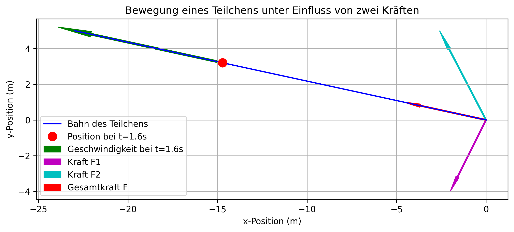
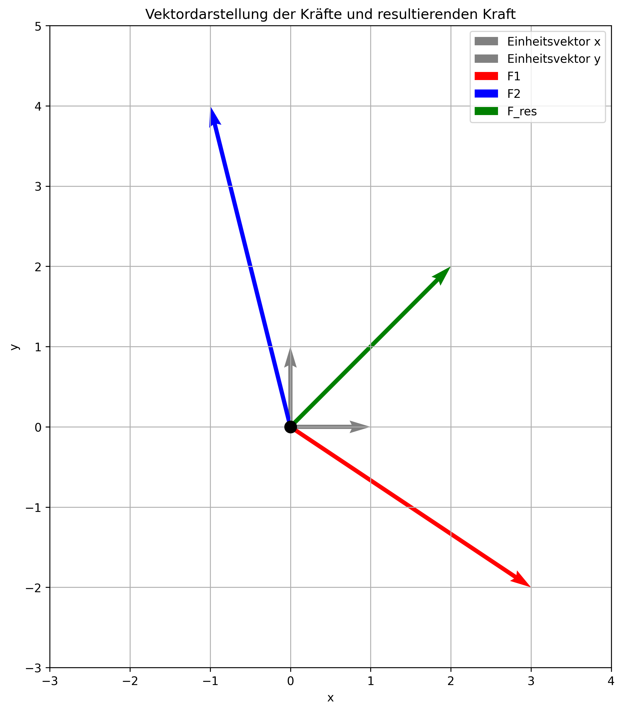

# Das zweite Newton'sche Axiom (Aktionsprinzip)

Letzte Aktualisierung: 2024-10-20

## Inhaltsverzeichnis

- [Das zweite Newton'sche Axiom (Aktionsprinzip)](#das-zweite-newtonsche-axiom-aktionsprinzip)
  - [Inhaltsverzeichnis](#inhaltsverzeichnis)
  - [Kernaussage](#kernaussage)
  - [Mathematische Formulierung](#mathematische-formulierung)
  - [Einheiten](#einheiten)
  - [Wichtige Aspekte](#wichtige-aspekte)
  - [Anwendungsbeispiel](#anwendungsbeispiel)
    - [Beispiel: Gleitende Eiscremepackungen](#beispiel-gleitende-eiscremepackungen)
      - [Ausgangssituation](#ausgangssituation)
      - [Aufgabenstellung](#aufgabenstellung)
      - [Lösungsweg](#lösungsweg)
        - [a) Berechnung der Masse](#a-berechnung-der-masse)
        - [b) Berechnung der Kraft F](#b-berechnung-der-kraft-f)
      - [Plausibilitätsprüfung](#plausibilitätsprüfung)
      - [Physikalische Interpretation](#physikalische-interpretation)
    - [Beispiel: Teilchen unter Einwirkung zweier Kräfte](#beispiel-teilchen-unter-einwirkung-zweier-kräfte)
      - [Ausgangssituation](#ausgangssituation-1)
      - [Aufgabenstellung](#aufgabenstellung-1)
      - [Lösungsweg](#lösungsweg-1)
        - [a) Berechnung des Ortsvektors r](#a-berechnung-des-ortsvektors-r)
        - [b) Berechnung der Geschwindigkeit v](#b-berechnung-der-geschwindigkeit-v)
      - [Physikalische Interpretation](#physikalische-interpretation-1)
        - [Ausgangssituation](#ausgangssituation-2)
        - [Kraftanalyse](#kraftanalyse)
          - [1. Kraft F1 (magentafarbener Pfeil):](#1-kraft-f1-magentafarbener-pfeil)
          - [2. Kraft F2 (türkisfarbener Pfeil):](#2-kraft-f2-türkisfarbener-pfeil)
          - [3. Gesamtkraft F (roter Pfeil):](#3-gesamtkraft-f-roter-pfeil)
        - [Physikalische Erklärung](#physikalische-erklärung)
  - [Massenvergleich](#massenvergleich)
  - [Vertiefung des Konzepts](#vertiefung-des-konzepts)
  - [Was sind Einheitsvektoren](#was-sind-einheitsvektoren)
    - [Schreibweisen für Einheitsvektoren](#schreibweisen-für-einheitsvektoren)
  - [Rechenbeispiel mit Einheitsvektoren](#rechenbeispiel-mit-einheitsvektoren)
    - [Ausgangssituation](#ausgangssituation-3)
    - [Aufgaben und Lösungen](#aufgaben-und-lösungen)
      - [1. Berechnung der resultierenden Kraft](#1-berechnung-der-resultierenden-kraft)
      - [2. Berechnung des Betrags der resultierenden Kraft](#2-berechnung-des-betrags-der-resultierenden-kraft)
      - [3. Berechnung des Winkels der resultierenden Kraft zur x-Achse](#3-berechnung-des-winkels-der-resultierenden-kraft-zur-x-achse)
      - [4. Skalarprodukt von F1 und F2](#4-skalarprodukt-von-f1-und-f2)
      - [5. Kreuzprodukt von F1 und F2 (in 3D)](#5-kreuzprodukt-von-f1-und-f2-in-3d)
    - [Interpretation](#interpretation)
    - [Vektordarstellung der Kräfte und resultierende Kraft](#vektordarstellung-der-kräfte-und-resultierende-kraft)

## Kernaussage

Das zweite Newton'sche Axiom beschreibt den Zusammenhang zwischen der auf einen Körper wirkenden Kraft und seiner resultierenden Beschleunigung. Es besagt:

Die Beschleunigung eines Körpers ist direkt proportional zu der auf ihn wirkenden Gesamtkraft und umgekehrt proportional zu seiner Masse.

## Mathematische Formulierung

$$\mathbf{a} = \frac{\mathbf{F}}{m}$$

oder in der häufiger verwendeten Form:

$$\mathbf{F} = m \cdot \mathbf{a}$$

wobei:

- $\mathbf{F}$: Gesamtkraft (Vektorsum2me aller wirkenden Kräfte): $\mathbf{F} = \sum \mathbf{F}_i$
- $m$: Masse des Körpers
- $\mathbf{a}$: Beschleunigung des Körpers

## Einheiten

- Kraft: Newton (N)
- Masse: Kilogramm (kg)
- Beschleunigung: Meter pro Sekunde zum Quadrat (m/s²)

Definitionsgemäß gilt: 1 N = 1 kg · m/s²

## Wichtige Aspekte

1. **Vektorielle Größen**: Sowohl Kraft als auch Beschleunigung sind Vektoren. Sie haben nicht nur einen Betrag, sondern auch eine Richtung.

2. **Proportionalität**: Die Beschleunigung ist direkt proportional zur Kraft und umgekehrt proportional zur Masse.

3. **Inertialsysteme**: Das Axiom gilt nur in Inertialsystemen, also in Bezugssystemen, die sich geradlinig und gleichförmig bewegen oder in Ruhe sind.

4. **Gesamtkraft**: Es wird die vektorielle Summe aller auf den Körper wirkenden Kräfte betrachtet.

5. **Masse als Proportionalitätskonstante**: Die Masse des Körpers bestimmt, wie stark er auf eine gegebene Kraft reagiert.

## Anwendungsbeispiel

Ein Eisklotz auf einer reibungsfreien Fläche:

- Ohne Krafteinwirkung: Konstante Geschwindigkeit (1. Newton'sches Axiom)
- Mit Krafteinwirkung: Beschleunigung proportional zur ausgeübten Kraft

### Beispiel: Gleitende Eiscremepackungen

#### Ausgangssituation

- Zwei Eiscremepackungen werden durch identische Gummibänder beschleunigt
- Packung 1: Masse $m_1 = 1{,}0~\text{kg}$, Beschleunigung $a_1 = 5{,}0~\text{m}/\text{s}^2$
- Packung 2: Masse $m_2$ unbekannt, Beschleunigung $a_2 = 11~\text{m}/\text{s}^2$

#### Aufgabenstellung

a) Bestimme die Masse $m_2$ der zweiten Eiscremepackung.
b) Berechne die Kraft $F$, die das Gummiband auf jede Packung ausübt.

#### Lösungsweg

##### a) Berechnung der Masse

1. Anwendung des zweiten Newton'schen Axioms auf beide Packungen:

   $F_1 = m_1 a_1$ und $F_2 = m_2 a_2$

2. Da die Kräfte gleich sind ($F_1 = F_2$), gilt:

   $m_1 a_1 = m_2 a_2$

3. Umstellen nach $m_2$:

   $m_2 = \frac{m_1 a_1}{a_2} = \frac{1{,}0~\text{kg} \cdot 5{,}0~\text{m}/\text{s}^2}{11~\text{m}/\text{s}^2} = 0{,}45~\text{kg}$

##### b) Berechnung der Kraft F

Wir können die Kraft mit den Werten von Packung 1 berechnen:

$F = m_1 a_1 = 1{,}0~\text{kg} \cdot 5{,}0~\text{m}/\text{s}^2 = 5{,}0~\text{N}$

#### Plausibilitätsprüfung

- Die berechnete Masse von 0,45 kg für eine Eiscremepackung erscheint realistisch.
- Die Kraft von 5,0 N entspricht etwa dem Gewicht einer 500g schweren Masse auf der Erde, was ebenfalls plausibel erscheint.

#### Physikalische Interpretation

1. Das Verhältnis der Massen ist umgekehrt proportional zum Verhältnis der Beschleunigungen. Die leichtere Packung erfährt bei gleicher Kraft eine größere Beschleunigung.

2. Die Kraft ist unabhängig von der Masse der Packung, da das Gummiband in beiden Fällen gleich gedehnt wurde.

3. Dieses Beispiel demonstriert die direkte Anwendung des zweiten Newton'schen Axioms und zeigt, wie Masse, Kraft und Beschleunigung zusammenhängen.

### Beispiel: Teilchen unter Einwirkung zweier Kräfte

#### Ausgangssituation

- Teilchen der Masse $m = 0{,}400 \text{ kg}$
- Zwei Kräfte wirken:
  - $\mathbf{F}_1 = -2{,}00\text{ N } \hat{x} - 4{,}00\text{ N } \hat{y}$
  - $\mathbf{F}_2 = -2{,}60\text{ N } \hat{x} + 5{,}00\text{ N } \hat{y}$
- Teilchen ruht anfänglich am Koordinatenursprung

#### Aufgabenstellung

a) Bestimme den Ortsvektor $\mathbf{r}$ zum Zeitpunkt $t = 1{,}60 \text{ s}$
b) Bestimme die Geschwindigkeit $\mathbf{v}$ zum Zeitpunkt $t = 1{,}60 \text{ s}$

#### Lösungsweg

##### a) Berechnung des Ortsvektors r

1. Allgemeine Gleichung für $\mathbf{r}(t)$ bei konstanter Beschleunigung:

   $\mathbf{r}(t) = \mathbf{r}_0 + \mathbf{v}_0 t + \frac{1}{2} \mathbf{a} t^2$

   Mit $\mathbf{r}_0 = \mathbf{v}_0 = \mathbf{0}$: $\mathbf{r}(t) = \frac{1}{2} \mathbf{a} t^2$

2. Beschleunigung aus dem zweiten Newton'schen Axiom:

   $\mathbf{a} = \frac{\sum \mathbf{F}_i}{m}$

3. Berechnung der resultierenden Kraft $\sum \mathbf{F}_i$:

   $\sum \mathbf{F}_i = \mathbf{F}_1 + \mathbf{F}_2 = (-4{,}60\text{ N}) \hat{x} + (1{,}00\text{ N}) \hat{y}$

4. Berechnung der Beschleunigung $\mathbf{a}$:

   $\mathbf{a} = \frac{\sum \mathbf{F}_i}{m} = (-11{,}5\text{ m/s}^2) \hat{x} + (2{,}5\text{ m/s}^2) \hat{y}$

5. Ortsvektor als Funktion der Zeit:

   $\mathbf{r}(t) = \frac{1}{2} \mathbf{a} t^2 = (-5{,}75\text{ m/s}^2 \hat{x} + 1{,}25\text{ m/s}^2 \hat{y}) t^2$

6. Ortsvektor bei $t = 1{,}60 \text{ s}$:

   $\mathbf{r}(1{,}60 \text{ s}) = (-14{,}7\text{ m}) \hat{x} + (3{,}20\text{ m}) \hat{y}$

##### b) Berechnung der Geschwindigkeit v

1. Geschwindigkeit als Zeitableitung des Ortsvektors:

   $\mathbf{v}(t) = \frac{d\mathbf{r}}{dt} = 2(-5{,}75\text{ m/s}^2 \hat{x} + 1{,}25\text{ m/s}^2 \hat{y}) t$

2. Geschwindigkeit bei $t = 1{,}60 \text{ s}$:

   $\mathbf{v}(1{,}6 \text{ s}) = (-18{,}4\text{ m/s}) \hat{x} + (4{,}00\text{ m/s}) \hat{y}$

#### Physikalische Interpretation

1. Die resultierende Kraft und damit auch die Beschleunigung haben sowohl eine x- als auch eine y-Komponente, was zu einer gekrümmten Bewegungsbahn führt.

2. Die negative x-Komponente der Beschleunigung führt zu einer Bewegung nach links, während die positive y-Komponente eine Aufwärtsbewegung bewirkt.

3. Die Geschwindigkeit nimmt linear mit der Zeit zu, während der zurückgelegte Weg quadratisch mit der Zeit wächst, was typisch für eine gleichmäßig beschleunigte Bewegung ist.

**Kraftanalyse:** Ball in der Luft

##### Ausgangssituation
Ein Ball bewegt sich durch die Luft unter dem Einfluss verschiedener Kräfte.

##### Kraftanalyse

###### 1. Kraft F1 (magentafarbener Pfeil):
- Richtung: nach links und unten
- Interpretation: Kombinierte Wirkung von Luftwiderstand und Gewichtskraft
  a) Luftwiderstand:
     - Wirkt der Bewegung entgegen (nach links)
     - Abhängig von Geschwindigkeit, Form und Oberfläche des Balls
  b) Gewichtskraft:
     - Zieht den Ball nach unten
     - Konstant, abhängig von der Masse des Balls und der Erdanziehung

###### 2. Kraft F2 (türkisfarbener Pfeil):
- Richtung: nach links und stark nach oben
- Interpretation: Auftriebskraft und Seitenwind
  a) Auftriebskraft:
     - Wirkt nach oben
     - Entsteht durch Druckunterschiede in der Luft (z.B. Magnus-Effekt bei rotierenden Bällen)
  b) Seitenwind:
     - Wirkt nach links
     - Externe Luftströmung, die den Ball seitwärts drückt

###### 3. Gesamtkraft F (roter Pfeil):
- Richtung: nach links und leicht nach oben
- Interpretation: Resultierende Kraft aus F1 und F2
  - Bestimmt die tatsächliche Beschleunigung und Bewegungsrichtung des Balls
  - Zeigt, dass der Auftrieb und Seitenwind stärker sind als die Gewichtskraft und der direkte Luftwiderstand

##### Physikalische Erklärung

1. **Luftwiderstand**: Nimmt mit der Geschwindigkeit zu, was die zunehmende Krümmung der Bahn erklärt.

2. **Auftrieb**: Könnte durch den Magnus-Effekt verstärkt werden, wenn der Ball rotiert. Dies erklärt die starke Aufwärtskomponente von F2.

3. **Seitenwind**: Konsistent mit der Linkskomponente beider Kräfte, verstärkt die seitliche Bewegung des Balls.

4. **Gewichtskraft**: Teilweise durch den Auftrieb kompensiert, was die leichte Aufwärtsbewegung ermöglicht.

5. **Resultierende Bewegung**: Eine gekrümmte Bahn nach links und oben, typisch für einen geschlagenen oder geworfenen Ball mit Spin in Gegenwart von Seitenwind.

## Massenvergleich

1. **Definition**: Der Massenvergleich basiert auf der Beobachtung der Beschleunigungen, die durch gleiche Kräfte auf verschiedene Körper ausgeübt werden.

2. **Mathematische Formulierung**:
   Für zwei Massen $m_1$ und $m_2$, die durch gleiche Kräfte $|\mathbf{F}_1| = |\mathbf{F}_2|$ beschleunigt werden, gilt:

   $$\frac{m_2}{m_1} = \frac{a_1}{a_2}$$

3. **Intuitive Interpretation**: Ein Körper mit größerer Masse erfährt bei gleicher Krafteinwirkung eine geringere Beschleunigung.

4. **Unabhängigkeit**: Das Verhältnis der Beschleunigungen ist unabhängig von Betrag, Richtung und Art der angewandten Kraft.

5. **Intrinsische Eigenschaft**: Die Masse ist eine innere Eigenschaft eines Körpers und unabhängig von seinem Ort im Universum.

## Vertiefung des Konzepts

1. **Trägheit und Masse**:
   - Die Masse ist ein Maß für die Trägheit eines Körpers.
   - Trägheit beschreibt den Widerstand eines Körpers gegen Änderungen seines Bewegungszustands.
   - Je größer die Masse, desto größer die Trägheit.

2. **Massenerhaltung**:
   - In klassischen (nicht-relativistischen) Systemen bleibt die Gesamtmasse erhalten.
   - Dies ist fundamental für viele physikalische Berechnungen.

3. **Unterscheidung zwischen Masse und Gewicht**:
   - Masse ist eine intrinsische Eigenschaft, Gewicht ist die Kraft, die durch Gravitation auf eine Masse wirkt.
   - Gewicht variiert je nach Gravitationsfeld, Masse bleibt konstant.

4. **Masse in der Relativitätstheorie**:
   - Bei sehr hohen Geschwindigkeiten ändert sich die effektive Masse eines Körpers.
   - Die Ruhmasse bleibt jedoch konstant.

5. **Äquivalenzprinzip**:
   - Träge Masse (Widerstand gegen Beschleunigung) und schwere Masse (Reaktion auf Gravitation) sind äquivalent.
   - Dies ist ein Grundprinzip der Allgemeinen Relativitätstheorie.

6. **Praktische Anwendungen**:
   - Massenspektrometrie in der Chemie und Biologie
   - Konstruktion von Fahrzeugen und Maschinen
   - Berechnung von Flugbahnen in der Raumfahrt

7. **Grenzen des klassischen Massenkonzepts**:
   - In der Quantenmechanik wird das klassische Massenkonzept erweitert.
   - Elementarteilchen können Masse durch Interaktion mit dem Higgs-Feld erhalten.

8. **Masse und Energie**:
   - Einsteins berühmte Formel $E = mc^2$ zeigt die Äquivalenz von Masse und Energie.
   - Dies hat weitreichende Konsequenzen für unser Verständnis des Universums.

## Was sind Einheitsvektoren

1. Einheitsvektoren:
   - $\hat{x}$, $\hat{y}$, und $\hat{z}$ sind Einheitsvektoren in einem kartesischen Koordinatensystem.
   - Ein Einheitsvektor hat per Definition die Länge 1 und zeigt in eine bestimmte Richtung.

2. Bedeutung:
   - $\hat{x}$ zeigt in die positive x-Richtung
   - $\hat{y}$ zeigt in die positive y-Richtung
   - $\hat{z}$ zeigt in die positive z-Richtung (in 3D-Systemen)

3. Verwendung in der Formel:
   - In der Gleichung $\mathbf{a} = (-11{,}5\text{ m/s}^2) \hat{x} + (2{,}5\text{ m/s}^2) \hat{y}$ werden die Einheitsvektoren verwendet, um die Richtung der Beschleunigungskomponenten anzugeben.
   - $-11{,}5\text{ m/s}^2$ ist der Betrag der Beschleunigung in x-Richtung (negativ, also nach links)
   - $2{,}5\text{ m/s}^2$ ist der Betrag der Beschleunigung in y-Richtung (positiv, also nach oben)

4. Vektordarstellung:
   - Diese Schreibweise ist eine kompakte Form, um einen Vektor in seine Komponenten zu zerlegen.
   - Man könnte den gleichen Vektor auch als $\mathbf{a} = (-11{,}5, 2{,}5) \text{ m/s}^2$ schreiben.

5. Vorteile:
   - Die Notation mit Einheitsvektoren macht die Richtung jeder Komponente explizit klar.
   - Sie erleichtert Berechnungen und das Verständnis in mehrdimensionalen Problemen.

6. Mathematische Eigenschaften:
   - $\hat{x} \cdot \hat{x} = 1$ (Skalarprodukt mit sich selbst)
   - $\hat{x} \cdot \hat{y} = 0$ (Skalarprodukt mit anderen Einheitsvektoren)
   - $\hat{x} \times \hat{y} = \hat{z}$ (Kreuzprodukt der Einheitsvektoren)

### Schreibweisen für Einheitsvektoren

Die Notation mit dem Dach (^) über x, y, und z ist eine gängige Form, aber es existieren auch andere gebräuchliche Schreibweisen.

1. i, j, k Notation:
   - $\mathbf{i}$ statt $\hat{x}$
   - $\mathbf{j}$ statt $\hat{y}$
   - $\mathbf{k}$ statt $\hat{z}$

   Diese Notation ist besonders in der Ingenieurwissenschaft und in einigen Physik-Lehrbüchern verbreitet.

2. Vektorpfeil-Notation:
   - $\vec{e}_x$ statt $\hat{x}$
   - $\vec{e}_y$ statt $\hat{y}$
   - $\vec{e}_z$ statt $\hat{z}$

   Hier wird der Einheitsvektor durch ein "e" mit entsprechendem Index gekennzeichnet.

3. Numerische Indizierung:
   - $\mathbf{e}_1$ statt $\hat{x}$
   - $\mathbf{e}_2$ statt $\hat{y}$
   - $\mathbf{e}_3$ statt $\hat{z}$

   Diese Notation ist besonders in der mathematischen Literatur und bei der Verallgemeinerung auf höherdimensionale Räume üblich.

4. Fettgedruckte Notation:
   - $\mathbf{x}$ statt $\hat{x}$
   - $\mathbf{y}$ statt $\hat{y}$
   - $\mathbf{z}$ statt $\hat{z}$

   Hier wird der Einheitsvektor einfach durch Fettdruck gekennzeichnet.

5. Komponentenschreibweise:
   - (1,0,0) statt $\hat{x}$
   - (0,1,0) statt $\hat{y}$
   - (0,0,1) statt $\hat{z}$

   Diese explizite Darstellung der Komponenten wird oft in der Programmierung und in numerischen Berechnungen verwendet.

Beispiel mit der i, j, k Notation:

- $\mathbf{F}_1 = 3\mathbf{i} - 2\mathbf{j}$
- $\mathbf{F}_2 = -1\mathbf{i} + 4\mathbf{j}$
- $\mathbf{F}_\text{res} = 2\mathbf{i} + 2\mathbf{j}$

## Rechenbeispiel mit Einheitsvektoren

### Ausgangssituation
Wir betrachten zwei Kräfte, die auf einen Punkt wirken:

- Kraft $\mathbf{F}_1 = 3\hat{x} - 2\hat{y}$ (in Newton)
- Kraft $\mathbf{F}_2 = -1\hat{x} + 4\hat{y}$ (in Newton)

### Aufgaben und Lösungen

#### 1. Berechnung der resultierenden Kraft

Die resultierende Kraft $\mathbf{F}_\text{res}$ ist die Vektorsumme von $\mathbf{F}_1$ und $\mathbf{F}_2$:

$\mathbf{F}_\text{res} = \mathbf{F}_1 + \mathbf{F}_2 = (3\hat{x} - 2\hat{y}) + (-1\hat{x} + 4\hat{y})$

$\mathbf{F}_\text{res} = (3-1)\hat{x} + (-2+4)\hat{y} = 2\hat{x} + 2\hat{y}$

#### 2. Berechnung des Betrags der resultierenden Kraft

Der Betrag wird mit dem Satz des Pythagoras berechnet:

$|\mathbf{F}_\text{res}| = \sqrt{2^2 + 2^2} = \sqrt{8} = 2\sqrt{2} \approx 2,83$ N

#### 3. Berechnung des Winkels der resultierenden Kraft zur x-Achse

Der Winkel $\theta$ zur x-Achse wird mit dem Arkustangens berechnet:

$\theta = \arctan(\frac{y}{x}) = \arctan(\frac{2}{2}) = \arctan(1) = 45°$

#### 4. Skalarprodukt von F1 und F2

Das Skalarprodukt berechnet sich wie folgt:

$\mathbf{F}_1 \cdot \mathbf{F}_2 = (3\hat{x} - 2\hat{y}) \cdot (-1\hat{x} + 4\hat{y})$

$= 3(-1) + (-2)(4) = -3 - 8 = -11$ N²

#### 5. Kreuzprodukt von F1 und F2 (in 3D)

Das Kreuzprodukt in 3D (unter Annahme, dass die z-Komponenten Null sind):

$\mathbf{F}_1 \times \mathbf{F}_2 = (3\hat{x} - 2\hat{y}) \times (-1\hat{x} + 4\hat{y})$

$= (3 \cdot 4 - (-2) \cdot (-1))\hat{z} = (12 - 2)\hat{z} = 10\hat{z}$ N²

### Interpretation

1. Die resultierende Kraft hat gleiche Komponenten in x- und y-Richtung, was zu einem 45°-Winkel führt.
2. Der Betrag der resultierenden Kraft ist größer als jede der Einzelkräfte.
3. Das negative Skalarprodukt zeigt, dass die Kräfte in gewissem Maße entgegengesetzt wirken.
4. Das Kreuzprodukt gibt die Größe und Richtung des Drehmoments an, das diese Kräfte erzeugen würden.

### Vektordarstellung der Kräfte und resultierende Kraft

1. Koordinatensystem:
   - Der Ursprung (0,0) ist durch einen schwarzen Punkt in der Mitte gekennzeichnet.
   - Die x-Achse verläuft horizontal, die y-Achse vertikal.
   - Das Gitter hilft bei der Orientierung und Abschätzung der Vektorgrößen.

2. Einheitsvektoren (grau):
   - Der Einheitsvektor x zeigt vom Ursprung eine Einheit nach rechts.
   - Der Einheitsvektor y zeigt vom Ursprung eine Einheit nach oben.
   - Diese verdeutlichen die Basisrichtungen des Koordinatensystems.

3. Kraft F1 (roter Pfeil):
   - Beginnt am Ursprung und endet bei etwa (3, -2).
   - Repräsentiert die Kraft 3x̂ - 2ŷ.

4. Kraft F2 (blauer Pfeil):
   - Beginnt am Ursprung und endet bei etwa (-1, 4).
   - Repräsentiert die Kraft -x̂ + 4ŷ.

5. Resultierende Kraft F_res (grüner Pfeil):
   - Beginnt am Ursprung und endet bei (2, 2).
   - Stellt die Vektorsumme von F1 und F2 dar: 2x̂ + 2ŷ.
   - Der 45°-Winkel zur x-Achse ist deutlich erkennbar.

Wichtige Beobachtungen:

- Die resultierende Kraft F_res liegt zwischen F1 und F2, was die Vektoraddition visualisiert.
- F_res hat gleiche x- und y-Komponenten, was den berechneten 45°-Winkel bestätigt.
- Die Länge von F_res ist kürzer als die Summe der Längen von F1 und F2, da die Kräfte nicht in die gleiche Richtung wirken.
- Das negative Skalarprodukt von F1 und F2 (aus der vorherigen Berechnung) wird durch den stumpfen Winkel zwischen ihnen sichtbar.
