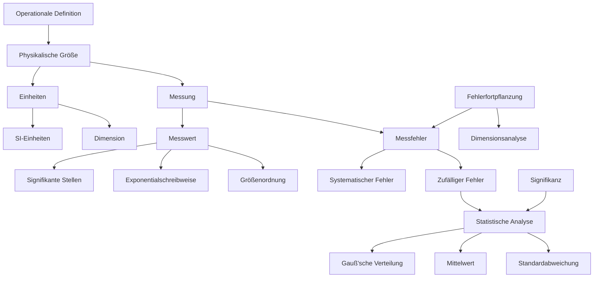
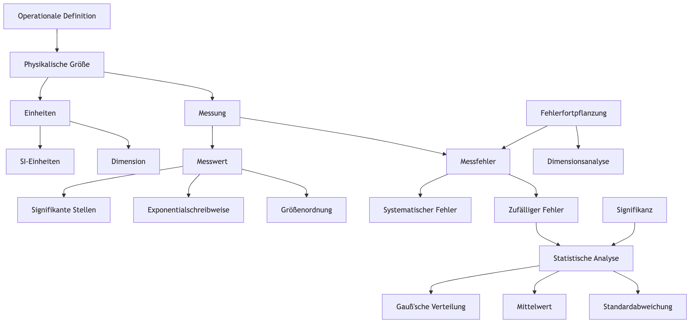

# Physikalische Größen und Messungen

Quelle: Tipler/Mosca Physik. 9. Aufl., 2024

- [Physikalische Größen und Messungen](#physikalische-größen-und-messungen)
- [Zusammenfassung: Physikalische Größen und Messungen](#zusammenfassung-physikalische-größen-und-messungen)
- [Beispiele, Vorgehensweisen und Übungen](#beispiele-vorgehensweisen-und-übungen)
  - [1. Vom Wesen der Physik](#1-vom-wesen-der-physik)
    - [Beispiel:](#beispiel)
    - [Vorgehensweise:](#vorgehensweise)
    - [Übung mit Lösung:](#übung-mit-lösung)
  - [2. Maßeinheiten](#2-maßeinheiten)
    - [Beispiel:](#beispiel-1)
    - [Vorgehensweise:](#vorgehensweise-1)
    - [Übung mit Lösung:](#übung-mit-lösung-1)
  - [3. Dimensionen physikalischer Größen](#3-dimensionen-physikalischer-größen)
    - [Beispiel:](#beispiel-2)
    - [Vorgehensweise:](#vorgehensweise-2)
    - [Übung mit Lösung:](#übung-mit-lösung-2)
  - [4. Signifikante Stellen und Größenordnungen](#4-signifikante-stellen-und-größenordnungen)
    - [Beispiel:](#beispiel-3)
    - [Vorgehensweise:](#vorgehensweise-3)
    - [Übung mit Lösung:](#übung-mit-lösung-3)
  - [5. Messgenauigkeit und Messfehler](#5-messgenauigkeit-und-messfehler)
    - [Beispiel:](#beispiel-4)
    - [Vorgehensweise:](#vorgehensweise-4)
    - [Übung mit Lösung:](#übung-mit-lösung-4)
- [Erklärungen zu wichtigen Tabellen und Diagrammen](#erklärungen-zu-wichtigen-tabellen-und-diagrammen)
  - [2. Maßeinheiten](#2-maßeinheiten-1)
    - [Tabelle 1.1: Vorsätze für Zehnerpotenzen](#tabelle-11-vorsätze-für-zehnerpotenzen)
  - [3. Dimensionen physikalischer Größen](#3-dimensionen-physikalischer-größen-1)
    - [Tabelle 1.2: Dimensionen und SI-Einheiten einiger physikalischer Größen aus der Mechanik](#tabelle-12-dimensionen-und-si-einheiten-einiger-physikalischer-größen-aus-der-mechanik)
  - [4. Signifikante Stellen und Größenordnungen](#4-signifikante-stellen-und-größenordnungen-1)
    - [Größenordnungen im Universum](#größenordnungen-im-universum)
  - [internationale Einheitensystem (SI)](#internationale-einheitensystem-si)
    - [SI-Grundeinheiten:](#si-grundeinheiten)
    - [Änderungen im Jahr 2018:](#änderungen-im-jahr-2018)
    - [Historische Entwicklung der Definitionen:](#historische-entwicklung-der-definitionen)
    - [Konstanten](#konstanten)
  - [5. Messgenauigkeit und Messfehler](#5-messgenauigkeit-und-messfehler-1)
    - [Abbildung 1.5: Verteilung von Klausurergebnissen](#abbildung-15-verteilung-von-klausurergebnissen)
    - [Abbildung 1.7: Gauß-Verteilung](#abbildung-17-gauß-verteilung)
- [Fachwörter](#fachwörter)
- [Visualisierung der zusammenhänge](#visualisierung-der-zusammenhänge)
- [Notizen: Physikalische Größen und Messungen](#notizen-physikalische-größen-und-messungen)
  - [1. Vom Wesen der Physik](#1-vom-wesen-der-physik-1)
    - [Lernziel](#lernziel)
    - [Notizen](#notizen)
    - [Beispiele](#beispiele)
  - [2. Maßeinheiten](#2-maßeinheiten-2)
    - [Lernziel](#lernziel-1)
    - [Notizen](#notizen-1)
    - [Beispiele](#beispiele-1)
  - [3. Dimensionen physikalischer Größen](#3-dimensionen-physikalischer-größen-2)
    - [Lernziel](#lernziel-2)
    - [Notizen](#notizen-2)
  - [4. Signifikante Stellen und Größenordnungen](#4-signifikante-stellen-und-größenordnungen-2)
    - [Lernziel](#lernziel-3)
    - [Notizen](#notizen-3)
  - [5. Messgenauigkeit und Messfehler](#5-messgenauigkeit-und-messfehler-2)
    - [Lernziel](#lernziel-4)
    - [Notizen](#notizen-4)
    - [Rechenbeispielen](#rechenbeispielen)
  - [Vorgehensweise: Berechnungen in der Exponentialschreibweise](#vorgehensweise-berechnungen-in-der-exponentialschreibweise)
- [Regeln für Berechnungen in Exponentialschreibweise](#regeln-für-berechnungen-in-exponentialschreibweise)
  - [Zusammenfassung](#zusammenfassung)
- [Beispiel 1.4: Reifenabrieb](#beispiel-14-reifenabrieb)
  - [Problemstellung](#problemstellung)
  - [Annahmen](#annahmen)
  - [Lösung](#lösung)
    - [Umrechnung von cm/km zu m/km](#umrechnung-von-cmkm-zu-mkm)
  - [Plausibilitätsprüfung](#plausibilitätsprüfung)
  - [Weiterführende Betrachtung](#weiterführende-betrachtung)
  - [Hinweis zur Softwareberechnung](#hinweis-zur-softwareberechnung)
- [Übung 1.1: Sandkörner am Strand](#übung-11-sandkörner-am-strand)
  - [Problemstellung](#problemstellung-1)
  - [Annahmen](#annahmen-1)
  - [Lösung](#lösung-1)
  - [Plausibilitätsprüfung](#plausibilitätsprüfung-1)
  - [Weiterführende Betrachtung](#weiterführende-betrachtung-1)
  - [Zusätzliche Betrachtung](#zusätzliche-betrachtung)
- [Beispiel 1.5: Klausurergebnisse](#beispiel-15-klausurergebnisse)
  - [Problemstellung](#problemstellung-2)
  - [Verteilungsfunktion](#verteilungsfunktion)
  - [Lösung](#lösung-2)
    - [1. Mittleres Ergebnis $\\langle s \\rangle$](#1-mittleres-ergebnis-langle-s-rangle)
    - [2. Quadratisch gemitteltes Ergebnis $s\_{rms}$](#2-quadratisch-gemitteltes-ergebnis-s_rms)
  - [Plausibilitätsprüfung](#plausibilitätsprüfung-2)
  - [Weiterführende Betrachtung](#weiterführende-betrachtung-2)
- [Beispiel 1.6: Pendelschwingungen](#beispiel-16-pendelschwingungen)
  - [Problemstellung](#problemstellung-3)
  - [Lösung](#lösung-3)
    - [1. Mittlere Schwingungsdauer ⟨T⟩](#1-mittlere-schwingungsdauer-t)
    - [2. Standardabweichung $\\sigma\_T$](#2-standardabweichung-sigma_t)
    - [3. Standardabweichung des Mittelwerts $\\sigma\_{\\langle T \\rangle}$](#3-standardabweichung-des-mittelwerts-sigma_langle-t-rangle)
  - [Plausibilitätsprüfung](#plausibilitätsprüfung-3)
  - [Weiterführende Betrachtung](#weiterführende-betrachtung-3)
- [Verständnisaufgaben](#verständnisaufgaben)
  - [1.1 Welche der folgenden physikalischen Größen ist keine Grundgröße im SI-Einheitensystem?](#11-welche-der-folgenden-physikalischen-größen-ist-keine-grundgröße-im-si-einheitensystem)
  - [1.2  Wie lautet die endgültige Maßeinheit?](#12--wie-lautet-die-endgültige-maßeinheit)
  - [1.3 Wie viele signifikante Stellen hat die Dezimalzahl 0,000 513 0?](#13-wie-viele-signifikante-stellen-hat-die-dezimalzahl-0000-513-0)
  - [1.4 Richtig oder falsch? Zwei Größen müssen die gleiche Dimension haben, um miteinander multipliziert werden zu können.](#14-richtig-oder-falsch-zwei-größen-müssen-die-gleiche-dimension-haben-um-miteinander-multipliziert-werden-zu-können)
- [Schätzungs- und Näherungsaufgaben](#schätzungs--und-näherungsaufgaben)
  - [1.5 Schätzung der Anzahl der Wassermoleküle in einem Menschen](#15-schätzung-der-anzahl-der-wassermoleküle-in-einem-menschen)
  - [1.6 Schätzung des Benzinverbrauchs in den USA](#16-schätzung-des-benzinverbrauchs-in-den-usa)
  - [1.7 Speicherkapazität von CDs](#17-speicherkapazität-von-cds)
- [Maßeinheiten](#maßeinheiten)
  - [1.8 Umrechnung von Werten mit geeigneten Vorsätzen](#18-umrechnung-von-werten-mit-geeigneten-vorsätzen)
  - [1.9 Bestimmung der SI-Einheiten von Konstanten in Gleichungen](#19-bestimmung-der-si-einheiten-von-konstanten-in-gleichungen)
- [Umrechnen von Einheiten](#umrechnen-von-einheiten)
  - [1.10 Umrechnung der Geschwindigkeit eines Überschallflugzeugs](#110-umrechnung-der-geschwindigkeit-eines-überschallflugzeugs)
  - [1.11 Bestimmung der SI-Einheiten von Ausdrücken](#111-bestimmung-der-si-einheiten-von-ausdrücken)
- [Berechnungen](#berechnungen)
  - [A 1.5 Schätzung der Anzahl von Wassermolekülen im menschlichen Körper](#a-15-schätzung-der-anzahl-von-wassermolekülen-im-menschlichen-körper)
  - [A 1.10 Umrechnung der Schallgeschwindigkeit](#a-110-umrechnung-der-schallgeschwindigkeit)
  - [A 1.18 Berechnung der Höhe von Kreidefelsen mit Fehlerfortpflanzung](#a-118-berechnung-der-höhe-von-kreidefelsen-mit-fehlerfortpflanzung)
  - [A 1.19 Berechnung des Masse-Volumen-Verhältnisses eines Eisenatomkerns](#a-119-berechnung-des-masse-volumen-verhältnisses-eines-eisenatomkerns)

# Zusammenfassung: Physikalische Größen und Messungen

1. Maßeinheiten
   - Physikalische Größen sind durch Messungen erhaltene Zahlenwerte
   - Wert einer physikalischen Größe = Maßzahl × Maßeinheit

2. Grundeinheiten des SI-Systems
   - Meter (m), Sekunde (s), Kilogramm (kg), Kelvin (K), Ampere (A), Mol (mol), Candela (cd)
   - Alle physikalischen Größen lassen sich durch diese Grundeinheiten ausdrücken

3. Gleichungen
   - Einheiten in Gleichungen werden wie algebraische Größen behandelt
   - Dimensionen auf beiden Seiten einer Gleichung müssen übereinstimmen

4. Signifikante Stellen
   - Bei Multiplikation/Division: Ergebnis hat nie mehr signifikante Stellen als der Faktor mit den wenigsten
   - Bei Addition/Subtraktion: Ergebnis hat so viele Dezimalstellen wie der Term mit den wenigsten

5. Umrechnung
   - Umrechnungsfaktoren haben stets den Wert 1
   - Ermöglichen einfache Umrechnung zwischen Einheiten

6. Exponentialschreibweise
   - Für sehr kleine/große Zahlen: Darstellung als Produkt einer Zahl und einer Zehnerpotenz

7. Exponenten
   - Multiplikation: Exponenten werden addiert
   - Division: Exponenten werden subtrahiert
   - Potenzierung: Exponenten werden multipliziert

8. Größenordnungen
   - Rundung auf nächstgelegene Zehnerpotenz
   - Ermöglicht schnelle Abschätzungen und einfache Berechnungen

9. Messfehler
   - Gauß'sche Verteilungsfunktion: $$f(x) = \frac{1}{\sqrt{2\pi\sigma}}e^{-(x-\langle x\rangle)^2/(2\sigma^2)}$$
   - Mittelwert (Schätzwert für wahren Messwert): $$\langle x\rangle = \frac{1}{n}\sum_{i=1}^n x_i$$
   - Standardabweichung einer Einzelmessung: $$\sigma = \sqrt{\langle x^2\rangle - \langle x\rangle^2} = \sqrt{\frac{1}{n-1}\sum_{i=1}^n (x_i - \langle x\rangle)^2}$$
   - Standardabweichung des Mittelwerts: $$\Delta x = \frac{\sigma}{\sqrt{n}} = \sqrt{\frac{1}{n(n-1)}\sum_{i=1}^n (x_i - \langle x\rangle)^2}$$

Diese Zusammenfassung bietet einen Überblick über die grundlegenden Konzepte der physikalischen Messtechnik und Datenanalyse, einschließlich wichtiger Formeln und Definitionen.

# Beispiele, Vorgehensweisen und Übungen

## 1. Vom Wesen der Physik

### Beispiel:

Galileis Experimente zum freien Fall

### Vorgehensweise:

1. Beobachtung des Phänomens
2. Formulierung einer Hypothese
3. Durchführung kontrollierter Experimente
4. Analyse der Ergebnisse
5. Formulierung eines Gesetzes oder einer Theorie

### Übung mit Lösung:

Beschreiben Sie, wie Newton auf Basis von Galileis Arbeiten das Gravitationsgesetz entwickelte.

Lösung:

1. Newton studierte Galileis Fallgesetze
2. Er erkannte, dass die Erdanziehung auch für Himmelskörper gelten könnte
3. Newton formulierte die Hypothese einer universellen Gravitationskraft
4. Er entwickelte mathematische Modelle zur Beschreibung der Kraft
5. Newton überprüfte seine Theorie anhand von Planetenbewegungen
6. Er formulierte das universelle Gravitationsgesetz: $$F = G \frac{m_1 m_2}{r^2}$$

## 2. Maßeinheiten

### Beispiel:

Definition des Kilogramms über die Planck-Konstante

### Vorgehensweise:

1. Identifizierung der zu definierenden Einheit
2. Auswahl einer geeigneten Naturkonstante
3. Festlegung des exakten Werts der Konstante
4. Formulierung der Definition

### Übung mit Lösung:

Rechnen Sie 5 m/s in km/h um.

**Lösung:**

1. Ausgangswert: 5 m/s
2. Umrechnung Meter in Kilometer: 1 km = 1000 m
3. Umrechnung Sekunden in Stunden: 1 h = 3600 s
4. Berechnung:
   $$5 \frac{\text{m}}{\text{s}} \cdot \frac{3600 \, \text{s}}{1 \, \text{h}} \cdot \frac{1 \, \text{km}}{1000 \, \text{m}} = 18 \frac{\text{km}}{\text{h}}$$
5. Ergebnis: 5 m/s = 18 km/h

## 3. Dimensionen physikalischer Größen

### Beispiel:
Dimension der Beschleunigung: $[\text{L}]/[\text{T}]^2$

### Vorgehensweise:
1. Identifizierung der beteiligten Grundgrößen
2. Bestimmung der Exponenten für jede Grundgröße
3. Aufstellen der Dimensionsgleichung

### Übung mit Lösung:
Bestimmen Sie die Dimension der Energie in der Gleichung $E = mc^2$.

**Lösung:**

1. Identifizierung der Größen:
   - $E$: Energie
   - $m$: Masse $[\text{M}]$
   - $c$: Lichtgeschwindigkeit $[\text{L}]/[\text{T}]$
2. Aufstellung der Dimensionsgleichung:
   $$[E] = [\text{M}] \cdot \left(\frac{[\text{L}]}{[\text{T}]}\right)^2$$
3. Ausmultiplizieren:
   $$[E] = [\text{M}] \cdot [\text{L}]^2/[\text{T}]^2$$
4. Ergebnis: Die Dimension der Energie ist $[\text{M}][\text{L}]^2[\text{T}]^{-2}$

## 4. Signifikante Stellen und Größenordnungen

### Beispiel:

Die Zahl 0,00300 hat drei signifikante Stellen.

### Vorgehensweise:

1. Identifizierung der signifikanten Stellen
2. Anwendung der Regeln für Berechnungen
3. Korrekte Rundung des Ergebnisses

### Übung mit Lösung:

Multiplizieren Sie 4,2 mit 0,0031 und geben Sie das Ergebnis mit der korrekten Anzahl signifikanter Stellen an.

Lösung:

1. Identifizierung der signifikanten Stellen:
   - 4,2 hat zwei signifikante Stellen
   - 0,0031 hat zwei signifikante Stellen
2. Durchführung der Multiplikation:  
   $4,2 \cdot 0,0031 = 0,01302$  
3. Bestimmung der Anzahl signifikanter Stellen im Ergebnis:  
   Das Ergebnis kann nicht mehr signifikante Stellen haben als der Faktor mit den wenigsten signifikanten Stellen (hier: zwei)  
4. Rundung des Ergebnisses auf zwei signifikante Stellen:  
   $0,01302 \approx 0,013$  
5. Ergebnis: $4,2 \cdot 0,0031 = 0,013$

## 5. Messgenauigkeit und Messfehler

### Beispiel:
Messung der Länge eines Tisches: $l = (1,50 \pm 0,01) \, \text{m}$

### Vorgehensweise:
1. Durchführung mehrerer Messungen
2. Berechnung des Mittelwerts
3. Bestimmung der Standardabweichung
4. Angabe des Ergebnisses mit Messunsicherheit

### Übung mit Lösung:
Berechnen Sie den Mittelwert und die Standardabweichung für folgende Messwerte der Schwingungsdauer eines Pendels: 2,05 s; 1,98 s; 2,03 s; 2,01 s; 2,00 s

Lösung:

1. Berechnung des Mittelwerts:
   $$\langle T \rangle = \frac{1}{n} \sum_{i=1}^n T_i = \frac{2,05 + 1,98 + 2,03 + 2,01 + 2,00}{5} = 2,014 \text{ s}$$

2. Berechnung der Standardabweichung:
   $$\sigma = \sqrt{\frac{1}{n-1} \sum_{i=1}^n (T_i - \langle T \rangle)^2}$$
   
   $$\sigma = \sqrt{\frac{(2,05-2,014)^2 + (1,98-2,014)^2 + (2,03-2,014)^2 + (2,01-2,014)^2 + (2,00-2,014)^2}{4}}$$
   
   $$\sigma = 0,027 \text{ s}$$

3. Ergebnis:  
   Mittelwert: $\langle T \rangle = 2,01 \, \text{s}$  
   Standardabweichung: $\sigma = 0,03 \, \text{s}$  

   Angabe mit Messunsicherheit: $T = (2,01 \pm 0,03) \, \text{s}$

# Erklärungen zu wichtigen Tabellen und Diagrammen

## 2. Maßeinheiten

### Tabelle 1.1: Vorsätze für Zehnerpotenzen

| Vielfaches | Vorsatz | Abkürzung |
| ---------- | ------- | --------- |
| $10^{18}$  | Exa     | E         |
| $10^{15}$  | Peta    | P         |
| $10^{12}$  | Tera    | T         |
| $10^9$     | Giga    | G         |
| $10^6$     | Mega    | M         |
| $10^3$     | Kilo    | k         |
| $10^2$     | Hekto   | h         |
| $10^1$     | Deka    | da        |
| $10^{-1}$  | Dezi    | d         |
| $10^{-2}$  | Zenti   | c         |
| $10^{-3}$  | Milli   | m         |
| $10^{-6}$  | Mikro   | $\mu$     |
| $10^{-9}$  | Nano    | n         |
| $10^{-12}$ | Piko    | p         |
| $10^{-15}$ | Femto   | f         |
| $10^{-18}$ | Atto    | a         |

> Hinweis: Die Vorsätze Hekto (h), Deka (da) und Dezi (d) sind keine Potenzen von $10^3$ oder $10^{-3}$ und werden selten verwendet. Eine Ausnahme bildet Zenti (c), das bei der Längeneinheit (1 cm = $10^{-2}$ m) üblich ist. Beachte, dass die Abkürzungen für Vorsätze ab $10^6$ großgeschrieben werden, alle anderen hingegen kleingeschrieben.

## 3. Dimensionen physikalischer Größen

### Tabelle 1.2: Dimensionen und SI-Einheiten einiger physikalischer Größen aus der Mechanik

| Größe               | Dimension               | SI-Einheit                              |
| ------------------- | ----------------------- | --------------------------------------- |
| Flächeninhalt $A$   | $L^2$                   | $\text{m}^2$                            |
| Volumen $V$         | $L^3$                   | $\text{m}^3$                            |
| Geschwindigkeit $v$ | $L/T$                   | $\text{m/s}$                            |
| Beschleunigung $a$  | $L/T^2$                 | $\text{m/s}^2$                          |
| Kraft $F$           | $M \cdot L/T^2$         | $\text{kg} \cdot \text{m/s}^2$          |
| Druck $p$           | $F/A = M/(L \cdot T^2)$ | $\text{kg}/(\text{m} \cdot \text{s}^2)$ |
| Dichte $\rho$       | $m/V = M/L^3$           | $\text{kg/m}^3$                         |
| Energie $E$         | $M \cdot L^2/T^2$       | $\text{kg} \cdot \text{m}^2/\text{s}^2$ |

Diese Tabelle ist nützlich für Dimensionsanalysen und Einheitenumrechnungen.

## 4. Signifikante Stellen und Größenordnungen

### Größenordnungen im Universum

Typische Größenordnungen für Längen, Massen und Zeitintervalle im Universum. Beispiele:

Tab. Größenordnungen im Universum

| Länge oder Größe (m)       | Wert       |
| -------------------------- | ---------- |
| Protonradius               | $10^{-15}$ |
| Atomradius                 | $10^{-10}$ |
| Virus                      | $10^{-7}$  |
| Riesenamöbe                | $10^{-4}$  |
| Walnuss                    | $10^{-2}$  |
| Mensch                     | $10^{0}$   |
| Höchster Berg              | $10^{4}$   |
| Erde                       | $10^{7}$   |
| Sonne                      | $10^{9}$   |
| Abstand Erde–Sonne         | $10^{11}$  |
| Sonnensystem               | $10^{13}$  |
| Abstand zum nächsten Stern | $10^{16}$  |
| Milchstraße/Galaxis        | $10^{21}$  |
| Sichtbares Universum       | $10^{26}$  |

| Masse (kg)          | Wert       |
| ------------------- | ---------- |
| Elektron            | $10^{-30}$ |
| Proton              | $10^{-27}$ |
| Aminosäure          | $10^{-25}$ |
| Hämoglobin          | $10^{-22}$ |
| Grippevirus         | $10^{-19}$ |
| Riesenamöbe         | $10^{-8}$  |
| Regentropfen        | $10^{-6}$  |
| Ameise              | $10^{-2}$  |
| Mensch              | $10^{2}$   |
| Saturn-V-Rakete     | $10^{6}$   |
| Pyramide            | $10^{10}$  |
| Erde                | $10^{24}$  |
| Sonne               | $10^{30}$  |
| Milchstraße/Galaxis | $10^{41}$  |
| Universum           | $10^{52}$  |

| Zeitintervall (s)                                  | Wert       |
| -------------------------------------------------- | ---------- |
| Licht durchquert den Atomkern                      | $10^{-23}$ |
| Schwingungsperiode des sichtbaren Lichts           | $10^{-15}$ |
| Schwingungsperiode von Mikrowellenstrahlung        | $10^{-10}$ |
| Halbwertszeit eines Myons                          | $10^{-6}$  |
| Schwingungsperiode der höchsten noch hörbaren Töne | $10^{-4}$  |
| Periode des menschlichen Herzschlags               | $10^{0}$   |
| Halbwertszeit freier Neutronen                     | $10^{3}$   |
| Umdrehungszeit der Erdrotation                     | $10^{5}$   |
| Umlaufzeit der Erde um die Sonne                   | $10^{7}$   |
| Lebensdauer eines Menschen                         | $10^{9}$   |
| Halbwertszeit von Plutonium-239                    | $10^{12}$  |
| Lebenszeit eines Gebirges                          | $10^{15}$  |
| Alter der Erde                                     | $10^{17}$  |
| Alter des Universums                               | $10^{18}$  |

## internationale Einheitensystem (SI)

Das internationale Einheitensystem (SI) ist ein unverzichtbarer Standard in der Physik, um Messungen weltweit einheitlich zu machen.

### SI-Grundeinheiten:

- **Länge (Meter, m):** Heute definiert als die Strecke, die Licht im Vakuum in $1/299,792,458$ Sekunden zurücklegt.
- **Masse (Kilogramm, kg):** Früher durch das Urkilogramm, heute über die Planck-Konstante $h = 6.62607015 \times 10^{-34}$ J s definiert.
- **Zeit (Sekunde, s):** Basierend auf der Schwingungsdauer eines Energieübergangs im Cäsium-133-Atom.
- **Elektrischer Strom (Ampere, A):** Definiert über die elementare Ladung $e = 1.602176634 \times 10^{-19}$ C.
- **Temperatur (Kelvin, K):** Bezogen auf die Boltzmann-Konstante $k = 1.380649 \times 10^{-23}$ J/K.
- **Stoffmenge (Mol, mol):** Definiert über die Avogadro-Konstante $N_A = 6.02214076 \times 10^{23}$ mol⁻¹.
- **Lichtstärke (Candela, cd):** Festgelegt über das photometrische Strahlungsäquivalent $K_{cd} = 683$ lm/W.

### Änderungen im Jahr 2018:

Die Neudefinition der SI-Einheiten basiert auf sieben Naturkonstanten, was zu noch präziseren Standards geführt hat. Die Änderungen betreffen vor allem das Kilogramm, das nun nicht mehr auf einem physischen Objekt (dem Urkilogramm) basiert, sondern auf der Planck-Konstante.

Die Masse wird nun unter anderem mit Verfahren wie der **Wattwaage** oder den **Siliciumkugeln** (Avogadro-Projekt) ermittelt.

### Historische Entwicklung der Definitionen:

- **Länge:** Vom Meridianabschnitt durch Paris über einen Platin-Iridium-Stab hin zur aktuellen Definition über die Lichtgeschwindigkeit.
- **Masse:** Vom Wasser-Liter hin zum Urkilogramm und schließlich zur heutigen Planck-Konstanten-Definition.
- **Zeit:** Von der Rotation der Erde hin zur heutigen Definition über die Cäsium-Atom-Uhr.

Diese neuen Definitionen stellen sicher, dass Messungen weltweit konsistent und unabhängig von physischen Prototypen sind.

### Konstanten

Tab. Festgelegte Werte der ausgewählten Konstanten

| Konstante                                                       | Symbol   | Wert                                                                                                                                                                |
| --------------------------------------------------------------- | -------- | ------------------------------------------------------------------------------------------------------------------------------------------------------------------- |
| Frequenz des Hyper. des Grundzustands im $^{133}\text{Cs}$-Atom | $D$      | $9\,192\,631\,770 \, \text{s}^{-1}$                                                                                                                                 |
| Lichtgeschwindigkeit im Vakuum                                  | $c$      | $299\,792\,458 \, \text{m/s}$                                                                                                                                       |
| Planck’sches Wirkungsquantum                                    | $h$      | $6.626\,070\,15 \times 10^{-34} \, \text{J} \cdot \text{s} \, (\text{J} \cdot \text{s} = \text{kg} \cdot \text{m}^2 \cdot \text{s}^{-1})$                           |
| Elementarladung                                                 | $e$      | $1.602\,176\,634 \times 10^{-19} \, \text{C} \, (\text{C} = \text{A} \cdot \text{s})$                                                                               |
| Boltzmann-Konstante                                             | $k$      | $1.380\,649 \times 10^{-23} \, \text{J} \cdot \text{K}^{-1} \, (\text{J} \cdot \text{K}^{-1} = \text{kg} \cdot \text{m}^2 \cdot \text{s}^{-2} \cdot \text{K}^{-1})$ |
| Avogadro-Konstante                                              | $N_A$    | $6.022\,140\,76 \times 10^{23} \, \text{mol}^{-1}$                                                                                                                  |
| Photometrisches Strahlungsäquivalent                            | $K_{cd}$ | $683 \, \text{lm/W} \, \text{(Strahlung der Frequenz } 540 \times 10^{12} \, \text{Hz)}$                                                                            |

## 5. Messgenauigkeit und Messfehler

### Abbildung 1.5: Verteilung von Klausurergebnissen

Dieses Diagramm zeigt:

- X-Achse: Erzielte Punkte in einer Klausur (0-25)
- Y-Achse links: Anzahl der Studierenden $n_i$ mit dem jeweiligen Ergebnis
- Y-Achse rechts: Anteil $f_i$ der Studierenden mit dem jeweiligen Ergebnis

Wichtige Kennwerte:

- Mittelwert: $\langle s \rangle = 14,2$
- Quadratisch gemitteltes Ergebnis: $s_{rms} = \sqrt{\langle s^2 \rangle} = 14,9$

Diese Darstellung veranschaulicht die statistische Verteilung von Messwerten und wichtige statistische Größen.

### Abbildung 1.7: Gauß-Verteilung

Diese Abbildung zeigt die charakteristische Glockenkurve der Gauß-Verteilung:

$$f(h) = \frac{1}{\sigma\sqrt{2\pi}} e^{-(h-\langle h \rangle)^2/(2\sigma^2)}$$

- X-Achse: Abweichung vom Mittelwert $(h - \langle h \rangle)$
- Y-Achse: Wahrscheinlichkeitsdichte $f(h)$

Die Gauß-Verteilung ist fundamental für die Beschreibung zufälliger Messfehler und statistischer Schwankungen in der Physik.

# Fachwörter

1. Physikalische Größe:
   Eine messbare Eigenschaft eines physikalischen Systems, die durch einen Zahlenwert und eine Einheit ausgedrückt wird.

2. SI-Einheiten (Système International d'Unités):
   Das international vereinbarte Einheitensystem, das sieben Basiseinheiten definiert.

3. Dimension:
   Die qualitative Beschreibung einer physikalischen Größe, unabhängig von spezifischen Einheiten (z.B. Länge, Zeit, Masse).

4. Signifikante Stellen:
   Die Anzahl der Ziffern in einem Messwert, die als zuverlässig betrachtet werden.

5. Exponentialschreibweise:
   Eine Darstellungsform für sehr große oder kleine Zahlen als Produkt einer Zahl zwischen 1 und 10 und einer Zehnerpotenz.

6. Größenordnung:
   Eine ungefähre Angabe der Größe eines Wertes, meist als nächstgelegene Zehnerpotenz.

7. Systematischer Fehler:
   Ein konstanter oder proportionaler Fehler, der bei wiederholten Messungen in gleicher Weise auftritt.

8. Zufälliger Fehler:
   Statistische Schwankungen in Messwerten, die auf unkontrollierbare Einflüsse zurückzuführen sind.

9. Gauß'sche Verteilung:
   Eine symmetrische, glockenförmige Wahrscheinlichkeitsverteilung, die häufig zur Beschreibung von Messfehlern verwendet wird.

10. Mittelwert:
    Der Durchschnittswert einer Reihe von Messungen, berechnet durch die Summe aller Werte geteilt durch ihre Anzahl.

11. Standardabweichung:
    Ein Maß für die Streuung der Messwerte um den Mittelwert.

12. Fehlerfortpflanzung:
    Die Berechnung des Gesamtfehlers eines Ergebnisses, das aus mehreren fehlerbehafteten Messgrößen berechnet wird.

13. Dimensionsanalyse:
    Eine Methode zur Überprüfung der Konsistenz von Gleichungen durch Vergleich der Dimensionen auf beiden Seiten.

14. Operationale Definition:
    Eine Definition, die eine physikalische Größe durch die Beschreibung ihrer Messmethode charakterisiert.

15. Signifikanz:
    Die statistische Bedeutsamkeit eines Messergebnisses, oft im Zusammenhang mit der Abweichung vom Erwartungswert.

Diese Fachbegriffe bilden das Grundvokabular für das Verständnis und die Diskussion von physikalischen Messungen und deren Analyse.

# Visualisierung der zusammenhänge

Diese Visualisierung zeigt:

1. Physikalische Größen sind der Ausgangspunkt, definiert durch Messungen und ausgedrückt in Einheiten.
2. Einheiten werden durch SI-Einheiten standardisiert und haben Dimensionen.
3. Messwerte werden durch signifikante Stellen, Exponentialschreibweise und Größenordnungen charakterisiert.
4. Messfehler unterteilen sich in systematische und zufällige Fehler.
5. Zufällige Fehler werden durch statistische Analyse behandelt, einschließlich Gauß'scher Verteilung, Mittelwert und Standardabweichung.
6. Fehlerfortpflanzung und Dimensionsanalyse sind wichtige Werkzeuge zur Fehlerbehandlung und Konsistenzprüfung.
7. Operationale Definitionen sind grundlegend für die Definition physikalischer Größen.
8. Signifikanz ist ein wichtiges Konzept in der statistischen Analyse von Messergebnissen.

Diese Darstellung verdeutlicht die Vernetzung der verschiedenen Konzepte in der Messtechnik und Datenanalyse in der Physik.

# Notizen: Physikalische Größen und Messungen

## 1. Vom Wesen der Physik

### Lernziel
Verstehen der grundlegenden Herangehensweise der Physik zur Beschreibung und Erklärung der Realität.

### Notizen

- Physik: Wissenschaftliche Beschreibung und Erklärung der Grundgesetze des Universums
- Methodik: Beobachtung, Hypothesenbildung, Experimente, Theorieentwicklung
- Klassische Physik: Mechanik, Licht, Wärme, Schall, Elektrizität, Magnetismus
- Moderne Physik: Relativitätstheorie, Quantenmechanik
- Bedeutung von Computern in der modernen Physik

### Beispiele

1. **Klassische Mechanik: Fallbewegung**

   Galileo Galilei untersuchte die Fallbewegung und entdeckte, dass alle Körper unabhängig von ihrer Masse gleich schnell fallen (im Vakuum).

   Fallgesetz: $s = \frac{1}{2}gt^2$

   wobei:
   $s$: zurückgelegte Strecke
   $g$: Erdbeschleunigung ($\approx 9.81 \text{ m/s}^2$)
   $t$: Zeit

2. **Elektromagnetismus: Maxwell-Gleichungen**

   James Clerk Maxwell vereinheitlichte Elektrizität und Magnetismus in seinen berühmten Gleichungen:

   $\nabla \cdot \mathbf{E} = \frac{\rho}{\epsilon_0}$ (Gaußsches Gesetz)
   $\nabla \cdot \mathbf{B} = 0$ (Gaußsches Gesetz für Magnetismus)
   $\nabla \times \mathbf{E} = -\frac{\partial \mathbf{B}}{\partial t}$ (Faradaysches Induktionsgesetz)
   $\nabla \times \mathbf{B} = \mu_0\mathbf{J} + \mu_0\epsilon_0\frac{\partial \mathbf{E}}{\partial t}$ (Ampère-Maxwell-Gesetz)

3. **Spezielle Relativitätstheorie: Zeitdilatation**

   Einstein zeigte, dass Zeit relativ ist und sich bei hohen Geschwindigkeiten verlangsamt:

   $\Delta t' = \frac{\Delta t}{\sqrt{1-\frac{v^2}{c^2}}}$

   wobei:
   $\Delta t'$: Zeit im bewegten System
   $\Delta t$: Zeit im ruhenden System
   $v$: Relativgeschwindigkeit
   $c$: Lichtgeschwindigkeit

4. **Quantenmechanik: Schrödinger-Gleichung**

   Die Schrödinger-Gleichung beschreibt das Verhalten von Quantensystemen:

   $i\hbar\frac{\partial}{\partial t}\Psi(\mathbf{r},t) = \left[-\frac{\hbar^2}{2m}\nabla^2 + V(\mathbf{r},t)\right]\Psi(\mathbf{r},t)$

   wobei:
   $\Psi$: Wellenfunktion
   $\hbar$: reduziertes Plancksches Wirkungsquantum
   $m$: Masse des Teilchens
   $V$: Potenzial

5. **Computergestützte Physik: Monte-Carlo-Simulation**

   Moderne physikalische Forschung nutzt oft Computersimulationen, z.B. die Monte-Carlo-Methode zur Berechnung komplexer Integrale:

   $\int_a^b f(x) dx \approx \frac{b-a}{N} \sum_{i=1}^N f(x_i)$

   wobei:
   $N$: Anzahl der zufällig gewählten Punkte
   $x_i$: zufällig gewählte Punkte im Intervall $[a,b]$

Diese Beispiele zeigen die Entwicklung der Physik von klassischen Konzepten bis hin zu modernen Theorien und Methoden, wobei die zunehmende mathematische Komplexität und die Bedeutung von Computern in der modernen Physik deutlich werden.

## 2. Maßeinheiten

### Lernziel
Erfassen der Bedeutung von Maßeinheiten und Kennenlernen des Internationalen Einheitensystems (SI).

### Notizen

- Physikalische Größen: Produkt aus Zahlenwert und Einheit
- SI-Basiseinheiten:
  - Sekunde (s): Zeit
  - Meter (m): Länge
  - Kilogramm (kg): Masse
  - Kelvin (K): Temperatur
  - Ampere (A): Elektrischer Strom
  - Mol (mol): Stoffmenge
  - Candela (cd): Lichtstärke
- Vorsätze für Zehnerpotenzen: z.B. Kilo (k) für $10^3$, Milli (m) für $10^{-3}$
- Umrechnung zwischen Einheiten mittels Umrechnungsfaktoren

### Beispiele

1. **Längenumrechnung**

   1 km = 1000 m
   
   Beispiel: 5,4 km in m umrechnen
   
   $5,4 \text{ km} = 5,4 \times 1000 \text{ m} = 5400 \text{ m}$

2. **Geschwindigkeitsumrechnung**

   1 m/s = 3,6 km/h
   
   Beispiel: 20 m/s in km/h umrechnen
   
   $20 \text{ m/s} = 20 \times 3,6 \text{ km/h} = 72 \text{ km/h}$

3. **Verwendung von SI-Vorsätzen**

   1 MHz = $10^6$ Hz
   1 μm = $10^{-6}$ m
   
   Beispiel: 2,5 GHz in Hz ausdrücken
   
   $2,5 \text{ GHz} = 2,5 \times 10^9 \text{ Hz}$

4. **Flächenberechnung mit SI-Einheiten**

   Fläche eines Rechtecks: $A = l \times b$
   
   Beispiel: $l = 2 \text{ m}$, $b = 50 \text{ cm}$
   
   $A = 2 \text{ m} \times 0,5 \text{ m} = 1 \text{ m}^2$

5. **Dichte-Berechnung**

   Dichte: $\rho = \frac{m}{V}$
   
   Beispiel: $m = 500 \text{ g}$, $V = 200 \text{ cm}^3$
   
   $\rho = \frac{500 \text{ g}}{200 \text{ cm}^3} = 2,5 \text{ g/cm}^3$
   
   In SI-Einheiten:
   $\rho = \frac{0,5 \text{ kg}}{0,0002 \text{ m}^3} = 2500 \text{ kg/m}^3$

6. **Temperaturumrechnung**

   Celsius zu Kelvin: $T(K) = T(°C) + 273,15$
   
   Beispiel: 25°C in Kelvin
   
   $T = 25°C + 273,15 = 298,15 \text{ K}$

7. **Elektrische Leistung**

   Leistung: $P = U \times I$
   
   Beispiel: $U = 230 \text{ V}$, $I = 2 \text{ A}$
   
   $P = 230 \text{ V} \times 2 \text{ A} = 460 \text{ W} = 0,46 \text{ kW}$

Diese Beispiele demonstrieren die Anwendung von SI-Einheiten, Umrechnungen zwischen verschiedenen Einheiten und die Verwendung von SI-Vorsätzen in praktischen Berechnungen.

## 3. Dimensionen physikalischer Größen

### Lernziel
Verstehen des Konzepts der Dimensionen und ihrer Anwendung in der Dimensionsanalyse.

### Notizen
- Dimension: Qualitative Beschreibung einer Größe
- Grunddimensionen: Länge [L], Zeit [T], Masse [M]
- Dimensionsanalyse: Überprüfung der Konsistenz von Gleichungen
- Beispiel: Geschwindigkeit hat die Dimension [L]/[T]

## 4. Signifikante Stellen und Größenordnungen

### Lernziel
Korrekter Umgang mit Messwerten in Bezug auf signifikante Stellen und Größenordnungen.

### Notizen
- Signifikante Stellen: Zuverlässig bekannte Ziffern eines Messwerts
- Regeln für Berechnungen mit signifikanten Stellen
- Exponentialschreibweise: $a \cdot 10^n$ für große/kleine Zahlen
- Größenordnung: Gerundeter Wert auf nächste Zehnerpotenz

## 5. Messgenauigkeit und Messfehler

### Lernziel
Verstehen der Konzepte der Messgenauigkeit, verschiedener Arten von Messfehlern und der Grundlagen der Fehlerrechnung.

### Notizen

- Systematische Fehler: Konstante Abweichungen
- Statistische Fehler: Zufällige Schwankungen
- Gauß'sche Normalverteilung: $f(x) = \frac{1}{\sigma\sqrt{2\pi}} e^{-(x-\langle x \rangle)^2/(2\sigma^2)}$
- Mittelwert: $\langle x \rangle = \frac{1}{n}\sum_{i=1}^n x_i$
- Standardabweichung: $\sigma = \sqrt{\frac{1}{n-1}\sum_{i=1}^n (x_i - \langle x \rangle)^2}$
- Fehlerfortpflanzung: $\Delta Y = \sqrt{\sum_{j=1}^m (\frac{\partial Y}{\partial X_j}\Delta X_j)^2}$

### Rechenbeispielen

1. **Systematischer Fehler:**

   **Beispiel:** Ein Thermometer zeigt stets 1.5°C zu viel an.

   **Korrektur:**

   Gemessene Temperatur: $T_{\text{gemessen}} = 25.3^\circ \text{C}$  
   Korrektur: $T_{\text{korrigiert}} = T_{\text{gemessen}} - 1.5^\circ \text{C} = 25.3^\circ \text{C} - 1.5^\circ \text{C} = 23.8^\circ \text{C}$

2. Mittelwertberechnung:
   **Beispiel:** Fünf Messungen der Fallzeit eines Balls: 2.1s, 2.3s, 2.0s, 2.2s, 2.1s

   **Berechnung:**

   $\langle t \rangle = \frac{1}{n} \sum_{i=1}^n t_i = \frac{1}{5}(2.1 + 2.3 + 2.0 + 2.2 + 2.1)$
   $= \frac{1}{5}(10.7) = 2.14\text{ s}$

3. Standardabweichung:
   **Beispiel:** Nutzen wir die Daten aus dem vorherigen Beispiel.

   **Berechnung:**

   $\sigma = \sqrt{\frac{1}{n-1} \sum_{i=1}^n (t_i - \langle t \rangle)^2}$
   
   $= \sqrt{\frac{1}{4}[(2.1-2.14)^2 + (2.3-2.14)^2 + (2.0-2.14)^2 + (2.2-2.14)^2 + (2.1-2.14)^2]}$
   
   $= \sqrt{\frac{1}{4}[(-0.04)^2 + (0.16)^2 + (-0.14)^2 + (0.06)^2 + (-0.04)^2]}$
   
   $= \sqrt{\frac{1}{4}[0.0016 + 0.0256 + 0.0196 + 0.0036 + 0.0016]}$
   
   $= \sqrt{\frac{0.052}{4}} = \sqrt{0.013} \approx 0.114\text{ s}$

4. Fehlerfortpflanzung:
   **Beispiel:** Berechnung des Fehlers bei der Bestimmung der Fläche eines Rechtecks.
   
   Länge: $l = 5.0 \pm 0.1\text{ m}$, Breite: $b = 3.0 \pm 0.1\text{ m}$

   **Berechnung:**

   Fläche: $A = l \cdot b$
   
   $\Delta A = \sqrt{(\frac{\partial A}{\partial l}\Delta l)^2 + (\frac{\partial A}{\partial b}\Delta b)^2}$
   
   $= \sqrt{(b\Delta l)^2 + (l\Delta b)^2}$
   
   $= \sqrt{(3.0 \cdot 0.1)^2 + (5.0 \cdot 0.1)^2}$
   
   $= \sqrt{0.09 + 0.25} = \sqrt{0.34} \approx 0.58\text{ m}^2$
   
   Also: $A = 5.0 \text{ m} \cdot 3.0 \text{ m} \pm 0.58 \text{ m}^2 = 15.0 \pm 0.6 \text{ m}^2$

5. Gauß'sche Normalverteilung:
   **Beispiel:** Berechnung der Wahrscheinlichkeitsdichte für einen Messwert.
   
   Mittelwert $\langle x \rangle = 10$, Standardabweichung $\sigma = 2$, für $x = 11$

   **Berechnung:**

   $f(x) = \frac{1}{\sigma\sqrt{2\pi}} e^{-\frac{(x-\langle x \rangle)^2}{2\sigma^2}}$
   
   $= \frac{1}{2\sqrt{2\pi}} e^{-\frac{(11-10)^2}{2(2)^2}}$
   
   $= \frac{1}{2\sqrt{2\pi}} e^{-\frac{1}{8}} \approx 0.176$

Diese Beispiele demonstrieren die praktische Anwendung der wichtigsten Konzepte in der Messtechnik und Fehlerrechnung mit detaillierten Berechnungsschritten.

## Vorgehensweise: Berechnungen in der Exponentialschreibweise

Hier ist die Vorgehensweise für Berechnungen in der Exponentialschreibweise, formatiert in Markdown mit LaTeX-Mathematik:

# Regeln für Berechnungen in Exponentialschreibweise

1. **Multiplikation und Division**:
   - Bei Multiplikation: Exponenten addieren
   - Bei Division: Exponenten subtrahieren

   Beispiele:
   - Multiplikation: $10^2 \cdot 10^3 = 100 \cdot 1000 = 100\,000 = 10^5$
   - Division: $\frac{10^2}{10^3} = \frac{100}{1000} = \frac{1}{10} = 10^{-1}$

2. **Nullte Potenz**:
   $10^0 = 1$ (per Definition)

   Beispiel: $\frac{1000}{1000} = \frac{10^3}{10^3} = 10^{3-3} = 10^0 = 1$

3. **Addition und Subtraktion**:
   Bei unterschiedlichen Exponenten vorsichtig sein:

   Beispiel: $(1,200 \cdot 10^2) + (8 \cdot 10^{-1}) = 120,0 + 0,8 = 120,8$

4. **Anpassung der Exponenten**:
   Für einfachere Addition/Subtraktion, Exponenten angleichen:

   Beispiel: $(1200 \cdot 10^{-1}) + (8 \cdot 10^{-1}) = 1208 \cdot 10^{-1} = 120,8$

5. **Potenzieren von Zehnerpotenzen**:
   Exponenten multiplizieren

   Beispiel: $(10^2)^4 = 10^2 \cdot 10^2 \cdot 10^2 \cdot 10^2 = 10^8$

6. **Negative Exponenten**:
   Bei Ergebnissen kleiner als 1 ist der Exponent negativ.

7. **Vorsicht bei Exponentenberechnungen**:
   Fehler bei Addition, Subtraktion oder Multiplikation von Exponenten können zu großen Abweichungen führen.

8. **Zwischenergebnisse**:
   Nutzen Sie den Rechnerspeicher für Zwischenergebnisse, um Rundungsfehler zu minimieren.

Beachten Sie diese Regeln sorgfältig, um präzise Ergebnisse bei Berechnungen mit Exponentialschreibweise zu erzielen.

## Zusammenfassung

Die Physik strebt nach einer präzisen Beschreibung und Erklärung der Naturgesetze. Sie verwendet dazu eine systematische Methodik aus Beobachtung, Hypothesenbildung und experimenteller Überprüfung. Physikalische Größen werden durch Zahlenwerte und Einheiten ausgedrückt, wobei das Internationale Einheitensystem (SI) sieben Basiseinheiten definiert. 

Die Dimensionsanalyse dient der Überprüfung der Konsistenz physikalischer Gleichungen. Bei der Angabe von Messwerten sind signifikante Stellen und Größenordnungen zu beachten. Die Exponentialschreibweise erleichtert den Umgang mit sehr großen oder kleinen Zahlen.

Messungen unterliegen stets Unsicherheiten. Man unterscheidet zwischen systematischen Fehlern, die konstante Abweichungen verursachen, und statistischen Fehlern, die zu zufälligen Schwankungen führen. Die Gauß'sche Normalverteilung beschreibt häufig die Verteilung von Messwerten. Zentrale statistische Größen sind der Mittelwert und die Standardabweichung. Die Fehlerfortpflanzung ermöglicht die Berechnung der Gesamtunsicherheit bei kombinierten Messgrößen.

Diese Konzepte bilden die Grundlage für präzise Messungen und zuverlässige Datenanalysen in der Physik. Sie ermöglichen ein tieferes Verständnis der natürlichen Welt und die Entwicklung neuer Technologien.

# Beispiel 1.4: Reifenabrieb

## Problemstellung

Wie dick ist die Gummiprofilschicht, die während einer 1 km langen Autofahrt durchschnittlich von einem Autoreifen abgerieben wird?

## Annahmen

- Ausgangsprofiltiefe eines neuen Reifens: 1 cm
- Lebensdauer eines Reifens: 60.000 km

## Lösung

Wir berechnen den Abrieb pro Kilometer basierend auf dem Gesamtabrieb über die Lebensdauer des Reifens:

$$\frac{1 \text{ cm Abrieb}}{60.000 \text{ km Fahrt}} = \frac{x \text{ cm Abrieb}}{1 \text{ km Fahrt}}$$

Umformen nach $x$:

$$x = \frac{1 \text{ cm}}{60.000 \text{ km}} = 1,7 \times 10^{-5} \text{ cm/km}$$

Umrechnung in Meter:

$$1,7 \times 10^{-5} \text{ cm/km} \approx 2 \times 10^{-7} \text{ m/km}$$

Hier ist die Erklärung der Umrechnung von $1,7 \times 10^{-5} \text{ cm/km}$ zu $2 \times 10^{-7} \text{ m/km}$ im gewünschten Format:

### Umrechnung von cm/km zu m/km

Die Umrechnung erfolgt in zwei Schritten:

1. Umwandlung von Zentimetern (cm) in Meter (m):
   
   $1 \text{ cm} = 10^{-2} \text{ m}$

2. Anwendung dieser Umrechnung auf den gegebenen Wert:

   $1,7 \times 10^{-5} \text{ cm/km} = 1,7 \times 10^{-5} \times 10^{-2} \text{ m/km}$

   $= 1,7 \times 10^{-7} \text{ m/km}$

3. Rundung auf eine signifikante Stelle:

   $1,7 \times 10^{-7} \text{ m/km} \approx 2 \times 10^{-7} \text{ m/km}$

Die Approximation auf $2 \times 10^{-7} \text{ m/km}$ ist eine Rundung auf eine signifikante Stelle, was in vielen praktischen Anwendungen ausreichend genau ist.

Diese Umrechnung zeigt, dass $1,7 \times 10^{-5} \text{ cm/km}$ tatsächlich sehr nahe an $2 \times 10^{-7} \text{ m/km}$ liegt, wobei der gerundete Wert für einfachere Berechnungen oder Abschätzungen verwendet werden kann.

## Plausibilitätsprüfung

Überprüfen wir das Ergebnis:

$$(1,7 \times 10^{-5} \text{ cm/km}) \times (60.000 \text{ km}) \approx 1 \text{ cm}$$

Dies entspricht der angenommenen Ausgangsprofiltiefe, was die Plausibilität unserer Berechnung bestätigt.

## Weiterführende Betrachtung

Gegeben:

- Durchmesser eines Atoms: $\approx 2 \times 10^{-10} \text{ m}$

Berechnung der Anzahl der Atomlagen pro Kilometer Fahrt:

$$\frac{2 \times 10^{-7} \text{ m/km}}{2 \times 10^{-10} \text{ m/Atomlage}} = 1000 \text{ Atomlagen/km}$$

Folglich nimmt die Reifendicke bei jedem gefahrenen Kilometer um etwa 1000 Atomlagen ab.

## Hinweis zur Softwareberechnung

Für präzise Berechnungen mit Zehnerpotenzen von SI-Einheiten können spezielle Softwaretools wie MATLAB® verwendet werden. Diese ermöglichen eine exakte Eingabe und Verarbeitung von Werten in wissenschaftlicher Notation.

# Übung 1.1: Sandkörner am Strand

## Problemstellung
Schätzen Sie die Anzahl der Sandkörner an einem Strand.

## Annahmen

- Strandmaße: 500 m lang, 100 m breit, 3 m tief
- Sandkorndurchmesser: 1 mm (Mittelwert aus 0,04 mm bis 2 mm)
- Vernachlässigung des Zwischenraums zwischen den Sandkörnern

## Lösung

1. Volumenbeziehung:
   $$V_S = n \cdot V_K$$
   wobei $V_S$ das Strandvolumen, $n$ die Anzahl der Sandkörner und $V_K$ das Volumen eines Sandkorns ist.

2. Volumen eines Sandkorns (Kugel):
   $$V_K = \frac{4}{3}\pi r^3$$

3. Berechnung der Anzahl der Sandkörner:
   $$n = \frac{V_S}{V_K} = \frac{3V_S}{4\pi r^3} = \frac{3 \cdot (500\text{ m}) \cdot (100\text{ m}) \cdot (3\text{ m})}{4\pi \cdot (0,5 \cdot 10^{-3}\text{ m})^3} \approx 2,9 \cdot 10^{14} \approx 3 \cdot 10^{14}$$

## Plausibilitätsprüfung

Volumen pro Sandkorn:

$$\frac{V_S}{n} = \frac{1,5 \cdot 10^5\text{ m}^3}{3 \cdot 10^{14}} = 5 \cdot 10^{-10}\text{ m}^3/\text{Sandkorn}$$

Dies entspricht annähernd dem geschätzten Volumen eines Sandkorns:

$$V_K = \frac{4}{3}\pi (5 \cdot 10^{-4}\text{ m})^3 \approx 5,2 \cdot 10^{-10}\text{ m}^3$$

## Weiterführende Betrachtung

Berücksichtigung des Zwischenraums:

- Annahme: 10% des Volumens ist Zwischenraum
- Korrigierte Schätzung: $0,9 \cdot 3 \cdot 10^{14} = 2,7 \cdot 10^{14}$ Sandkörner

## Zusätzliche Betrachtung

Für einen 2 km langen, 500 m breiten und 3,00 m tiefen Sandstreifen:

$$n \approx 4 \cdot (3 \cdot 10^{14}) = 1,2 \cdot 10^{15} \approx 6 \cdot 10^{15}\text{ Sandkörner}$$

Diese Berechnung zeigt, wie man mit einfachen geometrischen Überlegungen und Schätzwerten zu einer plausiblen Größenordnung für die Anzahl der Sandkörner an einem Strand kommen kann. Die weiterführende Betrachtung verdeutlicht, wie wichtig es ist, zusätzliche Faktoren wie den Zwischenraum zwischen den Sandkörnern zu berücksichtigen, um die Genauigkeit der Schätzung zu verbessern.

# Beispiel 1.5: Klausurergebnisse

## Problemstellung

15 Schüler schrieben eine Klausur mit maximal 25 erreichbaren Punkten. Die Ergebnisse sind:
25, 22, 22, 20, 20, 20, 18, 18, 18, 18, 18, 15, 15, 15, 10 Punkte.

Gesucht sind:

- Das mittlere Ergebnis ⟨s⟩
- Das quadratisch gemittelte Ergebnis s_rms

## Verteilungsfunktion

$n_{25} = 1, \, n_{22} = 2, \, n_{20} = 3, \, n_{18} = 5, \, n_{15} = 3, \, n_{10} = 1$

## Lösung

### 1. Mittleres Ergebnis $\langle s \rangle$

Wir verwenden die Formel: $\langle s \rangle = \frac{1}{n} \sum\limits_{i} n_i s_i$

$$
\begin{align*}
\langle s \rangle &= \frac{1}{15}[(1 \cdot 25) + (2 \cdot 22) + (3 \cdot 20) + (5 \cdot 18) + (3 \cdot 15) + (1 \cdot 10)] \\
&= \frac{1}{15} \cdot 274 \\
&= 18,27 \\
&\approx 18,3 \text{ Punkte}
\end{align*}
$$

### 2. Quadratisch gemitteltes Ergebnis $s_{rms}$

Zuerst berechnen wir $\langle s^2 \rangle$:

$$
\begin{align*}
\langle s^2 \rangle &= \frac{1}{15}[(1 \cdot 25^2) + (2 \cdot 22^2) + (3 \cdot 20^2) + (5 \cdot 18^2) + (3 \cdot 15^2) + (1 \cdot 10^2)] \\
&= \frac{1}{15} \cdot 5188 \\
&= 345,9
\end{align*}
$$

Nun ziehen wir die Wurzel:

$$
\begin{align*}
s_{rms} &= \sqrt{\langle s^2 \rangle} \\
&= \sqrt{345,9} \\
&\approx 18,6 \text{ Punkte}
\end{align*}
$$

## Plausibilitätsprüfung

- Der Unterschied zwischen Mittelwert und quadratisch gemitteltem Ergebnis beträgt etwa 1-2%.
- Das quadratisch gemittelte Ergebnis (18,6) ist größer als der Mittelwert (18,3), was stets der Fall sein muss.

## Weiterführende Betrachtung

Bei einer großen Anzahl von Datenpunkten ist es empfehlenswert, ⟨s⟩ und s_rms mit Hilfe von Computersoftware wie MATLAB® zu berechnen.

Die geringe Differenz zwischen ⟨s⟩ und s_rms deutet auf eine relativ gleichmäßige Verteilung der Punktzahlen hin. Das höhere s_rms weist auf einige überdurchschnittliche Leistungen hin, die durch die Quadrierung stärker gewichtet werden.

# Beispiel 1.6: Pendelschwingungen

## Problemstellung

Ein Pendel einer Pendeluhr wird beobachtet, und die Schwingungsdauer (hin, her und zurück) wird zehnmal gemessen. Die folgenden Werte wurden ermittelt:

$T_1 = 2,05$ s, $T_2 = 1,99$ s, $T_3 = 2,06$ s, $T_4 = 1,97$ s, $T_5 = 2,01$ s,
$T_6 = 2,00$ s, $T_7 = 2,03$ s, $T_8 = 1,97$ s, $T_9 = 2,02$ s, $T_{10} = 1,96$ s

Gesucht sind:

- Die mittlere Schwingungsdauer: $\langle T \rangle$
- Die Standardabweichung: $\sigma_T$
- Die Standardabweichung des Mittelwerts: $\sigma_{\langle T \rangle}$

## Lösung

### 1. Mittlere Schwingungsdauer ⟨T⟩

Wir verwenden die Formel: $\langle T \rangle = \frac{1}{n} \sum\limits_{i} T_i$

$$
\begin{align*}
\langle T \rangle &= \frac{1}{10}(2,05 + 1,99 + 2,06 + 1,97 + 2,01 + 2,00 + 2,03 + 1,97 + 2,02 + 1,96)\text{ s} \\
&= \frac{1}{10} \cdot 20,06\text{ s} \\
&= 2,006\text{ s} \\
&\approx 2,01\text{ s}
\end{align*}
$$

### 2. Standardabweichung $\sigma_T$

Wir verwenden die Formel: $\sigma_T = \sqrt{\frac{1}{n-1}\sum_{i=1}^{n} (T_i - \langle T \rangle)^2}$

$$
\sigma_T = \sqrt{\frac{1}{9}\sum_{i=1}^{10} (T_i - 2,01\text{ s})^2} = 0,03\text{ s}
$$

### 3. Standardabweichung des Mittelwerts $\sigma_{\langle T \rangle}$

Wir verwenden die Formel: $\sigma_{\langle T \rangle} = \frac{\sigma_T}{\sqrt{n}} = \sqrt{\frac{1}{n(n-1)}\sum_{i=1}^n (T_i - \langle T \rangle)^2}$

$$
\sigma_{\langle T \rangle} = \sqrt{\frac{1}{10 \cdot 9}\sum\limits_{i=1}^{10} (T_i - 2,01\text{ s})^2} = 0,01\text{ s}
$$

## Plausibilitätsprüfung

Die Standardabweichung des Mittelwerts $\sigma_{\langle T \rangle}$ (0,01 s) ist kleiner als die Standardabweichung der Einzelmessung $\sigma_T$ (0,03 s), was plausibel ist, da der Mittelwert in der Regel genauer ist als eine Einzelmessung.

## Weiterführende Betrachtung

In der Praxis werden Messwerte oft direkt in Dateien gespeichert. Software wie MATLAB® kann verwendet werden, um Daten aus Formaten wie Microsoft® Excel®-Tabellen einzulesen und weiterzuverarbeiten. Dies ermöglicht eine effiziente Analyse größerer Datensätze.

Die berechneten Werte geben Aufschluss über die Genauigkeit und Präzision der Messungen:

- Der Mittelwert von 2,01 s repräsentiert die beste Schätzung der wahren Schwingungsdauer.
- Die Standardabweichung von 0,03 s zeigt die Streuung der Einzelmessungen.
- Die Standardabweichung des Mittelwerts von 0,01 s gibt an, wie genau der Mittelwert den wahren Wert schätzt.

# Verständnisaufgaben

## 1.1 Welche der folgenden physikalischen Größen ist keine Grundgröße im SI-Einheitensystem?

a) Masse, b) Länge, c) Energie, d) Zeit, e) alle genannten Größen sind solche Grundgrößen.

**Lösung:** Die korrekte Antwort ist c) Energie.

Erklärung: Masse, Länge und Zeit sind physikalische Grundgrößen im SI-Einheitensystem. Energie hingegen ist eine abgeleitete Größe, die sich aus den Grundgrößen zusammensetzt.

## 1.2  Wie lautet die endgültige Maßeinheit?

Am Ende einer Berechnung erhalten Sie $$\frac{m}{s}$$ im Zähler und $$\frac{m}{s^2}$$ im Nenner.

a) $$\frac{m^2}{s^3}$$, b) $$\frac{1}{s}$$, c) $$\frac{s^3}{m^2}$$, d) $$s$$, e) $$\frac{m}{s}$$

**Lösung:** Die korrekte Antwort ist d) $$s$$.

Erklärung: Bei der Division kürzen sich die Meter-Einheiten, und wir erhalten:

$$\frac{\frac{m}{s}}{\frac{m}{s^2}} = \frac{m}{s} \cdot \frac{s^2}{m} = s$$

## 1.3 Wie viele signifikante Stellen hat die Dezimalzahl 0,000 513 0?

a) eine, b) drei, c) vier, d) sieben, e) acht

**Lösung:** Die korrekte Antwort ist c) vier.

Erklärung: Bei der Zählung der signifikanten Stellen werden führende Nullen nicht berücksichtigt. Die ersten vier Nullen (einschließlich der drei nach dem Komma) sind nicht signifikant. Die Ziffern 5, 1, 3 und die letzte 0 sind signifikant. Somit hat die Zahl vier signifikante Stellen.

## 1.4 Richtig oder falsch? Zwei Größen müssen die gleiche Dimension haben, um miteinander multipliziert werden zu können.

**Lösung:** Falsch

Erklärung: Größen mit unterschiedlichen Dimensionen können durchaus miteinander multipliziert werden. Ein klassisches Beispiel ist die Berechnung des zurückgelegten Weges, der sich aus der Multiplikation von Geschwindigkeit (Dimension: Länge pro Zeit) und Zeit ergibt. Das Ergebnis hat dann eine neue Dimension, in diesem Fall die Länge.

# Schätzungs- und Näherungsaufgaben

## 1.5 Schätzung der Anzahl der Wassermoleküle in einem Menschen

Gegeben:

- Masse eines Menschen: $$m = 60 \text{ kg}$$
- Masse eines Wassermoleküls: $$m_{\text{Molekül}} = 29,9 \times 10^{-27} \text{ kg}$$

Die Anzahl der Wassermoleküle $$n$$ lässt sich schätzen durch:

$$n = \frac{m}{m_{\text{Molekül}}} = \frac{60 \text{ kg}}{29,9 \times 10^{-27} \text{ kg/Molekül}} \approx 2,0 \times 10^{27} \text{ Moleküle}$$

## 1.6 Schätzung des Benzinverbrauchs in den USA

a) Schätzung des täglichen Benzinverbrauchs:
- Annahme: $3 \times 10^8$ Fahrzeuge in den USA
- Durchschnittlicher Verbrauch: 5 Liter pro Tag pro Fahrzeug

Täglicher Gesamtverbrauch:

$$B = (3 \times 10^8 \text{ Fahrzeuge}) \times (5 \text{ L/Tag}) = 15 \times 10^8 \text{ L/Tag}$$

Bei einem Preis von 0,80 $/L:

$$K = B \times P = (15 \times 10^8 \text{ L/Tag}) \times (0,80 \text{ \$/L}) \approx 1,2 \text{ Mrd. \$/Tag}$$

b) Jährlicher Rohölbedarf für Benzin:

$$n_B = \frac{B \times 365 \text{ Tage/Jahr}}{73 \text{ L/Barrel}} = \frac{(15 \times 10^8 \text{ L/Tag}) \times (365 \text{ Tage/Jahr})}{73 \text{ L/Barrel}} \approx 8 \times 10^9 \text{ Barrel/Jahr}$$

Täglicher Rohölbedarf:

$$n_B = \frac{8 \times 10^9 \text{ Barrel/Jahr}}{365 \text{ Tage/Jahr}} \approx 2 \times 10^7 \text{ Barrel/Tag}$$

## 1.7 Speicherkapazität von CDs

a) Speicherbedarf für einen 5-minütigen Musiktitel:

$$\frac{700 \text{ MB}}{70 \text{ min}} = \frac{n_{\text{MB,Titel}}}{5 \text{ min}}$$

$$n_{\text{MB,Titel}} = \frac{700 \text{ MB}}{70 \text{ min}} \times (5 \text{ min}) = 50 \text{ MB}$$

b) Anzahl der Romane auf einer CD-ROM:

Annahmen:

- 1 Romanseite = 5 KB
- 1 Roman = 200 Seiten

Speicherbedarf pro Roman:
$$k_R = 200 \text{ Seiten} \times 5 \text{ KB/Seite} = 1000 \text{ KB/Roman}$$

Anzahl der Romane:
$$n_R = \frac{700 \text{ MB}}{k_R} = \frac{700 \text{ MB}}{1000 \text{ KB/Roman}} = \frac{700 \times 1024 \text{ KB}}{1000 \text{ KB/Roman}} \approx 717 \text{ Romane}$$

Hinweis: Bei Speichergrößen steht MB für 1024 KB, nicht für 1000 KB.

# Maßeinheiten

## 1.8 Umrechnung von Werten mit geeigneten Vorsätzen

a) $1 \,000\,000 \, \text{W} = 10^6 \, \text{W} = 1 \, \text{MW}$
b) $0{,}002 \, \text{g} = 2 \times 10^{-3} \, \text{g} = 2 \, \text{mg}$
c) $3 \times 10^{-6} \, \text{m} = 3 \, \mu\text{m}$
d) $30\,000 \, \text{s} = 30 \times 10^3 \, \text{s} = 30 \, \text{ks}$

## 1.9 Bestimmung der SI-Einheiten von Konstanten in Gleichungen

Bei allen Gleichungen gilt: Die Einheit des Terms auf der rechten Seite muss der Einheit der Größe auf der linken Seite entsprechen.

a) $$x = C_1 + C_2t$$
   - $$x$$ in m
   - $$C_1$$ in m
   - $$C_2$$ in m/s

b) $$x = \frac{1}{2}C_1t^2$$
   - $$x$$ in m
   - $$C_1$$ in m/s²

c) $$v^2 = 2C_1x$$
   - $$v^2$$ in m²/s²
   - $$C_1$$ in m/s²

d) $$x = C_1 \cos(C_2t)$$
   - $$x$$ in m
   - $$C_1$$ in m
   - $$C_2$$ in s⁻¹

e) $$v^2 = 2C_1v - (C_2x)^2$$
   - $$v^2$$ in m²/s²
   - $$C_1$$ in m/s
   - $$C_2$$ in s⁻¹

Diese Lösungen basieren auf der Dimensionsanalyse, einem fundamentalen Konzept in der Physik zur Überprüfung der Konsistenz von Gleichungen.

# Umrechnen von Einheiten

## 1.10 Umrechnung der Geschwindigkeit eines Überschallflugzeugs

**Gegeben:**

- Schallgeschwindigkeit in Luft: 343 m/s
- Fluggeschwindigkeit: Mach 2 (doppelte Schallgeschwindigkeit)

**Berechnung:**

$$v = 2 \cdot (343 \, \text{m/s}) = 686 \, \text{m/s}$$

**Umrechnung in km/h:**

$$
\begin{aligned}
v &= 686 \, \text{m/s} \cdot \frac{1 \, \text{km}}{10^3 \, \text{m}} \cdot \frac{3600 \, \text{s}}{1 \, \text{h}} \\
&= 686 \cdot 3.6 \, \text{km/h} \\
&\approx 2470 \, \text{km/h}
\end{aligned}
$$

Die Geschwindigkeit des Überschallflugzeugs beträgt also etwa 2470 km/h.

## 1.11 Bestimmung der SI-Einheiten von Ausdrücken

a) $$\frac{v^2}{x}$$:
   $$\frac{(\text{m/s})^2}{\text{m}} = \frac{\text{m}^2}{\text{s}^2 \cdot \text{m}} = \frac{\text{m}}{\text{s}^2}$$

b) $$\sqrt{\frac{x}{a}}$$:
   $$\sqrt{\frac{\text{m}}{\text{m/s}^2}} = \sqrt{\frac{\text{m} \cdot \text{s}^2}{\text{m}}} = \sqrt{\text{s}^2} = \text{s}$$

c) $$\frac{1}{2}at^2$$:
   Der Faktor $\frac{1}{2}$ ist dimensionslos und beeinflusst die Einheit nicht.
   $$\frac{\text{m}}{\text{s}^2} \cdot \text{s}^2 = \text{m}$$

Diese Einheitenanalysen demonstrieren die Wichtigkeit der Dimensionskonsistenz in physikalischen Gleichungen und helfen bei der Überprüfung der Plausibilität von Berechnungen.

# Berechnungen

## A 1.5 Schätzung der Anzahl von Wassermolekülen im menschlichen Körper

Gegeben:

- Masse eines Wassermoleküls: $m_{H2O} = 29,9 \times 10^{-27}$ kg
- Masse eines Menschen: $m_{Mensch} = 60$ kg

Schritte:

1. Annahme: Der menschliche Körper besteht hauptsächlich aus Wasser.
2. Berechnung der Anzahl der Wassermoleküle:

   $N = \frac{m_{Mensch}}{m_{H2O}} = \frac{60 \text{ kg}}{29,9 \times 10^{-27} \text{ kg}} \approx 2,01 \times 10^{27}$

Ergebnis: Ein 60 kg schwerer Mensch besteht aus etwa $2 \times 10^{27}$ Wassermolekülen.

## A 1.10 Umrechnung der Schallgeschwindigkeit

Gegeben:

- Schallgeschwindigkeit: 343 m/s
- Mach 2 = doppelte Schallgeschwindigkeit

Schritte:

1. Berechnung der Geschwindigkeit bei Mach 2:
   $v = 2 \times 343 \text{ m/s} = 686 \text{ m/s}$

2. Umrechnung in km/h:
   $v = 686 \text{ m/s} \times \frac{3600 \text{ s}}{1 \text{ h}} \times \frac{1 \text{ km}}{1000 \text{ m}} = 2469,6 \text{ km/h}$

Ergebnis: Ein Überschallflugzeug mit Mach 2 fliegt mit etwa 2470 km/h.

## A 1.18 Berechnung der Höhe von Kreidefelsen mit Fehlerfortpflanzung

Gegeben:

- Entfernung: $l = 35 \pm 5$ km
- Winkel: $\alpha = 0,2° \pm 0,02°$
- Formel: $h = l \times \sin(\alpha)$

Schritte:

1. Umrechnung des Winkels in Radianten:
   $\alpha = 0,2° \times \frac{\pi}{180°} = 0,00349$ rad

2. Berechnung der Höhe:
   $h = 35 \text{ km} \times \sin(0,00349) = 0,122$ km $= 122$ m

3. Fehlerfortpflanzung:
   $\Delta h = \sqrt{(\sin(\alpha) \Delta l)^2 + (l \cos(\alpha) \Delta \alpha)^2}$
   
   $\Delta h = \sqrt{(0,00349 \times 5)^2 + (35 \times 0,999 \times 0,00035)^2} \approx 0,0175$ km $= 17,5$ m

Ergebnis: Die Höhe der Kreidefelsen beträgt $h = 122 \pm 18$ m.

## A 1.19 Berechnung des Masse-Volumen-Verhältnisses eines Eisenatomkerns

Gegeben:

- Radius des Eisenatomkerns: $r = 5,4 \times 10^{-15}$ m
- Masse des Eisenatomkerns: $m = 9,3 \times 10^{-26}$ kg

Schritte:

1. Berechnung des Volumens:
   $V = \frac{4}{3}\pi r^3 = \frac{4}{3}\pi (5,4 \times 10^{-15})^3 = 6,59 \times 10^{-43}$ m³

2. Berechnung des Masse-Volumen-Verhältnisses:
   $\frac{m}{V} = \frac{9,3 \times 10^{-26} \text{ kg}}{6,59 \times 10^{-43} \text{ m}^3} = 1,41 \times 10^{17}$ kg/m³

3. Annahme: Die Erde hat das gleiche Masse-Volumen-Verhältnis
   Masse der Erde: $M_E = 5,98 \times 10^{24}$ kg
   
   Berechnung des hypothetischen Radius der Erde:
   $R_E = \sqrt[3]{\frac{3M_E}{4\pi \frac{m}{V}}} = \sqrt[3]{\frac{3 \times 5,98 \times 10^{24}}{4\pi \times 1,41 \times 10^{17}}} = 2,72 \times 10^6$ m = 2720 km

Ergebnis:

a) Das Masse-Volumen-Verhältnis des Eisenatomkerns beträgt $1,41 \times 10^{17}$ kg/m³.
b) Wenn die Erde das gleiche Verhältnis hätte, wäre ihr Radius etwa 2720 km.

Diese Berechnungen demonstrieren die Anwendung physikalischer Prinzipien und Fehlerfortpflanzung in praktischen Situationen.