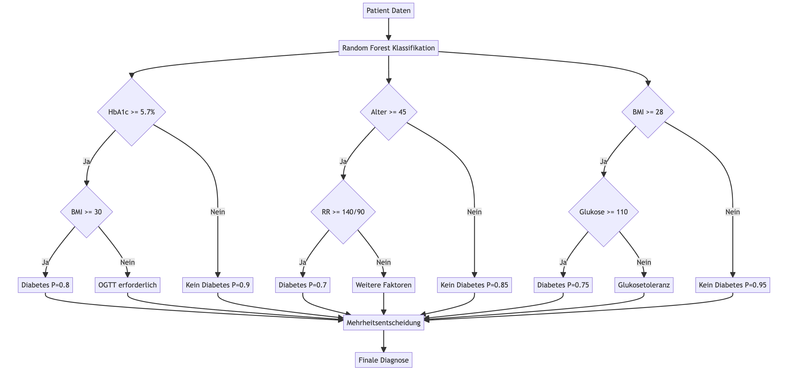

# Random Forest Algorithmus für Diabetes-Diagnose

## Lernen aus Beispielen (Training)

Der Random Forest Algorithmus basiert auf dem Aufbau von Entscheidungsbäumen. Die Entscheidungsregeln werden durch mathematische Schwellenwerte definiert:

### Entscheidungsbaum Diabetes-Diagnose




## Datengrundlage und Implementierung

### A) Datengenerierung (aus diabetes_data_generator.py):

```python
def generate_diabetes_dataset(n_samples=1000):
    # Demografische Daten
    alter = np.random.normal(50, 15, n_samples).clip(18, 90)
    # Klinische Messungen
    bmi = np.random.normal(28, 5, n_samples).clip(16, 45)
    # ...etc.
```

Mathematische Darstellung:

$$\begin{align*}
\text{Alter} &\sim \mathcal{N}(50, 15^2) \cap [18, 90] \\
\text{BMI} &\sim \mathcal{N}(28, 5^2) \cap [16, 45] \\
\text{HbA1c} &\sim \mathcal{N}(5.7, 0.8^2) \cap [4.0, 9.0]
\end{align*}$$

#### mathematische Notation und deren Bedeutung für die Datengenerierung

Die Formel verwendet folgende mathematische Notation:

1) $$\sim$$ bedeutet "ist verteilt nach"

2) $$\mathcal{N}(\mu, \sigma^2)$$ steht für eine Normalverteilung mit:
   - $$\mu$$ = Mittelwert 
   - $$\sigma^2$$ = Varianz (Quadrat der Standardabweichung)

3) $$\cap [a,b]$$ bedeutet eine Beschränkung (clipping) auf das Intervall [a,b]

Für die einzelnen Variablen bedeutet das:

**Alter:**

- $$\mathcal{N}(50, 15^2)$$: Normalverteilung mit Mittelwert 50 und Standardabweichung 15
- $$\cap [18, 90]$$: Werte werden auf den Bereich 18-90 Jahre beschränkt
- Dies erzeugt realistische Alterswerte für eine Diabetesstudie

**BMI (Body Mass Index):**

- $$\mathcal{N}(28, 5^2)$$: Normalverteilung mit Mittelwert 28 und Standardabweichung 5
- $$\cap [16, 45]$$: Beschränkung auf medizinisch plausible BMI-Werte von 16-45
- Ein BMI von 28 liegt im übergewichtigen Bereich, was für Diabetesrisiko relevant ist

**HbA1c (Glykohämoglobin):**

- $$\mathcal{N}(5.7, 0.8^2)$$: Normalverteilung mit Mittelwert 5.7 und Standardabweichung 0.8
- $$\cap [4.0, 9.0]$$: Beschränkung auf typische HbA1c-Werte
- 5.7% ist der Grenzwert zum Prädiabetes, was für die Studie relevant ist

#### medizinischen Fachbegriffe

**BMI (Body Mass Index):**

- Ein Maß für das Körpergewicht im Verhältnis zur Körpergröße
- Berechnung: Gewicht (kg) / (Größe (m))²
- Klassifikation:
  - < 18.5: Untergewicht
  - 18.5 - 24.9: Normalgewicht
  - 25 - 29.9: Übergewicht
  - ≥ 30: Adipositas
- Der gewählte Mittelwert von 28 ($$\mu = 28$$) liegt im übergewichtigen Bereich, was sinnvoll ist, da Übergewicht ein wichtiger Risikofaktor für Typ-2-Diabetes ist

**HbA1c (Glykohämoglobin):**

- Ein Langzeitmarker für den durchschnittlichen Blutzuckerspiegel der letzten 2-3 Monate
- Wird in Prozent oder mmol/mol angegeben
- Klassifikation:
  - < 5.7%: Normal
  - 5.7% - 6.4%: Prädiabetes (erhöhtes Diabetesrisiko)
  - ≥ 6.5%: Diabetes
- Der gewählte Mittelwert von 5.7% ($\mu = 5.7$) liegt genau an der Grenze zum Prädiabetes, was für eine Diabetesstudie relevant ist

**Normalverteilung im medizinischen Kontext:**

- Viele biologische und medizinische Messwerte folgen annähernd einer Normalverteilung
- Die Beschränkung (clipping) auf realistische Intervalle ist wichtig:
  - Alter [18, 90]: Erwachsene Studienpopulation
  - BMI [16, 45]: Extrem niedrige oder hohe BMI-Werte werden ausgeschlossen
  - HbA1c [4.0, 9.0]: Deckt den klinisch relevanten Bereich ab

Diese Parameter wurden so gewählt, dass sie:

1. Medizinisch plausible Werte erzeugen
2. Die Risikofaktoren für Diabetes widerspiegeln
3. Eine realistische Verteilung in der Studienpopulation simulieren

Die mathematische Modellierung hilft dabei, einen synthetischen Datensatz zu erstellen, der für das Training und die Validierung von Diabetes-Vorhersagemodellen genutzt werden kann.


### B) Feature-Wichtigkeit (aus den Daten):

```python
selected_features = [
    'Alter', 'BMI', 'Blutdruck_Systolisch', 'Blutzucker_Nuechtern', 
    'HbA1c', 'Cholesterin_Gesamt', 'Taillenumfang', 'Familien_Diabetes',
    'Bluthochdruck', 'Herz_Kreislauf_Erkrankung'
]
```

## Risiko-Score-Berechnung

### A) Implementierte Risikofaktoren:

```python
risiko_score = (
    (bmi > 30) * 2 +                     # w_1 = 2
    (blutdruck_systolisch > 140) * 1.5 + # w_2 = 1.5
    (blutzucker_nuechtern > 100) * 2 +   # w_3 = 2
    (hba1c > 5.7) * 2.5 +                # w_4 = 2.5
    (familien_diabetes) * 1.5 +          # w_5 = 1.5
    (alter > 45) * 1                     # w_6 = 1
)
```

Mathematische Formulierung:

$$R_{\text{gesamt}} = \sum_{i=1}^{n} w_i \cdot \mathbb{1}_{\text{Kriterium}_i}$$

### B) Erweiterte Risikofunktionen:

```latex
Blutzucker-Risikofunktion:
$$R_{\text{BZ}}(x) = \begin{cases}
0 & x < 100 \text{ mg/dl} \\
0.3 & 100 \leq x < 126 \text{ mg/dl} \\
0.6 & x \geq 126 \text{ mg/dl}
\end{cases}$$

Blutdruck-Risikofunktion:
$$R_{\text{BP}}(x) = \begin{cases}
0 & x < 120 \text{ mmHg} \\
0.3 & 120 \leq x < 140 \text{ mmHg} \\
0.6 & x \geq 140 \text{ mmHg}
\end{cases}$$
```

## Modelltraining und Evaluation

### A) Grid Search Parameter:

```python
param_grid = {
    'classifier__n_estimators': [100, 200],
    'classifier__max_depth': [10, 20, None],
    'classifier__min_samples_split': [2, 5]
}
```

### B) Modellmetriken:

```latex
Accuracy:
$$\text{ACC} = \frac{TP + TN}{TP + TN + FP + FN}$$

Precision:
$$\text{PPV} = \frac{TP}{TP + FP}$$

Recall:
$$\text{TPR} = \frac{TP}{TP + FN}$$

F1-Score:
$$\text{F1} = 2 \cdot \frac{\text{PPV} \cdot \text{TPR}}{\text{PPV} + \text{TPR}}$$
```

## Kreuzvalidierung und Konfidenzintervalle

### A) K-Fold Cross-Validation:

```python
scores = cross_val_score(model, X_train, y_train, cv=5)
```

Mathematisch:
$$\text{CV-Score} = \frac{1}{k}\sum_{i=1}^{k} \text{ACC}_i \pm 2\sigma$$

### B) Konfidenzintervalle:

$$\text{CI}_{95\%} = \bar{x} \pm 1.96 \cdot \frac{\sigma}{\sqrt{n}}$$

## Gesamtmodell-Performance

```python
print(f"Mittlere CV-Genauigkeit: {scores.mean():.4f} (+/- {scores.std() * 2:.4f})")
```

Mathematische Interpretation:

$$P(\text{Diabetes}|X) = \frac{1}{N}\sum_{i=1}^{N} h_i(X)$$
wobei $h_i(X)$ die Vorhersage des i-ten Entscheidungsbaums ist.

# Random Forest Algorithmus

## Grundprinzip

Random Forest ist ein Ensemble-Lernverfahren, das mehrere Entscheidungsbäume kombiniert, um eine genauere und robustere Vorhersage zu treffen. Bei der Diabetes-Diagnose würde jeder Baum im "Wald" eine Entscheidung darüber treffen, ob ein Patient Diabetes hat oder nicht.

## Funktionsweise für Diabetes-Diagnose

1. **Datensatzerstellung**: Der Algorithmus verwendet einen Trainingsdatensatz mit verschiedenen Merkmalen wie Alter, BMI, Blutzuckerwert, Blutdruck und anderen relevanten Faktoren.

2. **Baumerstellung**: Mehrere Entscheidungsbäume werden erstellt, wobei jeder Baum eine zufällige Teilmenge der Daten und Merkmale verwendet.

3. **Feature-Auswahl**: Für jeden Knoten im Baum wählt der Algorithmus die beste Aufteilung basierend auf einer Teilmenge der verfügbaren Merkmale aus.

4. **Entscheidungsfindung**: Jeder Baum trifft eine Entscheidung (Diabetes oder kein Diabetes) basierend auf den ihm zur Verfügung stehenden Daten und Merkmalen.

5. **Mehrheitsentscheidung**: Die endgültige Diagnose wird durch eine Mehrheitsentscheidung aller Bäume im Wald getroffen.

## Vorteile für Diabetes-Diagnose

- **Hohe Genauigkeit**: Random Forest kann komplexe Beziehungen in den Daten erfassen und liefert oft sehr genaue Vorhersagen.

- **Robustheit**: Der Algorithmus ist weniger anfällig für Overfitting als einzelne Entscheidungsbäume.

- **Umgang mit unbalancierten Daten**: Dies ist besonders nützlich bei Diabetes-Datensätzen, die oft unbalanciert sind.

- **Feature-Wichtigkeit**: Random Forest kann die Bedeutung verschiedener Merkmale für die Diagnose bewerten.

## Anwendung und Ergebnisse

Studien haben gezeigt, dass Random Forest bei der Diabetes-Klassifikation gute Ergebnisse erzielt. Eine Untersuchung ergab eine Genauigkeit von 78,2% bei der Verwendung des Standard-Random-Forest-Algorithmus, die durch Optimierung auf 82,1% gesteigert werden konnte[5].

Eine andere Studie, die den PIMA Indians Diabetes-Datensatz verwendete, erreichte eine Genauigkeit von 75%, eine Präzision von 87% und einen Recall von 80%[3].

## Optimierungsmöglichkeiten

- **Feature-Selektion**: Die Auswahl der relevantesten Merkmale kann die Leistung verbessern.
- **Hyperparameter-Tuning**: Anpassung von Parametern wie der Anzahl der Bäume oder der maximalen Baumtiefe.
- **Kombination mit anderen Techniken**: Beispielsweise kann die Verwendung von SMOTE-Tomek Link zur Behandlung unbalancierter Daten die Leistung weiter verbessern[1].

Random Forest hat sich als effektiver Ansatz für die Diabetes-Diagnose erwiesen, der sowohl genaue als auch interpretierbare Ergebnisse liefert.

Citations:

[1] https://www.semanticscholar.org/paper/01e79fa7fdf67c99d85bed2b7676370a4b2aba2d
[2] https://www.ncbi.nlm.nih.gov/pmc/articles/PMC10043839/
[3] https://www.semanticscholar.org/paper/534d836b51ebe4447de3643f15cbdd6acb7e4575
[4] https://www.semanticscholar.org/paper/79fe14595faeaab90b6fe242d86f49e118e9d750
[5] https://www.semanticscholar.org/paper/e8f42a70c7f29ac98576ffc9c9aa9066c972a2f7
[6] https://www.semanticscholar.org/paper/8e39051e5ba11208924c17ac0fac6f6d0be15544
[7] https://pubmed.ncbi.nlm.nih.gov/37294539/
[8] https://www.semanticscholar.org/paper/fc0b523af4ad54dbf151d2699282f5107e095351